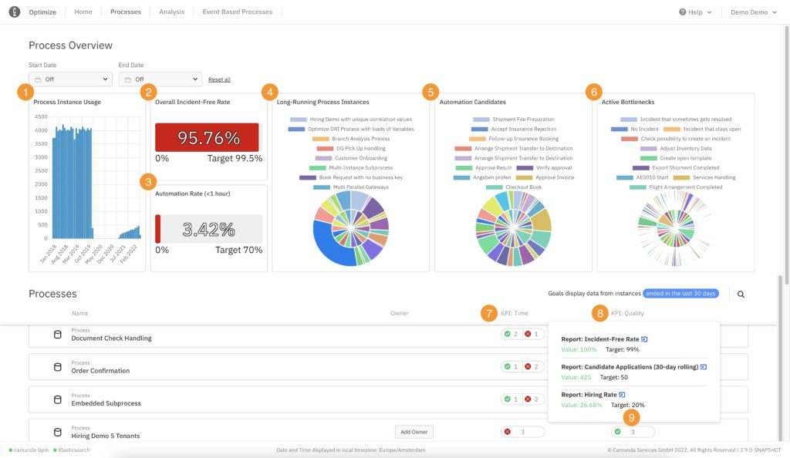

## Overview

The **Process Default Dashboards and KPIs** section gives you an overview of all the processes and their status on a single page.
This section also allows you to set a process owner and take responsibility of a process, viewing time, and quality KPIs to track process performance. Additionally, a **Adoption Dashboard** can be found at the top of the page, which integrates data from all processes in one view. The optional date filter is applied to all the reports shown in this view.

Note the available views below:

1. Process Instance Usage: Track Camunda adoption by visualizing how many process instances were started each month.

2. Overall Incident-Free Rate: Check the overall technical health of your processes by visualizing the percentage of process instances that did not have an incident.

3. Automation Rate (<1 hour): View the percentage of process instances completed within one hour. This is a good proxy for how automated your entire suite of processes is.

4. Long-Running Process Instances: View how many process instances that started over a week ago are still running. In addition, you can combine that with their average duration to identify the least efficient processes and potential pain points.

5. Automation Candidates: View your most expensive user tasks by seeing how often they run next to their average duration.

6. Active Bottlenecks: Identify the worst bottlenecks across any process in real-time by seeing the number of instances at any certain task and how long those instances have been there.

7. Time KPIs: These are KPIs based on duration reports or percentage reports with a duration filter.

8. Quality KPIs: These are KPIs based on other reports.

9. KPI Results: You can see the KPI’s current and target values, plus a link to the report itself.

10. Clicking on each process on the list opens a default dashboard dedicated to this process. For more details, 
    please [click here.](./instant-preview-dashboards.md)

:::tip
For the pie chart reports in 4, 5, and 6, both time and count are displayed in the chart according to the following format:

:::

## Set time and quality KPIs

KPIs are single number reports, which have a target set. A report can be configured as a KPI report through the report configuration panel and the classification to a time or quality KPI happens internally in Optimize based on the measure selected.
Once a report is configured as KPI, its status can be seen on the **Adoption Dashboard**. Hovering over its status allows previewing more specific information in regard to the KPIs, such as the target set, the actual current value of the single number report and a link to it. If a user accesses a report via this link and does not have authorization to view it, they will not be able to see any data in the report view.

## Configuring process owner and digests

The process can be configured by clicking the **Configure** option selected from the three dots menu displayed on the right side when hovering over the process. From this modal, you can change the owner of the process, as well as enable/disable the process digest. The process digest is a scheduled email report summarizing the current and previous state of the KPI reports for that process. It will be emailed to the owner of that process at [globally configurable regular intervals](/self-managed/optimize-deployment/configuration/system-configuration.md/#digest). Note that process digests are an alpha feature.

## KPI import scheduler

Since users might be dealing with hundreds or even thousands of KPIs, a scheduler has been developed which updates the KPI values on a given interval. The default interval in which the KPIs get updates is 10 minutes.
To change this interval, please modify the configuration value for **entity.kpiRefreshInterval**. For more information please visit the relevant [configuration section](/self-managed/optimize-deployment/configuration/system-configuration.md).

## Limitations

Since the updates on the KPIs will appear on the process overview page after the given KPI import scheduler interval has passed, changes such as creation, update and deletion of KPIs will show with a delay. In case you wish to make these changes apparent more promptly, you can set the kpi scheduler interval to a lower value as described above.

Additionally, it is worth mentioning that for the evaluation of the KPI reports, the default timezone of the machine on which Optimize is being run on will be used.
