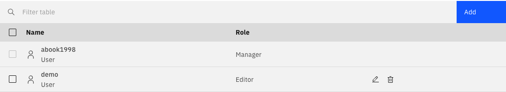
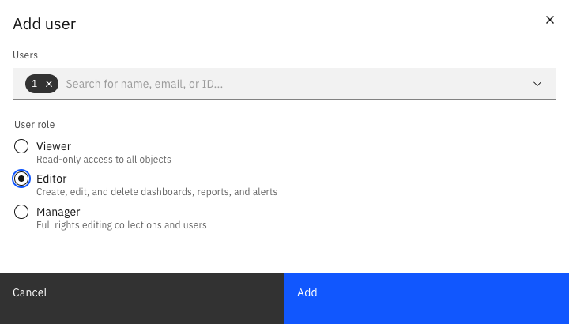

By default, if you create a collection, only you can access the collection and the contents within. To share a collection with other users, add them to the collection.

You are automatically assigned the manager role when creating a new collection. There can be multiple managers for a collection. However, there must be at least one manager for every collection. Managers can do the following:

User permissions in collections involve managers, editors, and viewers. Managers control collection content, including adding/removing dashboards and reports, users, and data sources. Editors can modify content but not collection details, while viewers can only observe and copy. Add users/groups to collections via the **Users** tab, assigning roles that determine access rights.

A manager can add a new user or group to the collection using the **Add** button. Use the ID of the user/group to add them. Every user/group has a role assigned to them that specifies their access rights to the collection.

Those with read-only access to the collection may only view the components contained within, as well as copy them. Viewers cannot create, edit, or delete components in a collection. They are also not allowed to rename or delete the collection itself, or change anything in the **Users** tab.
