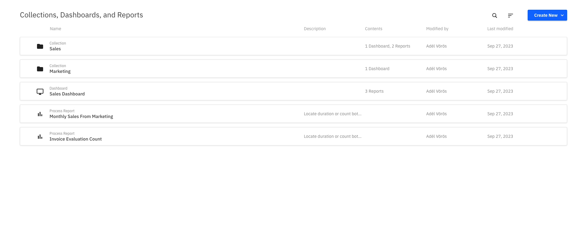

Within Optimize, **reports** are based on a _single_ visualization, similar to a single chart or graph. **Dashboards** are aggregations of these visualizations, similar to a full spreadsheet of data collections, or a combination of several comparative charts and graphs. **Collections** are groups of these data sets, similar to project folders for organizational purposes where we can nest a series of dashboards and/or reports within.

The Optimize landing page shows a list of all existing dashboards and reports created, as well as collections an individual user or a group have access to. Click on a collection to view its accompanying reports and dashboards.

In addition to the name of the dashboard, report, or collection, you can also see the date it was last modified. Alongside collections, dashboards, and combined process reports, you can also see how many entities are contained within (e.g. how many reports are on a dashboard). You can also see how many users and groups have access to a collection.

:::note
Optimize offers collaborative capabilities, too. Click the **Share** tab to share a created [dashboard](./creating-dashboards.md). Toggle to **Enable sharing**, and copy or embed the provided link. Colleagues without access to Optimize can still view your report with the shared link. Learn more about [user permissions](./user-permissions.md).
:::

Clicking on a report, dashboard, or collection takes you to its corresponding details page. When moving the mouse over one of these entities, you can access a context menu that allows you to edit, copy, or delete the entity. Multiple entities can be selected and deleted at once using the bulk menu which appears after selecting at least one entity. When copying an entity, you also have the option to move that copy into a collection.

To find a collection, report, or dashboard, use the search field on the top of the page to filter the list by the name of the entity.

To [create a dashboard](./creating-dashboards.md) or [report](./creating-reports.md), use the **Create New** button available in the top right corner of the page.

## User permissions

By default, if you create a collection, only you can access the collection and the contents within. To share a collection with other users, add them to the collection.

You are automatically assigned the manager role when creating a new collection. There can be multiple managers for a collection. However, there must be at least one manager for every collection. Managers can do the following:

- Add, edit, and remove dashboards and reports to the collection.
- Edit the collection name and delete the collection using the context menu in the header.
- Add, edit, and remove other users and user groups to collections via the collection's **Users** tab.

A manager can add a new user or group to the collection using the **Add** button. Use the ID of the user/group to add them. Every user/group has a role assigned to them that specifies their access rights to the collection.

An editor may edit, delete, and create new dashboards or reports in the collection. Editors may not edit the name of the collection, delete the collection, or change anything in the **Users** tab.

Those with read-only access to the collection may only view the components contained within, as well as copy them. Viewers cannot create, edit, or delete components in a collection. They are also not allowed to rename or delete the collection itself, or change anything in the **Users** tab.
