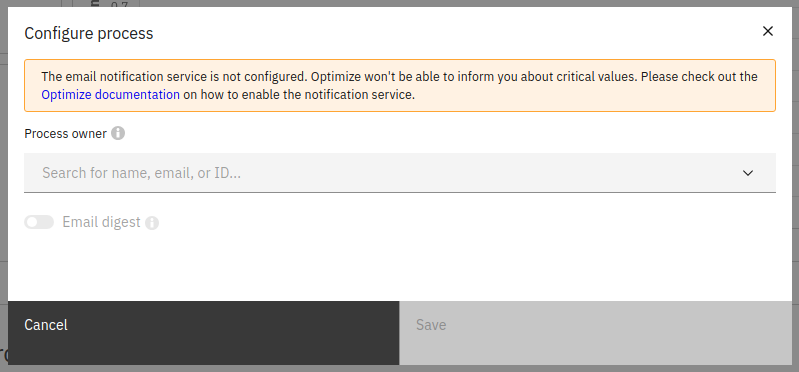

## Overview

The **Process Default Dashboards and KPIs** section gives you an overview of all the processes and their status on a single page.
This section also allows you to set a process owner and take responsibility of a process, viewing time, and quality KPIs to track process performance. Additionally, an **Adoption Dashboard** can be found at the top of the page, which integrates data from all processes in one view.

## Set time and quality KPIs

KPIs, or Key Performance Indicators, are reports represented by single numerical values with predefined targets. The process of creating KPI reports is explained in [process KPIs](./process-KPIs.md). The classification into a time or quality KPI occurs internally in Optimize based on the chosen measure.

Once a report is set as a KPI, its status is visible on the **Dashboards** page. Hovering over the status provides a preview of specific information related to the KPI, including the set target, the current actual value of the single-number report, and a link to it. Users accessing the report via this link without proper authorization won't be able to view any data in the report view.

## Configuring process owner and digests

The process can be configured by clicking the **Configure** option selected from the three dots menu displayed on the right side when hovering over the process. From this modal, you can change the owner of the process, and enable/disable the process digest.

The process digest is a scheduled email report summarizing the current and previous state of the KPI reports for that process. It will be emailed to the owner of that process at [globally configurable regular intervals](/self-managed/optimize-deployment/configuration/system-configuration.md#digest). Note that process digests are an alpha feature.

## KPI import scheduler

Since users might be dealing with hundreds or even thousands of KPIs, a scheduler has been developed which updates the KPI values on a given interval. The default interval in which the KPIs get updates is 10 minutes.

To change this interval, modify the configuration value for **entity.kpiRefreshInterval**. For more information, visit the relevant [configuration section](/self-managed/optimize-deployment/configuration/system-configuration.md).

## Limitations

Since the updates on the KPIs will appear on the process overview page after the given KPI import scheduler interval has passed, changes such as creation, update and deletion of KPIs will show with a delay. In case you wish to make these changes apparent more promptly, you can set the KPI scheduler interval to a lower value as described above.

Additionally, it is worth mentioning that for the evaluation of the KPI reports, the default timezone of the machine on which Optimize is being run on will be used.
