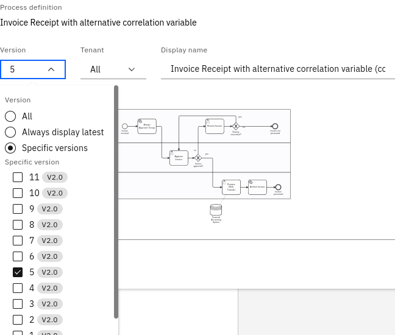
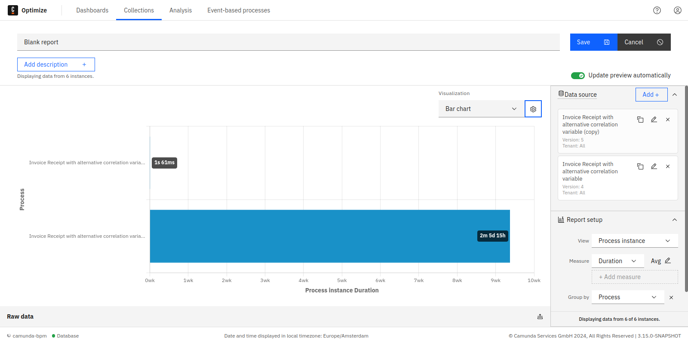

When creating reports, it is possible to copy the data source and set different versions and/or tenants for each copy, as well as give it a custom title. This allows you to compare different variants of the process.

To use this feature, navigate to the definition edit window from inside a report. Click the copy icon while hovering over the data source. This will create a copy of the data source with all its parameters.

Now click the pencil icon while hovering over the data source you want to edit and select a different version and/or tenant. This way there are two variants of the same process which can be now compared.

Here is an example of a bar chart report comparing the average process instance duration of two versions of the same process.

