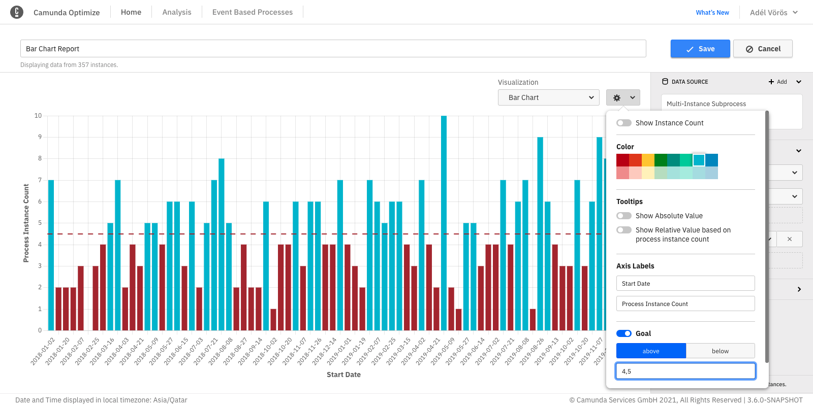

## Edit mode

The edit mode allows you to configure the report and adjust it to your needs. The following operations are possible within edit mode:

- Rename your report
- Build a report
- Configure your report
- Save the current state with your applied changes
- Cancel changes you already applied to the report

Building a report is the crux of the report edit mode. The building process itself is composed of several steps, which happen in the control panel.

### Select process definitions

Every report relates to one or multiple process definitions, versions, and tenants. You must choose at least one process definition you want to create a report for.

To add a process definition to the report, click **Add** at the top of the **Data Source** section of the report control panel. This opens a dialog showing all process definitions you can use in the report. You can select up to 10 definitions to add to the report. If there are many process definitions, you can use the input field to search for the definition you are looking for.

For every added process definition, you can set a display name and a specific version or version range. To do so, click the **Edit** button in the process definition card. There are also buttons to remove the definition from the report or add a copy of the definition.

When editing a process definition, using the version dropdown, you can choose between all versions, the latest version, or a specific set of versions.

- **All** option: Every process instance across all versions of the process definition will be considered in your report.
- **Always display latest** option: Makes your report always refer to the latest version. Keep in mind that if a new version of the process is deployed, the report will automatically consider process instances of this new version only.
- **Specific version** option: Specify one or multiple existing versions of the process.

Data from older versions is mapped to the most recent version in the selection. Therefore, the report data can seem to be inconsistent, which is due to changes that occurred within the diagram through the different versions. For example, the old versions do not contain newly added tasks or a part of the diagram was removed because it was considered to be obsolete.

By default, all process instances for the selected process definitions are included in a report. You can reduce this set of process instances by applying a [filter](../../additional-features/filters.md).

### Define the report

In this section of the report builder, you are characterizing the output of the report. Basically, you are defining "I want to view ... grouped by ... visualized as ...". To understand better what "View" and "Group by" mean, you can use the analogy of a graph, where "View" is the y-axis and "Group by" is the x-axis.

First, you need to select which part of the data you want to view. Optimize differentiates between the view (e.g. process instance or flow node) and the measure (e.g. count or duration):

1. Raw Data: View just a table with the actual data listed as rows. This can come in handy if you found interesting insights in certain process instances and need detailed information about those instances, or you are exploring a process definition with a limited number of instances. This report type also allows you to inspect raw [object variable values](../../../../self-managed/optimize-deployment/setup/object-variables.md).
2. Process instance

- Count: View how many process instances were executed.
- Duration: View how long the process instances took to complete.

3. Incident

- Count: View how many incidents occurred on the process.
- Resolution duration: View how long the incident took to get resolved.

4. Flow node

- Count: View how often the flow nodes (e.g. tasks) have been executed.
- Duration: View how long each flow node took to complete.

5. User task

- Count: View how often each user task has been executed.
- Duration: View how long each user task took to complete.

6. Variable: View an aggregation of values for a specific numeric variable of the process definition.

It is possible to display both count and duration measures for a single view in the same report.

Subsequently, you need to define how to group the data. Think of it as applying a metric to your input, where you break up the data by date, flow nodes, variable values, or other properties. For that, you have different options:

- **None**: Do not split up the data.
- **Flow nodes**: Cluster the data by flow nodes.
- **User tasks**: Cluster the data by user tasks.
- **Duration**: Cluster the data by duration. Depending on the selected view, this can be the duration of process instances, flow nodes, or user tasks.
- **Start date**: Group instances together that were started during the same date period or time, e.g. hour, day or month. Depending on the selected view, this can be the start date of process instances, flow nodes, or user tasks.
- **End date**: Group instances together that were finished during the same date period or time, e.g. hour, day or month. Depending on the selected view, this can be the start date of process instances, flow nodes, or user tasks.
- **Running date of the process instance**: Group process instances together that were running during the same date period or time, e.g. hour, day, or month.
- **Variable**: Process instances with the same value for the selected variable are grouped together.
- **Assignee**: Only available for user task views. Tasks are grouped together according to their current assignee.
- **Candidate group**: Only available for user task views. Tasks with the same candidate group are grouped together.
- **Process**: Only available for process instance reports with multiple definitions. Data from the same process is grouped together.

Finally, define how you want the data to be visualized. Examples are heatmap, table, bar, or line chart.

Not all the above view, group by, and visualization options can be combined. For instance, if you choose `Flow Node: Count` as view, the data is automatically grouped by flow nodes as no other combination would be valid.

All possible combinations can also be found in the following table:

| View                                                | Group by                                                        | Visualize as          |
| --------------------------------------------------- | --------------------------------------------------------------- | --------------------- |
| Raw Data                                            | None                                                            | Table                 |
| Process instance: Count, Process instance: Duration | None                                                            | Number                |
| Process instance: Count                             | Start Date, End Date, Running Date, Variable, Duration, Process | Table, Chart          |
| Process instance: Duration                          | Start Date, End Date, Variable, Process                         | Table, Chart          |
| Incident: Count, Incident Duration                  | None                                                            | Number                |
| Incident: Count, Incident Duration                  | Flow Nodes                                                      | Table, Chart, Heatmap |
| Flow Node: Count, Flow Node: Duration               | Flow Nodes                                                      | Table, Chart, Heatmap |
| Flow Node: Count                                    | Start Date, End Date, Duration, Variable                        | Table, Chart          |
| Flow Node: Duration                                 | Start Date, End Date, Variable                                  | Table, Chart          |
| User Task: Count, User Task: Duration               | User Tasks                                                      | Table, Chart, Heatmap |
| User Task: Count, User Task: Duration               | Start Date, End Date, Assignee, Candidate Group                 | Table, Chart          |
| User Task: Count                                    | Duration                                                        | Table, Chart          |
| Variable                                            | None                                                            | Number                |

:::note
You might sometimes see a warning message indicating that the data is limited to a certain number of points. This happens because the available stored data, in this case is very large, and it is not possible to display all the data in the selected visualization.
:::

### Reports with a second "Group by" option

Using the second "Group by" option, it is possible to apply another grouping to your data to display extra details such as dates, variable values, or assignees. This option will be shown below the first "Group by" option if the current report combination supports it. Here is an overview of the reports that supports a second "Group by":

### Flow node reports

Flow node names can be applied as a second "Group by". If the report contains multiple process definitions, the data can also be grouped by process as a second "Group by".

### User task reports

User task names, assignees, and candidate groups can be applied as a second "Group by".

For example, if your report is grouped by assignee/candidate group, it is possible to add another grouping by user task to see which user task your users/group are working on or have completed in the past. If the report contains multiple process definitions, the data can also be grouped by process as a second "Group by".

:::note
Reports using assignee/candidate groups are only available in Camunda Platform 7.
:::

Refer to the table below for an overview of all report combinations that support a second "Group by":

| View                      | Group by                  | Second group by                                                                    |
| ------------------------- | ------------------------- | ---------------------------------------------------------------------------------- |
| User Task Count, Duration | User Tasks                | Assignee, Candidate Group, Process (only for multi-definition reports)             |
| User Task Count, Duration | Start Date, End Date      | Assignee, Candidate Group, User Tasks, Process (only for multi-definition reports) |
| User Task Count, Duration | Assignee, Candidate Group | User Tasks, Process (only for multi-definition reports)                            |
| User Task Count           | Duration                  | User Tasks, Process (only for multi-definition reports)                            |

### Process instance reports

Refer to the table below for the process instance count and duration reports that support a second "Group by":

| View                             | Group by               | Second group by                                                   |
| -------------------------------- | ---------------------- | ----------------------------------------------------------------- |
| Process Instance Count, Duration | Start Date, End Date   | Variable, Process (only for multi-definition reports)             |
| Process Instance Count, Duration | Variable               | Start Date, End Date, Process (only for multi-definition reports) |
| Process Instance Count           | Running Date, Duration | Process (only for multi-definition reports)                       |

The diagram below shows a report grouped by `Start Date` and a boolean variable:

### Duration and variable report aggregation

For duration and variable views, the default aggregation type is the average. You can add and change different aggregations like minimum, maximum, and median in the report configuration panel. Note that the median is an estimate and the other operations are exact values.

Reports with multiple aggregations that have a [second "Group by"](#reports-with-a-second-group-by-option) can only be visualized as table.

### User task duration time

:::note
The following information regarding idle versus work is currently applicable only to Camunda Platform 7.
:::

In user task duration reports, you have the opportunity to select which part of the user task's lifecycle you want to see in the report:

- Idle: View how long each user task was considered idle (not claimed by an assignee/user) during its execution.
- Work: View how long each user task was considered to be worked on by assignees/users (claimed by an assignee/user) during its execution.
- Total: View how long each user task took to complete.

It is possible to display and compare multiple user task duration times in the same report. Reports with multiple user task duration times that have a [second "Group by"](#reports-with-a-second-group-by-option) can only be visualized as table.

:::note
User tasks which have been completed yet have no claim operations are evaluated as follows: if the user task was canceled, the task is considered to have been idle whereas user tasks which were completed are considered to have been worked on programmatically or via a custom UI, meaning the time between start and end is considered work time.
:::

### Target value comparison

Based on flow node duration heatmaps, Optimize allows you to specify a target value for every activity. For example, if a user task has to be completed within one day, you can set the target value to one day. If the time it takes to complete the user task exceeds this target value, the task is highlighted in the heatmap.

To set target values and create a target value comparison heatmap, you need to be in the edit mode of a report which has the following configuration:

| View         | Flow node duration/user task duration |
| ------------ | ------------------------------------- |
| Group by     | Flow nodes/user tasks                 |
| Visualize as | Heatmap                               |

If your report has this configuration, a target value button is visible. Clicking on the **Target Value** button for the first time opens an overlay containing the process diagram and a table with all flow nodes. You can also see the actual duration value for every flow node.

To set a target value for a flow node, use the number and unit fields in the last column. If the target value number field for a flow node is empty, this flow node has no target value set (the selected time unit is ignored in that case).

If you set a target value for a flow node, this target value is represented as a badge on the flow node in the diagram in the upper part of the overlay. You can click on any flow node in the diagram to jump to the target value input field in the table.

If you have a user task report, you can only select user tasks here, as only those are included in the report result. When selecting a target value input field in the table, the corresponding diagram element is highlighted. To save the target value configuration, click **Apply**.

After you save the target values, the normal duration heatmap is replaced with a target value visualization. In this new visualization, flow nodes with an average duration larger than the specified target value are highlighted in red.

If you mouse over one of the nodes, the tooltip shows the following:

- The target duration value
- The actual duration
- The relative percentage the actual value is of the target value
- A button to download a list of process instance IDs that exceed the target value

You can also see the target value as a badge on the diagram.

After the initial target values for a report are set, you can use the target value button to toggle between the target value and the regular duration view mode. If you want to change target values, use the gear button to open the overlay again.

As with any change to a report configuration, to persist target values and show them in the report view mode and on dashboards, you need to save the report using the **Save** button in the upper right corner.

### Process instance parts

In some cases, you may not be interested in the duration of the whole process instance, but only a certain part of it. For that scenario, there is an additional button called **Process Instance Part** available for every process instance duration view that only shows data for a single process definition.

Clicking this button opens an overlay letting you select the start and end of the part of the process instance you are interested in. After confirming the selection, the displayed duration refers to the selected part only instead of the whole instance.

In some cases it can happen that the same activity is executed multiple times in the same process instance, e.g. if the process contains loops or parallel gateways. In such cases, Optimize considers only the part between the start date of the first instance of the start node and the end date of the first instance of the end node.

### Configure a report

The configuration panel groups all the settings that can be applied to a report in one place. To see the panel, click on the cog button available in the edit mode of any report. Every visualization has different settings that can be configured in the panel.

When you save changes to the report configuration, they apply to the report view mode and any dashboard this report is displayed on.

### Number

Number reports are any reports that are visualized as a single number (e.g. `Process Instance: Count` grouped by `None` or `Process Instance: Duration` Grouped by `None`).

In number reports, the following configurations are possible:

### Number precision

Number precision can be configured from the panel to limit the most significant units to be shown.

For example, we have a report that calculates the total process instances duration. When the precision limit is not set, you will see all possible units, e.g.: `1y 5m 2wk 5d 3h 16min 3s 170ms`. In case you are only interested in certain units - e.g. months - you can omit all insignificant units by limiting the precision as shown in the figure below:

### Number goal value (progress bar)

Number reports appear as progress bar when the goal option is enabled from the panel as shown. The baseline and the target value of the progress bar can be also set using the panel.

You can toggle between the progress bar and the single number visualization using the same goal line switch.

A red line indicator appears on the progress bar when its value exceeds the goal value. On the right side of the indicator, the bar turns into a darker color to clearly show the exceeded amount.

### Table settings

In table reports, the following configurations are possible:

### Show instance count

Displays the total instance count on the right side of the visualization. If you save the report while this option is enabled, the number will also be shown on any dashboard this report is added to and when the report is shared.

### Hide, show, and reorder table columns

The table settings allow you to hide specific columns using the configuration menu as shown in the figure below:

When working with raw data table reports, you can also re-order the table columns using drag-and-drop on the header of the respective column.

### Sorting by table column

To sort a table by a specific column, click on the header of that column. Doing that will show a small caret icon in the header of the column indicating which column the table is currently sorted by and the direction of this sorting (ascending or descending) as shown:

Clicking again on the same column header will reverse the direction of sorting.

Saving the reports will also preserve the applied sorting.

The sorting currently works for all table reports except for:

- Combined table reports
- Reports grouped by integer type variables

### Absolute and relative values

When configuring a count report, you have the opportunity to configure which columns are included in the table. You can hide or show the corresponding columns using the switches for absolute and relative value.

### Custom bucket size for date variables

When evaluating a report which is grouped by a date variable and displayed as a table, Optimize offers you the option to select your preferred unit specifying the custom result bucket size from the report configuration menu. The available units are year, month, week, day, and automatic.

The default unit is automatic, which will create evenly spaced result buckets based on the values of the date variable. This configuration option is also available for charts.

### Custom bucket size and baseline

When evaluating a report which is grouped by duration or a number variable, Optimize offers you the option to specify your preferred result bucket size as well as a custom baseline in the report configuration menu. The bucket size determines the width of one bucket, and the baseline specifies the start of the first bucket.

For example, say a report contains the variable values 0.3, 6, and 13, and you set a bucket size of 5. By default, Optimize would now return a bucket for the values 0.3 to 5.3, one for 5.3 to 10.3, and one for 10.3 to 15.3. You may prefer your bucket start and end points to be a round number, in which case you should set your baseline to 0. With a baseline of 0 and bucket size 5, the result buckets now span 0 to 5, 5 to 10, and 10 to 15.

If these configuration fields are not set, by default Optimize will create evenly spaced result buckets with a range based on the minimum and maximum values of the number variable.

This configuration option is also available for charts.

### Charts (line, bar, pie)

In bar chart and line chart reports, it is possible to select the color of the graph, add names to the x-axis and y-axis, and edit many other settings as shown in the figure below:

In charts, you can hide/show absolute and relative values that appear in the tooltips.

### Show instance count

Displays the total instance count on the right side of the visualization. If you save the report while this option is enabled, the number will also be shown on any dashboard this report is added to and when the report is shared.

### Chart goal line

Optimize allows you to set a goal line in bar chart and line chart visualizations. Using this feature, it is possible to highlight anything above or below a certain value.

A good use case for such functionality is the following example:

First, go to the edit mode of a report and choose the following configuration:

| View         | Count frequency of process instance   |
| ------------ | ------------------------------------- |
| Group by     | Start date of process instance: Month |
| Visualize as | Bar chart                             |

Let us say that the number of completed process instances should always be above six. A goal line can be used as follows:

Set the target value input field to six and select the above button. If the number of process instances is below six, it will be highlighted in red as shown:

This feature can be also used with every other bar chart and line chart visualization. Here is another example where the target value is used with line chart visualization:

### Custom bucket size for date variables

When evaluating a report which is grouped by a date variable and displayed as a chart, Optimize offers you the option to select your preferred unit specifying the custom result bucket size in the report configuration menu.

The available units are year, month, week, day, and automatic. The default unit is automatic, which will create evenly spaced result buckets based on the values of the date variable. This configuration option is also available for tables.

### Custom bucket size and baseline

When evaluating a report which is grouped by duration or a number variable, Optimize offers you the option to specify your preferred result bucket size as well as a custom baseline in the report configuration menu. The bucket size determines the width of one bucket, and the baseline specifies the start of the first bucket.

For example, say a report contains the variable values 0.3, 6, and 13 and you set a bucket size of 5. By default, Optimize would now return a bucket for the values 0.3 to 5.3, one for 5.3 to 10.3, and one for 10.3 to 15.3. You may prefer your bucket start and end points to be a round number, in which case you should set your baseline to 0. With a baseline of 0 and bucket size 5, the result buckets now span 0 to 5, 5 to 10, and 10 to 15.

If these configuration fields are not set, Optimize will create evenly spaced result buckets with a range based on the minimum and maximum values of the number variable by default.

This configuration option is also available for tables.

### Stacked bar chart

When evaluating a report which has a second "Group by", Optimize offers you the option to stack the bar chart bars instead of displaying them near each other. Stacking bars would be useful when the focus of the chart is to compare the totals (e.g. flow node count, process instance count, etc.) and one part of the totals (e.g. flow node, variable value, etc.)

This configuration option is also available for bar/line charts.

### Bar/line chart

When evaluating a report which has both count and duration measures, Optimize offers you the option to display one of the measures as bars and the other measure as a line. This would help to differentiate between duration and count values displayed in the visualization. By default, the count measure is displayed as bars and the duration as a line. You can also switch between them by using the configuration option shown.

### Heatmaps

When enabling absolute or relative values switches, all tooltips for all flow nodes stay visible. This is also possible when you have defined target values. If you save the report in this state, the tooltips will also be shown on any dashboard this report is added to.

As for charts and table reports, it is possible to display the total instance count on the right-hand side of the visualization. If you save the report while this option is enabled, the number will also be shown on any dashboard this report is added to and when the report is shared.
