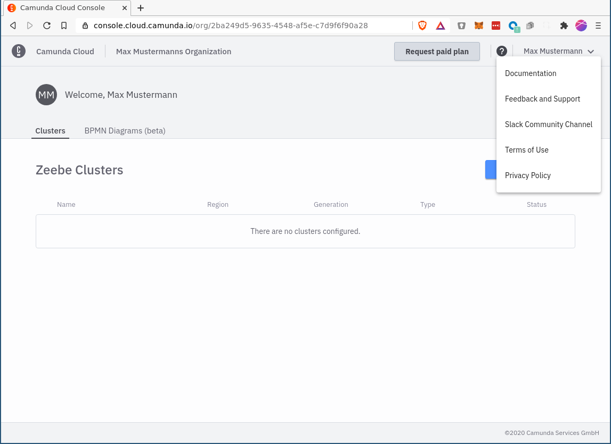

# Contact

There are various channels where you can reach us.

- We encourage everyone to participate in our **community chat** via [Slack](https://zeebe-io.slack.com/), where you can exchange ideas with other Zeebe and Camunda Cloud users, as well as the product developers.

- If you find a **bug**, please open an issue in this [repository](https://github.com/camunda-cloud/bugs). The bugs have a default template, so please describe what doesn't work in detail.

- For **security-related issues**, please e-mail us at [this address](mailto:cloud-security@camunda.com) so we can solve the problem as quickly as possible.

- **Feebdack and Support** can be submitted or requested via the corresponding entry in the navigation menu. If you have a **license agreement** with us you will be redirected to the [Support queue](https://jira.camunda.com/projects/SUPPORT/) at Camunda. In the Free Plan, contact can be made using the internal form:

