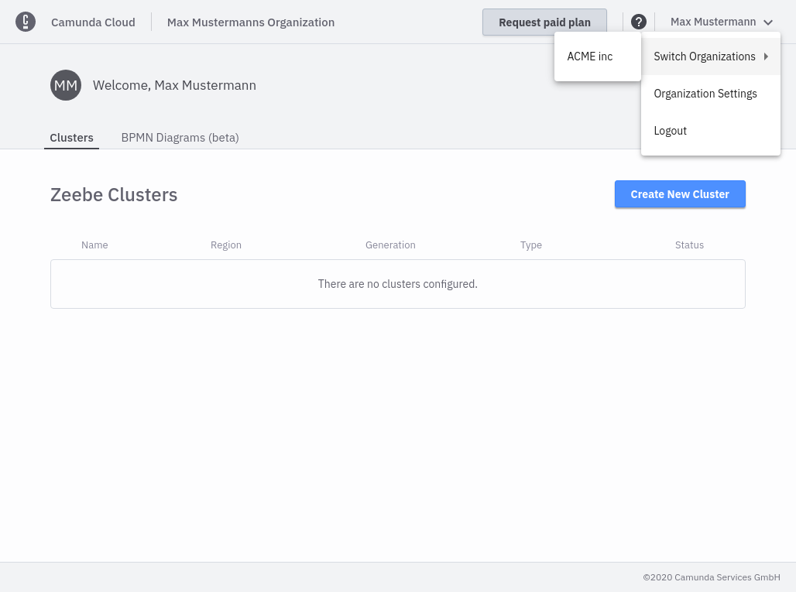
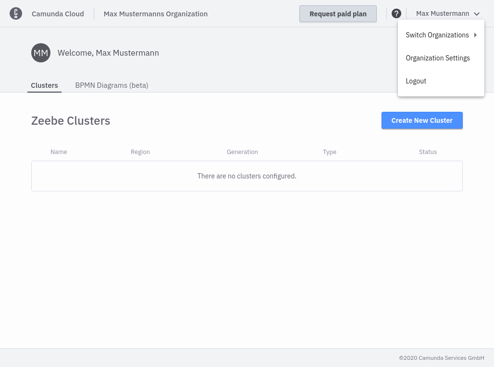

## Rights concept

When a user signs up to Camunda Cloud, they receive a personal organization. Clusters that the user creates in this organization are assigned to this organization.

If several users need access to the same Zeebe cluster, all users can be assigned to the same organization. If a user is assigned to more than one organization, the organization can be changed in the menu of the navigation bar.

## Organization Settings

Organization settings can be accessed via the menu in the navigation bar.

### Overview

The overview provides a summary of the organization:

- Organization name
- Pricing Plan
- Owner of the organization

### Users

Under this setting members of the current organization can be managed. A user can have one of the following roles:

- Owner: Owner of the organization (currently limited to one user, cannot be changed by the user)
- Admin: Restricted rights for user management
- Member: Can manage Zeebe Clusters and Client and use Operate

The following table illustrates the rights of the each roles:

|                              | Owner | Admin | Member |
| ---------------------------- | ----- | ----- | ------ |
| Manage Zeebe Clusters        | X     | X     | X      |
| Manage Clients               | X     | X     | X      |
| Use Operate                  | X     | X     | X      |
| Users: Manage Members        | X     | X     |        |
| Billing: Manage Reservations | X     | X     |        |
| Billing: Request Paid Plan   | X     | X     |        |
| Users: Manage Admins         | X     |       |        |

Users are invited to a Camunda cloud organisation via their email address, which must be accepted by the user. As long as the invitation has not been accepted, the user remains in the Pending state.

People can also be invited to an organisation that does not yet have a Camunda cloud account. In this case the invited person must first create a Camunda Cloud account and then has access to the organisation.

### Billing

This setting is only visible in the Professional Plan for Owners and Admins. More about it under [Professional Plan](../manage-plan/professional-plan.md).
