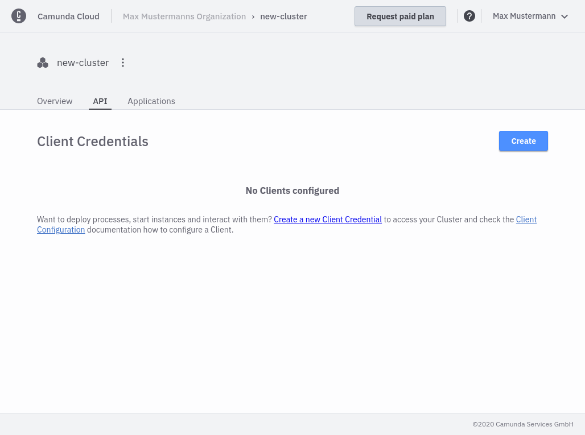
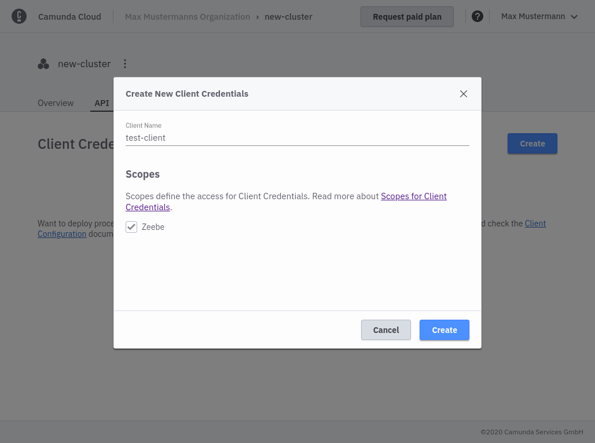
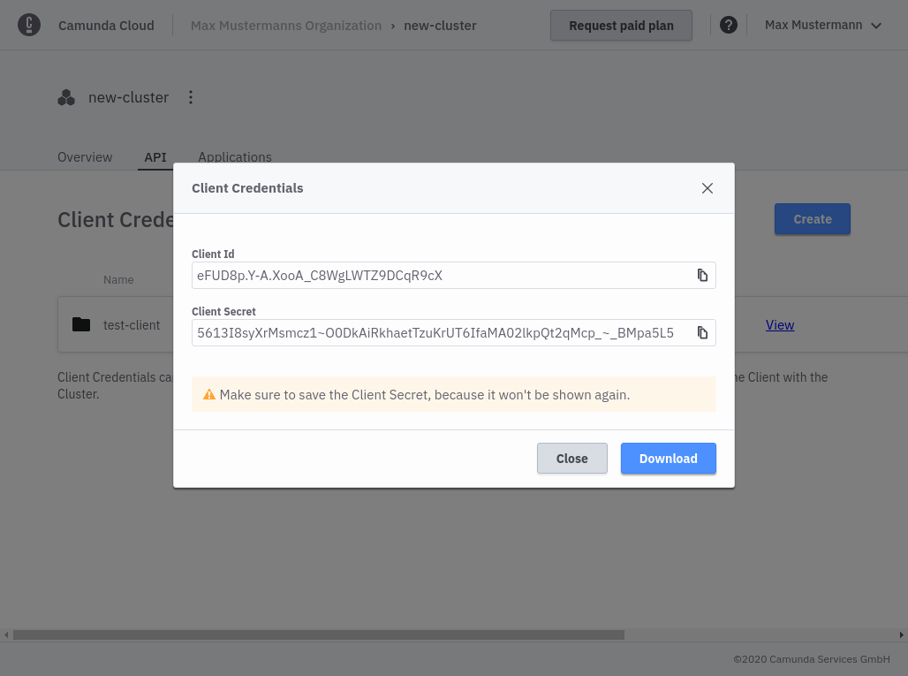

To be able to interact with Zeebe in the cloud from the outside, every client application must authenticate itself. An OAuth Flow is used for authentication, which is shown below:

The client configuration is shown at the bottom of the cluster detail view. Create a new client and all necessary information is displayed.

With the `Client Id` and `Client Secret`, a client application can request an access token at the authentication URL (steps 1 and 2). The access token is necessary to interact with Zeebe in the cloud (step 3).

Please note:

- Access tokens have a validity period that can be found in the access token. After this time a new Access Token must be requested.
- The Auth Service has a built-in rate limiting. If too many token requests are executed in a short time, the client is blocked for a certain time. Since the access tokens have a certain validity period, they must be cached on the client side.

The officially offered client libraries (as well as the node client) have already integrated the Auth routine and take care of obtaining and refreshing an access token and make use of a local cache.

### Create a client

To create a new client you have to navigate into the API tab:

Click on _Create New Client_-Button to create a new client and name your client accordingly. 

Make sure you keep the generated client credentials in a safe place - the Client Secret will not be shown again. For your convenience, you can also download the client information to your computer.

The downloaded file contains all necessary information to later on communicate with your zeebe instance:

- `ZEEBE_ADDRESS`: Address where your cluster can be reached.
- `ZEEBE_CLIENT_ID` and `ZEEBE_CLIENT_SECRET`: Credentials to request a new access token.
- `ZEEBE_AUTHORIZATION_SERVER_URL`: A new token can be requested at this address, using the
