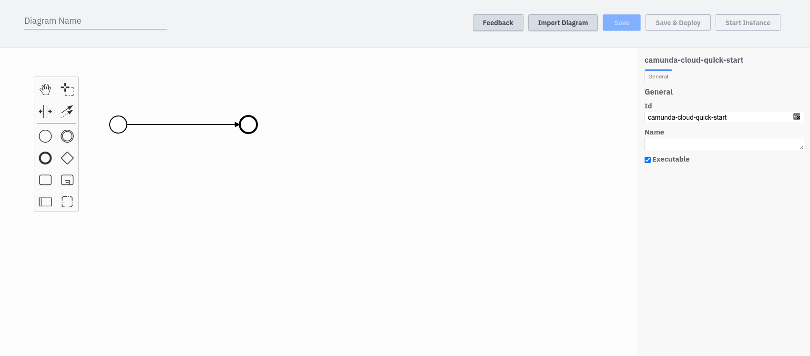
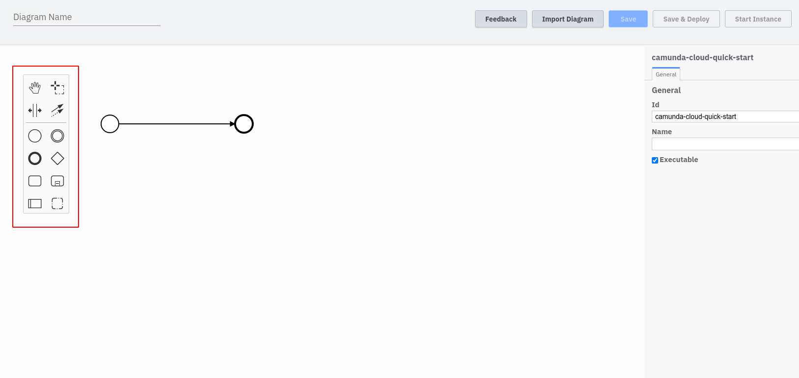
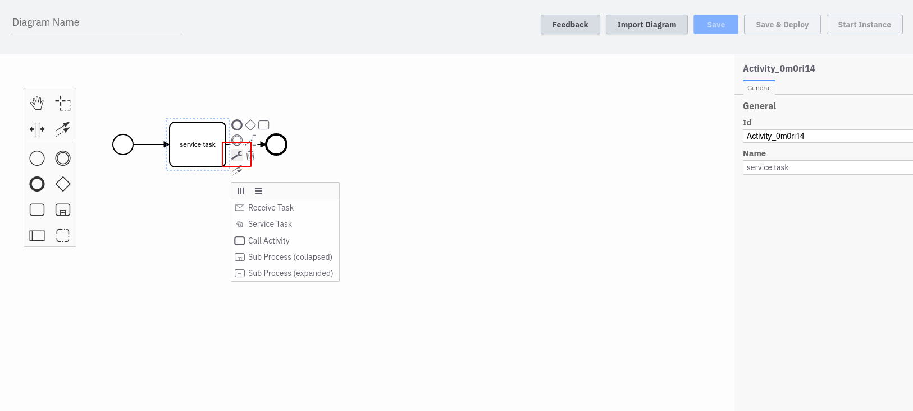
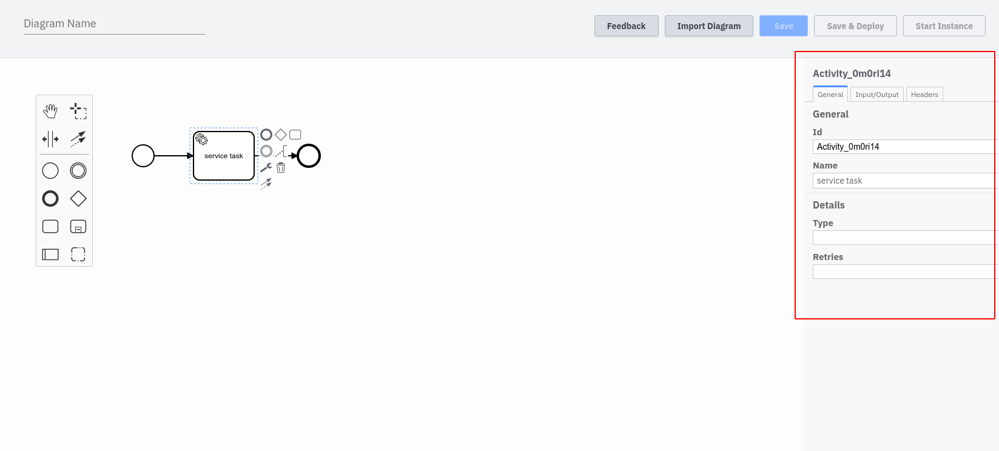

After you have created a new BPMN diagram you can start modeling it. We have preconfigured a very simple diagram - it consists of a start and end event and does not need to be configured further to be deployed. Of course you can add more elements and configure the different events.

On the left side you will find the element palette that is supported by the engine. You can drag and drop the elements into the diagram.

Elements that support different types can be reconfigured by clicking on the corresponding icon. In the following screenshot a task has been added to the diagram. It can be converted to a service task, for example.

Each element has certain attributes that can be changed. The properties panel is located on the right side.

