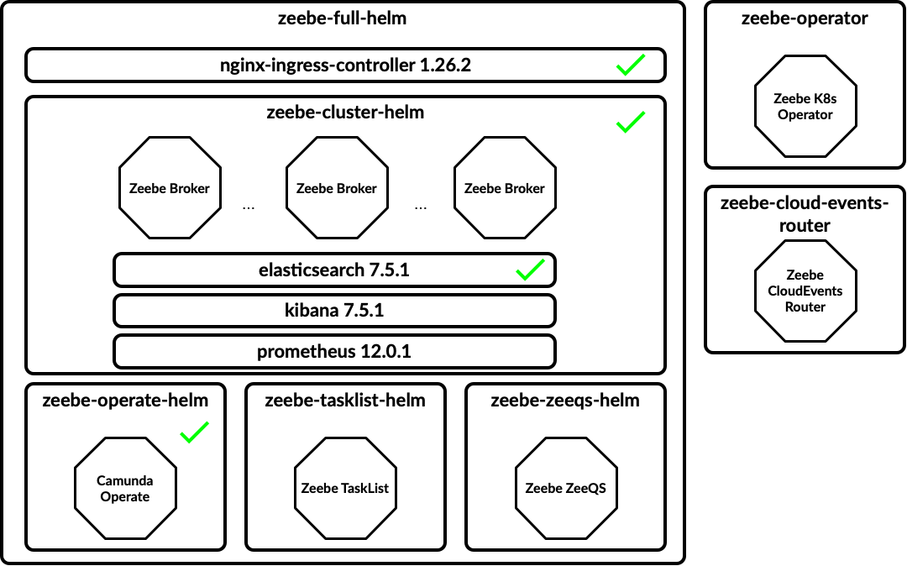

[Helm](https://github.com/helm/helm) is a package manager for Kubernetes resources. Helm allows us to install a set of components by just referencing a package name and it allows us to override configurations to accommodate these packages to different scenarios. Helm also provide dependency management between charts, meaning that charts can depend on other charts allowing us to aggregate a set of components together that can be installed with a single command. 

> Note that all the Helm Charts are provided as a Community effort, these charts are not part of the Zeebe or Camunda Cloud release process, hence not updated as regularly as other artifacts. You are encouraged to get involved, submit fixes and report issues if you find them. 

The following Zeebe Helm Charts are currently available: 

- **Zeebe Cluster Helm (zeebe-cluster-helm)** : Deploys a Zeebe Cluster with 3 brokers using the `camunda/zeebe` docker image. This Chart depends on ElasticSearch Helm Chart and optionally on Kibana Helm Chart. This chart is hosted in the following repository, where you can find more information about its configuration: [http://github.com/camunda-community-hub/zeebe-cluster-helm/](http://github.com/camunda-community-hub/zeebe-cluster-helm/)
- **Zeebe Operate Helm (zeebe-operate-helm)**: Deploys Zeebe Operate which connects to an existing ElasticSearch. This chart source code can be located here: [http://github.com/camunda-community-hub/zeebe-operate-helm/](http://github.com/camunda-community-hub/zeebe-operate-helm/)
- **Zeebe Full Helm (zeebe-full-helm)** (Parent): Deploys a Zeebe Cluster + Operate + Ingress Controller. This parent chart can be located here: [http://github.com/camunda-community-hub/zeebe-full-helm/](http://github.com/camunda-community-hub/zeebe-full-helm/)

- **Zeebe TaskList Helm (zeebe-tasklist-helm)** (Experimental): Deploys a Task List component to deal with User Tasks. This chart source code can be located here: [http://github.com/camunda-community-hub/zeebe-tasklist-helm/](http://github.com/camunda-community-hub/zeebe-tasklist-helm/)

- **Zeebe ZeeQS Helm (zeebe-zeeqs-helm)** (Experimental) Deploys a ZeeQS component that provides a Graphql interface to consume Zeebe Process data. This component requires the Hazelcast Exporter configured in the Zeebe Brokers. This chart source code can be located here: [http://github.com/camunda-community-hub/zeebe-zeeqs-helm/](http://github.com/camunda-community-hub/zeebe-zeeqs-helm/)

- **Zeebe Kubernetes Operator Helm (zeebe-operator)** (Experimental) Deploys the Zeebe Kubernetes Operator. The Zeebe Operator allows you to declarative provision Zeebe Clusters by interacting with the `kubectl` command-line. This chart source code can be located here: [http://github.com/camunda-community-hub/zeebe-operator/](http://github.com/camunda-community-hub/zeebe-operator/)

- **Zeebe CloudEvents Router Helm (zeebe-cloud-events-router)** (Experimental) Deploys the Zeebe CloudEvents Router. This component provides [CloudEvents](http://cloudevents.io) Router to emit and consume CloudEvents from your processes running in Zeebe.



When installing the `zeebe-full-helm` chart all the components marked in green are installed, the remaining components can be enabled by using the flags provided in the `zeebe-full-helm` chart documentation. 

### Add Zeebe Helm Repository

The next step is to add the Zeebe official Helm Chart repository to your installation. Once this is done, Helm will be able to fetch and install Charts hosted in [http://helm.camunda.io](http://helm.camunda.io).
```
> helm repo add zeebe https://helm.camunda.io
> helm repo update
```

Once this is done, we are ready to install any of the Helm Charts hosted in the official Zeebe Helm Chart repo. 


### Install Zeebe Full Helm Chart (Zeebe Cluster + Operate + Ingress Controller)

In this section we are going to install all the available Zeebe components inside a Kubernetes Cluster. Notice that this Kubernetes cluster can have already running services and Zeebe is going to installed just as another set of services. 

```
> helm install <RELEASE NAME> zeebe/zeebe-full-helm
```

> Note: change &gt;RELEASE NAME&lt; with a name of your choice
> Notice that you can add the `-n` flag to specify in which Kubernetes namespace the components should be installed.

Installing all the components in a cluster requires all the Docker images to be downloaded to the remote cluster, depending on which Cloud Provider you are using, the amount of time that it will take to fetch all the images will vary. 

If you are using [Kubernetes KIND](https://github.com/kubernetes-sigs/kind) add `-f kind-values.yaml`
> The `kind-values.yaml` file can be [downloaded here](assets/kind-values.yaml).
```
helm install --name <RELEASE NAME> zeebe/zeebe-full-helm -f kind-values.yaml
```

This will deploy the same components but with a set of parameters tailored to a local environment setup. 
> Note that all the Docker images will be downloaded to your local KIND cluster, so it might take some time for the services to get started. 

You can check the progress of your deployment by checking if the Kubernetes PODs are up and running with:
```
> kubectl get pods
```

which returns something like: 
```
NAME                                                   READY   STATUS    RESTARTS   AGE
elasticsearch-master-0                                 1/1     Running   0          4m6s
elasticsearch-master-1                                 1/1     Running   0          4m6s
elasticsearch-master-2                                 1/1     Running   0          4m6s
<RELEASE NAME>-nginx-ingress-controller-5cf6dd7894-kc25s      1/1     Running   0          4m6s
<RELEASE NAME>-nginx-ingress-default-backend-f5454db5-j9vh6   1/1     Running   0          4m6s
<RELEASE NAME>-operate-5d4867d6d-h9zqw                        1/1     Running   0          4m6s
<RELEASE NAME>-zeebe-0                                        1/1     Running   0          4m6s
<RELEASE NAME>-zeebe-1                                        1/1     Running   0          4m6s
<RELEASE NAME>-zeebe-2                                        1/1     Running   0          4m6s
```

Check that each Pod has at least 1/1 running instances. You can always tail the logs of these pods by running:
```
> kubectl logs -f <POD NAME> 
```

In order to interact with the services inside the cluster you need to use `port-forward` to route traffic from your environment to the cluster. 
```
> kubectl port-forward svc/<RELEASE NAME>-zeebe 26500:26500
```

Now you can connect and execute operations against your newly created Zeebe cluster. 

> Notice that you need to keep `port-forward` running to be able to communicate with the remote cluster.

> Notice that accessing directly to the Zeebe Cluster using `kubectl port-forward` is recommended for development purposes. By default the Zeebe Helm Charts are not exposing the Zeebe Cluster via Ingress. If you want to use `zbctl` or a local client/worker from outside the Kubernetes Cluster, you rely on `kubectl port-forward` to the Zeebe Cluster to communicate.
