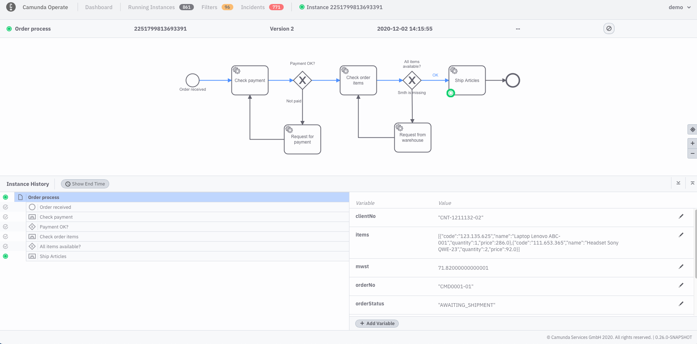

This section "Getting familiar with Operate" and the next section “Variables and incidents” assumes that you’ve deployed a process to Zeebe and have created at least one process instance. 

If you’re not sure how to deploy processes or create instances, we recommend going through the [Getting started tutorial](./guides/getting-started/model-your-first-process.md)

In the following sections, we’ll use the same `order-process.bpmn` process model from the Getting Started guide. 

## View a deployed process

In the **Instances by Process** panel in your dashboard, you should see a list of your deployed processes and running instances. 

When you click on the name of a deployed process in the **Instances by Process** panel, you’ll navigate to a view of that process model along with all running instances.

From this **Running Instances** view, you have the ability to cancel a single running process instance. 

## Inspect a process instance

Running process instances appear in the **Instances** section below the process model. To inspect a specific instance, you can click on the instance id. 

There, you’ll be able to see detail about the process instance, including the instance history and the variables attached to the instance. 

