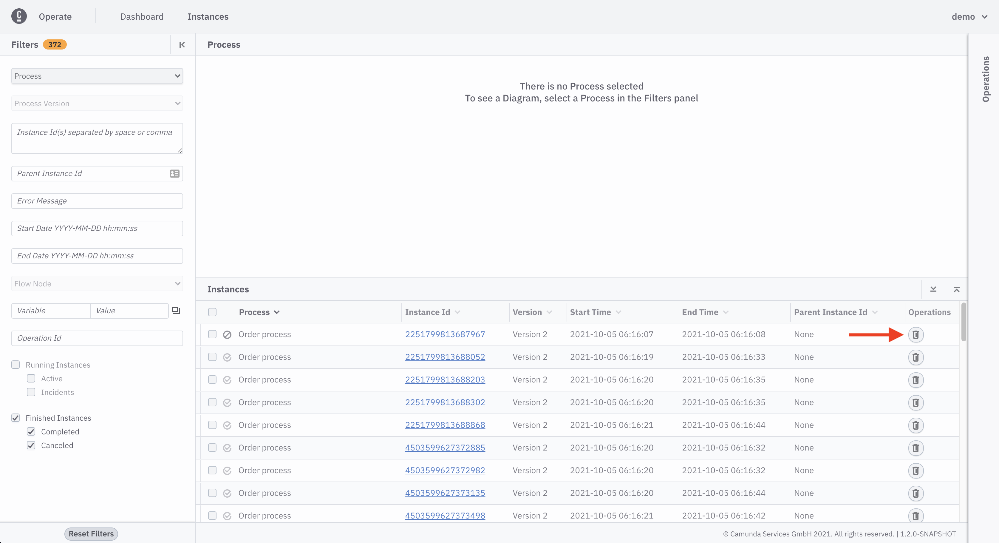
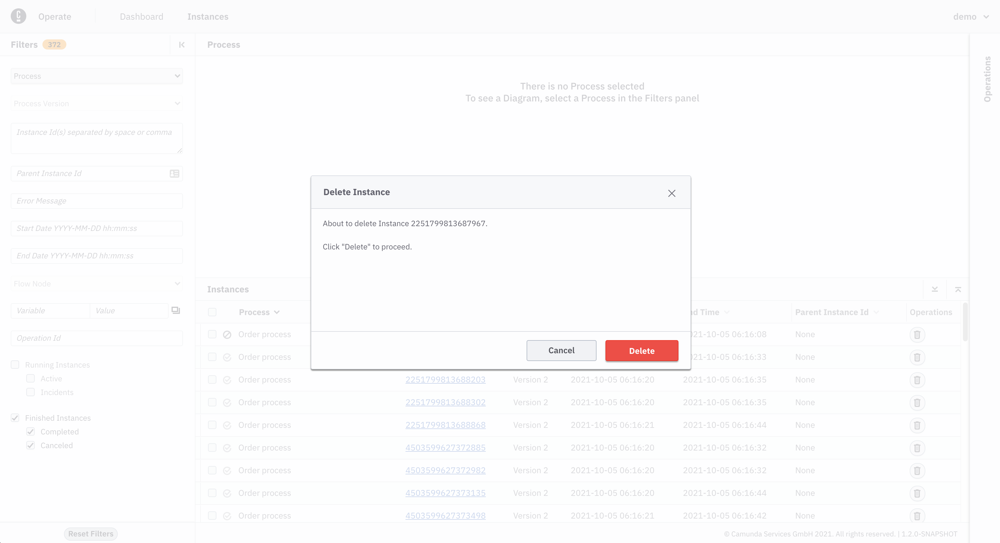
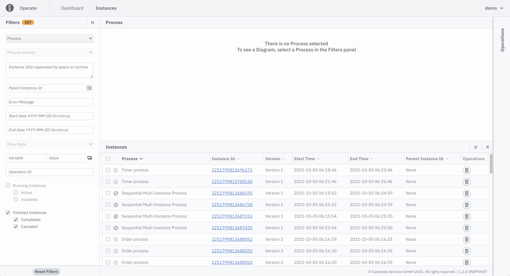
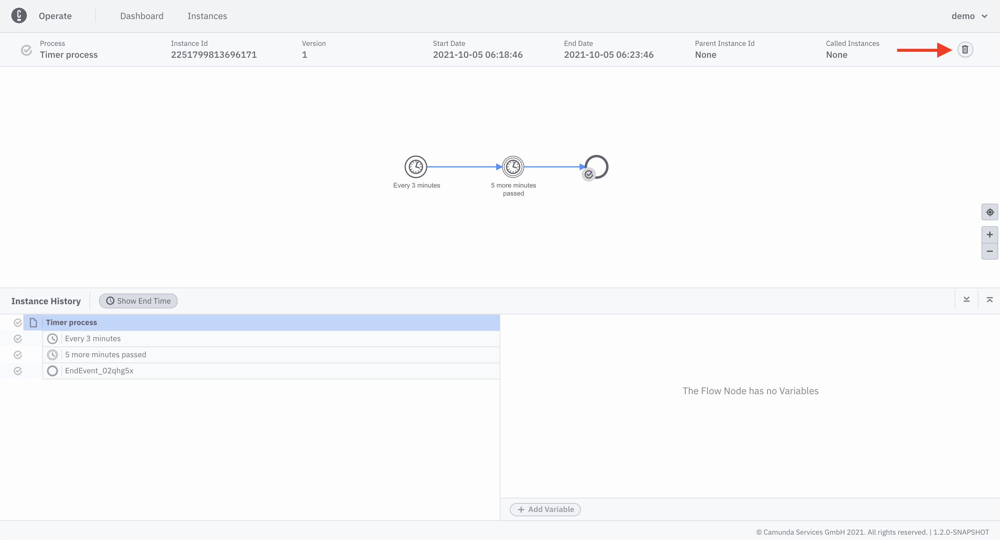
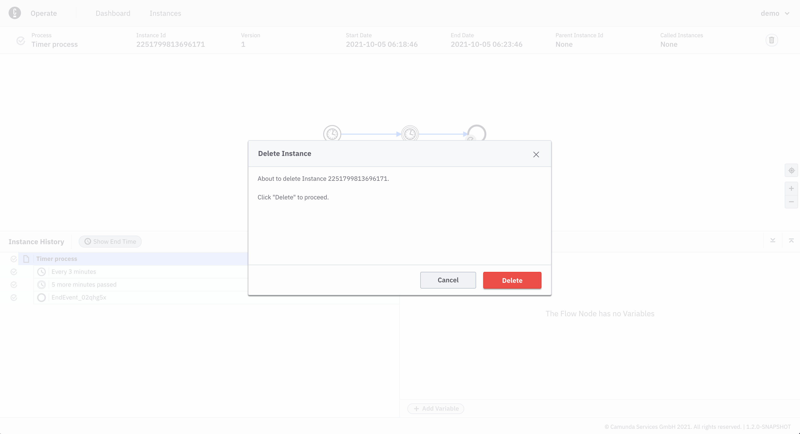

A finished process instance, meaning a canceled or a completed process instance, can be deleted from instances page or instance detail page.

## Delete process instance from instances page

1. On instances page, apply **Finished Instances** filter

2. Click delete icon on any process instance you want to delete

3. Confirm the delete operation by clicking 'Delete'

4. Delete operation can be seen in operations panel

## Delete process instance from instance detail page

1. On instances page, apply **Finished Instances** filter

2. Navigate to instance detail page, by clicking the id of the process instance you want to delete

3. Click the delete icon

4. Confirm the delete operation by clicking 'Delete'

5. Process instance is deleted

