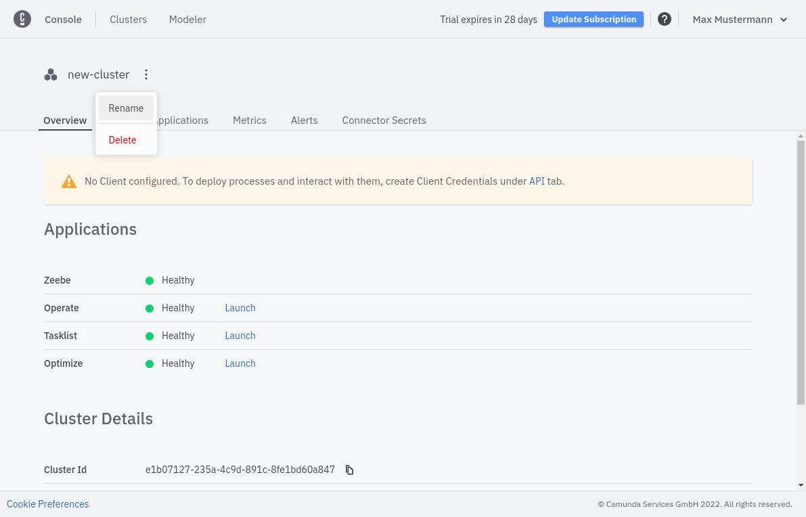

A cluster can be renamed at any time. To rename your cluster, follow the steps below:

1. Open the cluster details by clicking on the cluster name.
2. Select the three vertical dots next to the cluster name near the top of the page to open the cluster's menu.
3. Click **Rename**.

