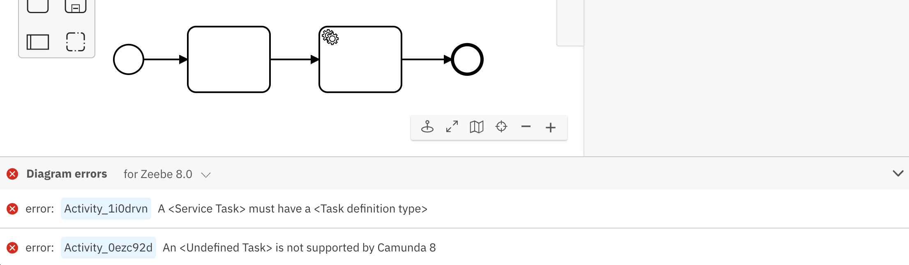

### Design time errors

Based on a set of lint rules, Web Modeler continuously validates implementation properties for a process diagram while the user is modeling. The validation errors are added to the error panel at the bottom of Web Modeler. Expand the error panel to view the errors by clicking the **Diagram errors** header. The panel is collapsed by default and the latest state (expanded or collapsed) is remembered for the next time you open Web Modeler.

### Engine version selection

The version selector can be used to choose the Zeebe version the diagram is validated against. The version chosen should match the Zeebe version of the cluster the diagram is going to be deployed in to get the correct set of errors. The version selector also provides information about the number of clusters available for each Zeebe version within the current organization.

### Interactivity

The errors are interactive. Clicking on the element ID in the error line highlights the corresponding element in the canvas and points to the specific property in the properties panel where you can resolve the issue.

### Deploy time errors

If all the design time errors are fixed and further errors are thrown by the engine when deploying the diagram, these are also shown in the same panel and while you can see these errors, you cannot interact with them the same way as with design time errors.

