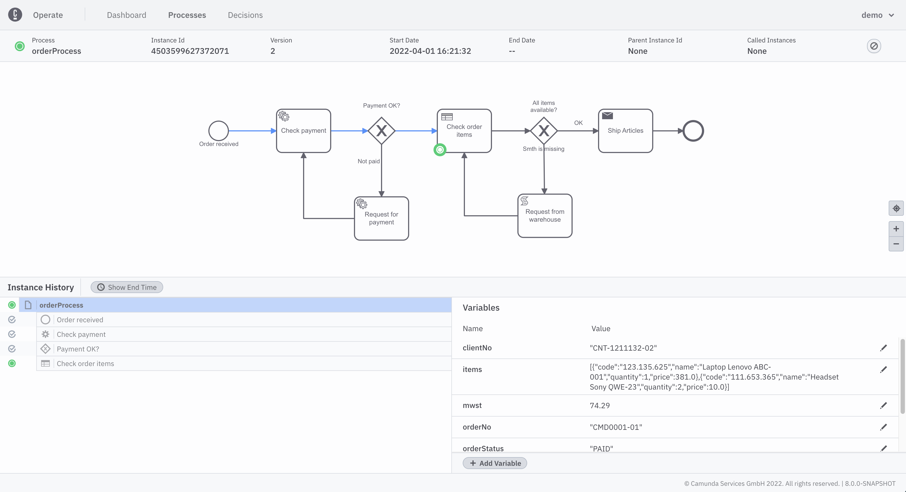

This section and the next section, [variables and incidents](./resolve-incidents-update-variables.md), assumes you’ve deployed a process to Zeebe and created at least one process instance.

If you’re not sure how to deploy processes or create instances, visit our [Guides section](/guides/introduction-to-camunda-platform-8.md).

In the following sections, we’ll use the same [`order-process.bpmn`](./assets/order-process.bpmn) process model.

## View a deployed process

To view a deployed process, take the following steps:

1. In the **Process Instances by Name** panel on your dashboard, note the list of your deployed processes and running instances.

2. When you click on the name of a deployed process in the **Process Instances by Name** panel, you’ll navigate to a view of that process model and all running instances.

3. From this **Processes** tab, you can cancel a single running process instance.

## Inspect a process instance

Running process instances appear in the **Instances** section below the process model. To inspect a specific instance, click on the instance id.

Here, see details about the process instance, including the instance history and the variables attached to the instance.

To visualize the performance of process instances, we recommend utilizing [Optimize]($optimize$/components/what-is-optimize).
