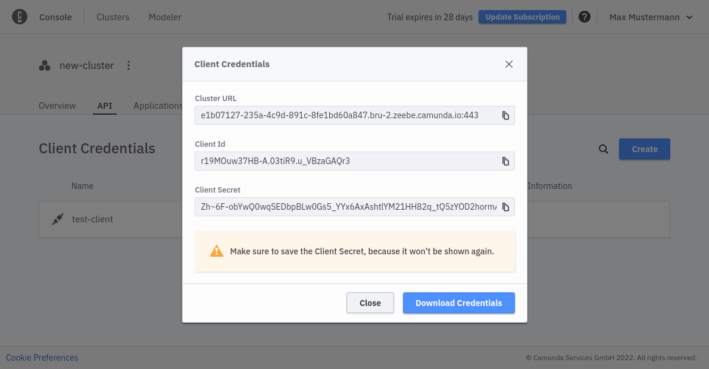

Beginner
Time estimate: Under 5 minutes

Here, we'll set up client connection credentials to create, name, and connect your client.

To create a new client, take the following steps:

1. Navigate to the API tab by clicking **Clusters > `cluster-name` > API**.
   
2. Click **Create** to create a new client and name your client accordingly.
3. Select **Zeebe** so the newly-created client can access your Zeebe instance.
   
4. Make sure you keep the generated client credentials in a safe place. The **Client Secret** will not be shown again. For your convenience, you can also download the client information to your computer.

The downloaded file contains all the necessary information to communicate with your Zeebe instance in the future:

- `ZEEBE_ADDRESS`: Address where your cluster can be reached.
- `ZEEBE_CLIENT_ID` and `ZEEBE_CLIENT_SECRET`: Credentials to request a new access token.
- `ZEEBE_AUTHORIZATION_SERVER_URL`: A new token can be requested at this address, using the credentials.
