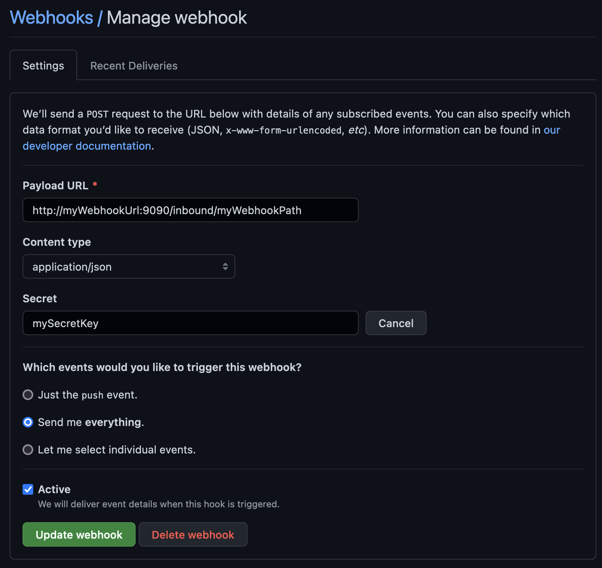

The **GitHub Webhook Connector** allows you to start a BPMN process instance triggered by a [GitHub event](https://docs.github.com/en/developers/webhooks-and-events/webhooks/about-webhooks).

:::note
Inbound Connectors are currently supported only in [Camunda Platform 8 Self-Managed](../../../self-managed/about-self-managed.md).
:::

## Prerequisites (Self-Managed Camunda 8 Platform)

To use the **GitHub Webhook Connector**, you need to [download](https://github.com/camunda/connectors-bundle/tree/main/connectors/github/element-templates) and [install](https://docs.camunda.io/docs/next/components/modeler/desktop-modeler/element-templates/configuring-templates/) the latest element template with your Modeler.

## Create a GitHub Webhook Connector task

1. Start building your BPMN diagram with a **Start Event** building block.
2. Change its template to a GitHub Webhook.
3. Fill in all required properties.
4. Complete your BPMN diagram.
5. Deploy it to your Camunda Platform 8 instance.

## Make your GitHub Webhook Connector for receiving messages executable

1. In the **Webhook Configuration** section, set the **Webhook ID**. This value is used to build a URL endpoint of your webhook. For example, given the `Webhook ID` value is `myWebhookPath`, the complete webhook URL endpoint will be `http(s)://<base URL>/inbound/myWebhookPath`.
2. Set the **GitHub secret**. This is a shared secret key that has to be defined in both your BPMN and GitHub webhook configuration page. The value is used to calculate HMAC authentication signature.
3. Configure **Activation Condition**. For example, given GitHub triggers a webhook endpoint with a new PR payload `{"action": "opened", "pull_request": ...}`, the **Activation Condition** value might look like as `=(request.body.action = "opened")`. Leave this field empty to trigger your webhook every time.
4. Configure **Variable Mapping**. For example, GitHub triggers a webhook endpoint with a new PR payload `{"action": "opened", "pull_request": { "url: "https://...", ... }}` and you would like to extract a PR URL as a process variable `prUrl`. In that case, the **Variable Mapping** might look like `={prUrl: request.body.pull_request.url}`.

## Nest steps

- Learn more about [GitHub webhooks](https://docs.github.com/en/developers/webhooks-and-events/webhooks/about-webhooks).
