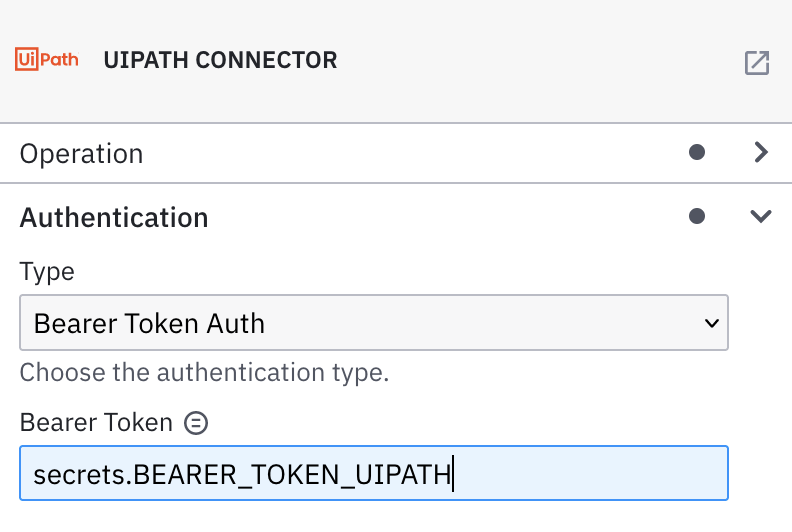

The **UIPath Connector** allows you to orchestrate an UIPath bot from your BPMN process with [UIPath](https://cloud.uipath.com).

## Prerequisites

To use the UIPath Connector, you need have an [UIPath] (https://cloud.uipath.com) account and configure your organization settings. See the [Automation Cloud Guide](https://docs.uipath.com/automation-cloud/docs/introduction) to learn more.

## Create a UIPath Connector task

To use a **UIPath Connector** in your process, either change the type of existing task using the wrench-shaped **Change type** context menu, or create a new Connector task by using the **Append Connector** context menu. Follow [our guide on using Connectors](../use-connectors.md) to learn more.

## Operation types

UIPath Connector supports two operation types: 'Add Queue Item' and 'Get Queue Item result by ID'. You can select the one that you need from the 'Operation type' dropdown list .


### Authentication

You can choose among the available UIPath Connector authentication types according to your authentication requirements.

### UIPath Connector (Bearer Token)

#### Create a new Connector secret

We advise you to keep your **Bearer Token** safe and avoid exposing it in the BPMN `xml` file by creating a secret:

1. Follow our [guide for creating secrets](../../console/manage-clusters/manage-secrets.md).
2. Name your secret (i.e `BEARER_TOKEN_UIPATH`) so you can reference it later in the Connector.

#### Configure the Bearer Token

Select the **UIPath Connector** and fill out the following properties under the **Authentication** section:

1. Click **Bearer Token** in the **Authentication** section.
2. Set **Bearer** to the secret you created (i.e. `secrets.UIPATH_BEARER_TOKEN`).



### UIPath Connector (OAuth token)

#### Create a new Connector secret

We advise you to keep your **Client ID** safe and avoid exposing it in the BPMN `xml` file by creating a secret:

1. Follow our [guide for creating secrets](../../console/manage-clusters/manage-secrets.md).
2. Name your secret (i.e `UIPATH_CLIENT_ID`) so you can reference it later in the Connector.

#### Configure the OAuth Token

Select the **UIPath Connector** and fill out the following properties under the **Authentication** section:

1. Click **OAuth 2.0** in the **Authentication** section.
2. Set **Client ID** to the secret you created (i.e. `secrets.UIPATH_CLIENT_ID`).
3. Set **Client secret** to the secret you created (i.e. `secrets.UIPATH_CLIENT_SECRET`).
4. Choose **Client Authentication** from the dropdown menu (i.e. `Send client credentials in body`).


Find more information about the OAuth client credentials flow at the [RFC reference](https://www.rfc-editor.org/rfc/rfc6749#section-4.4).

### Add Queue Item

This operation allows you to create a new item and add it to a queue from UIPath Orchestrator. In order to execute it, you need to take the following steps:

1. Select the operation 'Add Queue Item' from 'Operation type' dropdown list.
2. Configure authentication as described in section [Authentication](#authentication)
3. Fill input fields as described in section [Configuration](#configuration)
4. Fill input fields as described in section [Input] (#Input)
5. Fill response mapping as described in section [[Add Queue Item response]](#add-queue-item-response)


#### Configuration

For this section, you have to fill the following fields:

1. Cloud Url - it comes with a default value 'cloud.uipath.com'. You can always change it, if needed.
2. Cloud Org - fill it with the name of your organization. See [About organizations](https://docs.uipath.com/automation-cloud/docs/about-organizations) to learn more.
3. Cloud Tenant - fill it with the name of the tenant. See [About tenants](https://docs.uipath.com/automation-cloud/docs/about-tenants) to learn more.
4. Organization Unit Id - click on 'Orchestrator' and you will find the id in the URL as in the following example: 'https://cloud.uipath.com/testOrg/DefaultTenant/orchestrator_/?tid=26929&fid=1964513' where 'Organization Unit Id' is 1964513.


#### Input

For this section, you have to fill the following fields:

1. Queue Name - it is the queue where the QueueItem object is to be added. Check [Queues and transactions](https://docs.uipath.com/orchestrator/docs/about-queues-and-transactions) to learn more.
2. (Optional) DeferDate - The earliest date and time at which the item is available for processing. If empty the item can be processed as soon as possible. Expected date format: 'yyyy-MM-dd'.
3. (Optional) DueDate - The latest date and time at which the item should be processed. If empty the item can be processed at any given time. Expected date format: 'yyyy-MM-dd'.
4. (Optional) Priority - select a value from the dropdown list. The priority level of the queue item to be added. This property is a criterion for the prioritization of queue items, alongside Deadline and Postpone.
5. (Optional) Specific Content for UIPath Job - Data that will be passed in to the job. It should be in the JSON format.

```
={
   "Name":"testItemName",
   "Value":"testItemValue"
 }
```

6. (Optional) Reference - A string reference for the queue item.

#### Add Queue Item response

The operation **Add Queue Item** returns information about the newly created item in the queue.

You can use an output mapping to map the response:

1. Use **Result Variable** to store the response in a process variable. For example, `myResultVariable`.
2. Use **Result Expression** to map fields from the response into process variables. It comes with a prefilled value '{itemId: response.body.Id}'. If you want to use operation 'Get Queue Item result by ID', you need an itemId. This expression will add it in the context for you. See more in section [Get Queue Item result by ID](#get-queue-item-result-by-id)

Response example:

```
= {
   "status":201,
   "headers":{
      "date":"Fri, 20 Jan 2023 10:13:20 GMT",
      "content-length":878,
      "server":"cloudflare",
      "expires":"-1",
      "cf-ray":"78c70973ce68153b-CDG",
      "api-supported-versions":"15.0",
      "x-frame-options":"Deny",
      "x-download-options":"noopen",
      "x-correlation-id":"7a211afe-53f1-4225-b77c-0fa477912685",
      "cf-cache-status":"DYNAMIC",
      "x-uipath-correlation-id":"undefined",
      "pragma":"no-cache",
      "strict-transport-security":"max-age=15724800; includeSubDomains",
      "request-context":"appId=cid-v1:354c7cb9-ae5a-4d16-84a7-f13242bbac6d",
      "content-security-policy":"default-src 'self';script-src 'self' https://orch-cdn.uipath.com https://use.typekit.net/ https://d2c7xlmseob604.cloudfront.net https://platform-cdn.uipath.com https://*.uipath.com https://*.pendo.io;style-src 'self' 'unsafe-inline' https://orch-cdn.uipath.com https://fonts.googleapis.com/css https://use.typekit.net https://p.typekit.net/ https://platform-cdn.uipath.com https://content.usage.uipath.com;img-src 'self' data: https://orch-cdn.uipath.com https://s.gravatar.com https://secure.gravatar.com https://*.wp.com https://*.googleusercontent.com https://i.ytimg.com https://platform-cdn.uipath.com https://*.pendo.io https://*.blob.core.windows.net https://*.amazonaws.com blob:;frame-src 'self' https://*.uipath.com https://*.pendo.io;font-src 'self' https://orch-cdn.uipath.com https://use.typekit.net/ https://fonts.gstatic.com https://platform-cdn.uipath.com data:;connect-src 'self' wss: https://orch-cdn.uipath.com https://primer.typekit.net https://use.typekit.net/ https://sentry.io https://studio-feedback.azure-api.net https://app.launchdarkly.com https://clientstream.launchdarkly.com https://events.launchdarkly.com https://api.smartling.com https://platform-cdn.uipath.com https://*.service.signalr.net https://*.uipath.com https://*.pendo.io https://cloud.uipath.com https://storage.googleapis.com https://*.blob.core.windows.net https://*.amazonaws.com dc.services.visualstudio.com;worker-src 'self' blob:",
      "x-xss-protection":"1",
      "x-content-type-options":"nosniff",
      "x-robots-tag":"noindex,nofollow",
      "content-type":"application/json; odata.metadata=minimal; odata.streaming=true",
      "location":"https://cloud.uipath.com/camunda1/DefaultTenant/orchestrator_/odata/QueueItems(436141352)",
      "connection":"keep-alive",
      "cache-control":"no-cache, no-store, must-revalidate",
      "odata-version":"4.0"
   },
   "body":{
      "@odata.context":"https://cloud.uipath.com/camunda1/DefaultTenant/orchestrator_/odata/$metadata#QueueItems/$entity",
      "QueueDefinitionId":165001,
      "Encrypted":false,
      "Status":"New",
      "ReviewStatus":"None",
      "Key":"2196eb07-c96a-4f47-a734-326dd5d58a9d",
      "Reference":"test",
      "Priority":"Low",
      "DeferDate":"2023-01-12T00:00:00Z",
      "SecondsInPreviousAttempts":0,
      "RetryNumber":0,
      "SpecificData":"{\"DynamicProperties\":{\"test\":\"test\"}}",
      "CreationTime":"2023-01-20T10:13:20.6603953Z",
      "RowVersion":"AAAAAE2f4GY=",
      "OrganizationUnitId":1964413,
      "Id":436141352,
      "SpecificContent":{
         "test":"test"
      }
   }
}
```

### Get Queue Item result by ID

This operation allows you get the information related to a certain item from your UIPath Orchestrator. In order to execute it, you need to take the following steps:

1. Select the operation 'Get Queue Item result by ID' from the dropdown list 'Operation type'.
2. Configure authentication as described in section [Authentication](#authentication)
3. Fill response mapping as described in section [Get Queue Item result by ID response](#get-queue-item-result-by-id-response)


#### Get Queue Item result by ID response

Given you have a queue item ID previously added to a queue, the operation **Get Queue Item result by ID** returns information about a certain item.

You can use an output mapping to map the response:

1. Use **Result Variable** to store the response in a process variable. For example, `myResultVariable`.
2. Use **Result Expression** to map fields from the response into process variables. It comes with a prefilled value '{response.body.value[1].Status}'. You will see the 'itemStatus' in the process variables. Its value will let you know if the item was processed or not.

Response example:

```
{
   "status":200,
   "headers":{
      "date":"Fri, 20 Jan 2023 10:13:21 GMT",
      "server":"cloudflare",
      "expires":"-1",
      "transfer-encoding":"chunked",
      "cf-ray":"78c709774a112a34-CDG",
      "api-supported-versions":"15.0",
      "x-frame-options":"Deny",
      "x-download-options":"noopen",
      "x-correlation-id":"8db50244-5f55-4598-82d3-1d6a00f806b0",
      "cf-cache-status":"DYNAMIC",
      "x-uipath-correlation-id":"undefined",
      "pragma":"no-cache",
      "strict-transport-security":"max-age=15724800; includeSubDomains",
      "request-context":"appId=cid-v1:354c7cb9-ae5a-4d16-84a7-f13242bbac6d",
      "content-security-policy":"default-src 'self';script-src 'self' https://orch-cdn.uipath.com https://use.typekit.net/ https://d2c7xlmseob604.cloudfront.net https://platform-cdn.uipath.com https://*.uipath.com https://*.pendo.io;style-src 'self' 'unsafe-inline' https://orch-cdn.uipath.com https://fonts.googleapis.com/css https://use.typekit.net https://p.typekit.net/ https://platform-cdn.uipath.com https://content.usage.uipath.com;img-src 'self' data: https://orch-cdn.uipath.com https://s.gravatar.com https://secure.gravatar.com https://*.wp.com https://*.googleusercontent.com https://i.ytimg.com https://platform-cdn.uipath.com https://*.pendo.io https://*.blob.core.windows.net https://*.amazonaws.com blob:;frame-src 'self' https://*.uipath.com https://*.pendo.io;font-src 'self' https://orch-cdn.uipath.com https://use.typekit.net/ https://fonts.gstatic.com https://platform-cdn.uipath.com data:;connect-src 'self' wss: https://orch-cdn.uipath.com https://primer.typekit.net https://use.typekit.net/ https://sentry.io https://studio-feedback.azure-api.net https://app.launchdarkly.com https://clientstream.launchdarkly.com https://events.launchdarkly.com https://api.smartling.com https://platform-cdn.uipath.com https://*.service.signalr.net https://*.uipath.com https://*.pendo.io https://cloud.uipath.com https://storage.googleapis.com https://*.blob.core.windows.net https://*.amazonaws.com dc.services.visualstudio.com;worker-src 'self' blob:",
      "x-xss-protection":"1",
      "x-content-type-options":"nosniff",
      "x-robots-tag":"noindex,nofollow",
      "content-type":"application/json; odata.metadata=minimal; odata.streaming=true",
      "connection":"keep-alive",
      "cache-control":"no-cache, no-store, must-revalidate",
      "odata-version":"4.0"
   },
   "body":{
      "@odata.context":"https://cloud.uipath.com/camunda1/DefaultTenant/orchestrator_/odata/$metadata#QueueItems",
      "@odata.count":1,
      "value":[
         {
            "QueueDefinitionId":165001,
            "Encrypted":false,
            "Status":"New",
            "ReviewStatus":"None",
            "Key":"2196eb07-c96a-4f47-a734-326dd5d58a9d",
            "Reference":"test",
            "Priority":"Low",
            "DeferDate":"2023-01-12T00:00:00Z",
            "SecondsInPreviousAttempts":0,
            "RetryNumber":0,
            "SpecificData":"{\"DynamicProperties\":{\"test\":\"test\"}}",
            "CreationTime":"2023-01-20T10:13:20.66Z",
            "RowVersion":"AAAAAE2f4GY=",
            "OrganizationUnitId":1964413,
            "OrganizationUnitFullyQualifiedName":"MyCorporateWorkspace",
            "Id":436141352,
            "SpecificContent":{
               "test":"test"
            }
         }
      ]
   }
}
```
