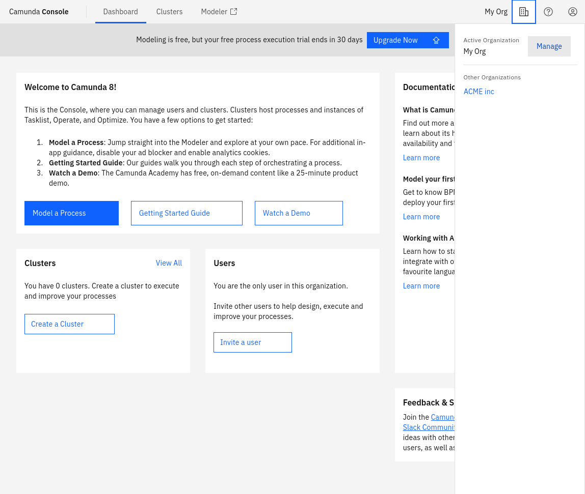

Organization management can be accessed via the menu in the navigation bar.

### Overview

The overview provides a summary of the organization, including:

- Organization name
- Pricing plan
- Owner of the organization

#### Rename organization

If you are the owner of the organization, you can change the name of your organization in the **Overview** tab.

## Next steps

- [Manage users of your organization](./manage-users.md)
- [View organization activity](./view-organization-activity.md)
