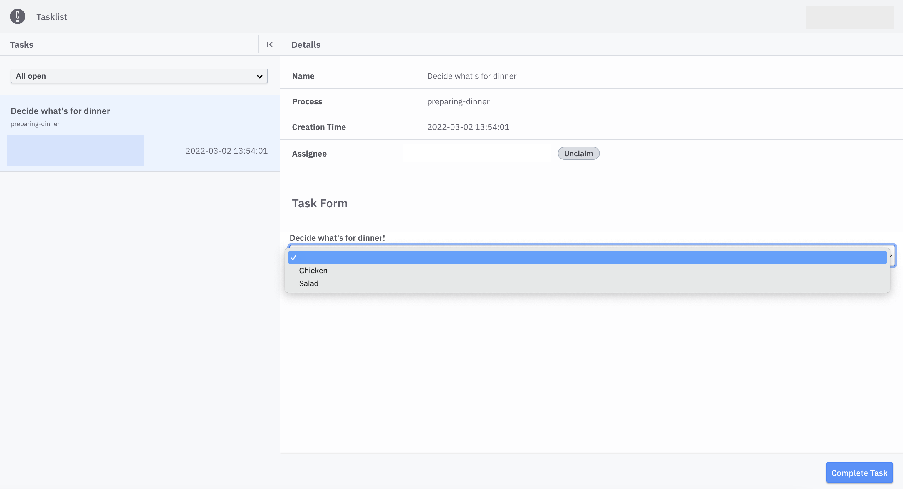

Beginner
Time estimate: 15 minutes

import clsx from "clsx";

Using [Camunda 8](https://camunda.io), you can orchestrate human tasks by assigning them to users. Then, users can enter the necessary data to drive the business process.

When a process instance arrives at such a user task, a new job is created. The process instance stops at this point and waits until the job is completed. Applications like [Tasklist](/components/tasklist/introduction-to-tasklist.md) can be used by humans to complete these tasks.

While it may originally seem like the goal of automating a process is to remove humans entirely, efficiently allocating work through user tasks can be even more beneficial.

In this guide, we’ll step through one way to create an automated process utilizing user tasks – all entirely executable in the browser. If you prefer a video-based learning experience, visit [this Camunda Academy course](https://bit.ly/3PJJocB) on Camunda 8 and getting started with human workflows.

## Create an automated process with user tasks

To create an automated process with [user tasks](/components/modeler/bpmn/user-tasks/user-tasks.md), take the following steps:

### Develop your automated process with user tasks

1. To create a BPMN diagram, navigate to Web Modeler via the **Modeler** tab, and click **New project**.
2. Name your project and select **New > BPMN Diagram > + Create blank**.
3. Give your model a descriptive name, and then give your model a descriptive id within the **General** tab inside the properties panel on the right side of the screen. In this case, we've named our model `Preparing dinner` with an id of `preparing-dinner`.
   
4. Use Web Modeler to design a BPMN flow with user tasks. Create a user task by dragging the task icon from the palette, or click the existing start event and the displayed task icon.
5. Change the task type by clicking the wrench icon. Select **User Task**.
   
6. Add a descriptive name using the properties panel. In this case, we've named ours `Decide what's for dinner`.
7. Append an exclusive [gateway](/components/modeler/bpmn/gateways.md) to your user task by clicking on the user task `Decide what's for dinner` and clicking on the element you'd like to create next. In this case, we've selected the diamond icon to create a gateway.
8. Create two sequence flows (represented by the arrows) from the gateway and two new user tasks based on what the user decides to eat. In this case, we've named ours `Prepare chicken` and `Prepare salad`.
9. Sequence flows require expressions to access variables from the form we'll create below to determine what to eat for dinner. To add an [expression](/components/concepts/expressions.md), click on the sequence flow to view the properties panel, and open the **Condition** tab to insert a conditional expression.
10. Verify the sequences flows have the following expressions: `= meal = "Salad"`on one side, and `= meal = "Chicken"`on the other.

    

11. Attach the two user tasks and an end event.

    

:::note
Are you new to BPMN or want to learn more? Visit our [BPMN cheat sheet](https://page.camunda.com/wp-bpmn-2-0-business-process-model-and-notation-en) for an overview of all BPMN symbols.
Variables are part of a process instance and represent the data of the instance. To learn more about these values, variable scope, and input/output mappings, visit our documentation on [variables](/components/concepts/variables.md).
:::

### Implement a form

1. Navigate to the Modeler **Home** page and click the project you are working on. Then, click **New > Form**.
2. Name your form. In this case, we've named ours `Dinner Options`.
3. Click and drag the **Select** element onto the palette. Give this **Select** field a description within the properties panel. We've labeled ours as `What's for dinner?`. Additionally, we need to set a key which maps to a process variable. As already defined by the conditions in the process model we are going to use the variable `meal`.
4. Scroll down to the **Values** section of the properties panel to add your values. For our dinner add an extra value by clicking on the plus sign. Enter the value `Chicken` with the label as `Chicken` and enter the value `Salad` with the label as `Salad` in the other value.

   

5. Within your BPMN diagram, click the appropriate user task, and click the blue square icon in the bottom right corner of your user task. Select the form you'd like to apply to your user task, and click **Import** to add the form to the BPMN diagram.
   

### Start and view your process instance

1. To deploy your diagram, click **Deploy diagram > Deploy**.
   :::note
   If you have not yet created a cluster, clicking **Deploy diagram** will take you to the console to create a cluster. Once you make your cluster creation request, you will automatically be redirected back to Modeler. The creation of a cluster can take 1 to 5 minutes. To read more about creating clusters, visit our documentation on [creating a cluster](create-cluster.md).
   :::
2. To officially start a new process instance, click **Start instance**.
3. Navigate to [Operate](/components/operate/operate-introduction.md) by clicking the honeycomb icon next to the **Start instance** button.
4. Click **View process instances** to see your process instance alongside the green token waiting at the user task.

### Complete a user task

Within this example, we've included a form to demonstrate the completion of a human task. To learn more about creating forms within your diagrams, visit our guide on [building forms with Modeler](/components/modeler/bpmn/user-tasks/user-tasks.md#user-task-forms).

1. Go back to your Camunda 8 diagram and select the honeycomb icon and then **View user tasks** to take a look at your user tasks inside Tasklist.
2. Select the open user task on the left panel of **Tasks**. In our example below, this is **Decide what's for dinner**.
3. Next to **Assignee**, click **Claim** to claim the task.
4. Once finished entering the appropriate information, click **Complete Task**.
   
5. On the left panel of **Tasks**, filter by **Completed** tasks to see your task has been finished.

You can now navigate back to Operate and notice the process instance has continued, and the token has moved forward.

The token moves through the exclusive gateway (also called the XOR gateway), and is used to model the decision in the process. When the execution arrives at this gateway, all outgoing sequence flows are evaluated in the order in which they have been defined. The sequence flow which condition evaluates to ‘true’ (or which doesn’t have a condition set, conceptually having a ‘true’ value defined on the sequence flow) is selected for continuing the process.

:::note
Here, after implementing your gateway, is when [expressions](/components/concepts/expressions.md) will become useful in accessing [variables](/components/concepts/variables.md) and calculating their value to move forward in a process.
:::

In this case, the token will move through the gateway and (according to the conditional expressions we outlined earlier) to the selected dinner based on the **Decide what's for dinner** user task we completed. If we select **Chicken**, the token moves forward to **Prepare chicken**. If we select **Salad**, the token moves forward to **Prepare salad**.

## Wrap up

At this point, you've successfully crafted a human-centered process that routes the process flow based on a decision made by a user.

A core value of Camunda 8 lies in the combination of automation and human interaction. Continue with the following resources to learn about intelligent task assignments, flexible forms to capture data and decisions, operational insights to refine task efficiency, and pathways to publish your processes to users via Tasklist or even publicly.

Don't want to build the process yourself? Click this button to create it from a template in Camunda 8 SaaS, or sign up first.

   <a
      className={clsx(
         "button button--outline button--secondary button--lg"
      )}
      href="https://modeler.cloud.camunda.io/tutorial/quick-start-human-tasks?utm_source=docs.camunda.io.gettingstarted">
      Open model in Camunda
   </a>
   <a
      className={clsx(
         "button button--outline button--secondary button--lg"
      )}
      href="https://signup.camunda.com/accounts?utm_source=docs.camunda.io&utm_medium=referral">
      Sign up
   </a>

## Additional resources and next steps

- [Video-based Human Task Orchestration Course](https://bit.ly/3PJJocB)
- [BPMN user tasks](/components/modeler/bpmn/user-tasks/user-tasks.md)
- [Building Forms with Modeler](./utilizing-forms.md)
- [Introduction to Operate](/components/operate/operate-introduction.md)
- [Introduction to Tasklist](/components/tasklist/introduction-to-tasklist.md)
- [Intermediate Modeler example](https://github.com/NPDeehan/Whos50GameCamundaCloud)
