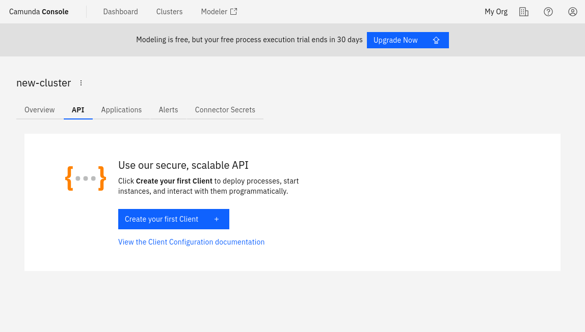
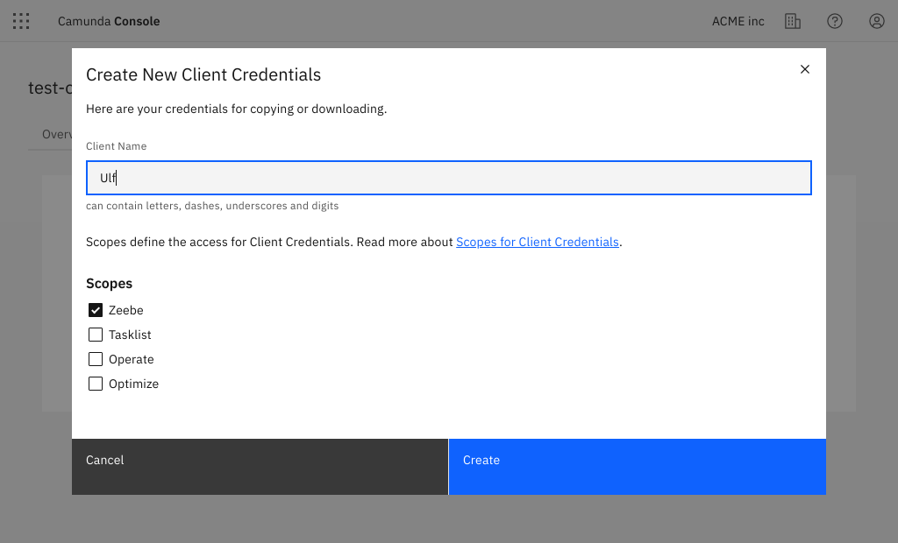

## Set up client connection credentials

Here, we'll set up client connection credentials to create, name, and connect your client.

To create a new client, take the following steps:

1. Navigate to the **API** tab [in Camunda Console](https://console.cloud.camunda.io/) by clicking **Clusters > `cluster-name` > API**.
   
2. Click **Create** to create a new client and name your client accordingly.
3. Select **Zeebe** so the newly-created client can access your Zeebe instance.
   
4. Make sure you keep the generated client credentials in a safe place. The **Client Secret** will not be shown again. For your convenience, you can also download the client information to your computer.

The downloaded file contains all the necessary information to communicate with your Camunda Platform 8 instance in the future:

- `ZEEBE_ADDRESS`: Address where your cluster can be reached.
- `ZEEBE_CLIENT_ID` and `ZEEBE_CLIENT_SECRET`: Credentials to request a new access token.
- `ZEEBE_AUTHORIZATION_SERVER_URL`: A new token can be requested at this address using the credentials.
- `ZEEBE_TOKEN_AUDIENCE`: The audience for a Zeebe token request.
- `CAMUNDA_CLUSTER_ID`: The UUID of the cluster.
- `CAMUNDA_CLUSTER_REGION`: The region of the cluster.
- `CAMUNDA_CREDENTIALS_SCOPES`: A comma-separated list of the scopes this credential set is valid for.
- `CAMUNDA_OAUTH_URL`: A new token can be requested at this address using the credentials. Duplicates the earlier Zeebe-focused variable.

Depending on the scopes granted to these client credentials, the following variables may also be present:

- `CAMUNDA_TASKLIST_BASE_URL`: The base URL for the Tasklist API.
- `CAMUNDA_OPTIMIZE_BASE_URL`: The base URL for the Optimize API.
- `CAMUNDA_OPERATE_BASE_URL`: The base URL for the Operate API.
