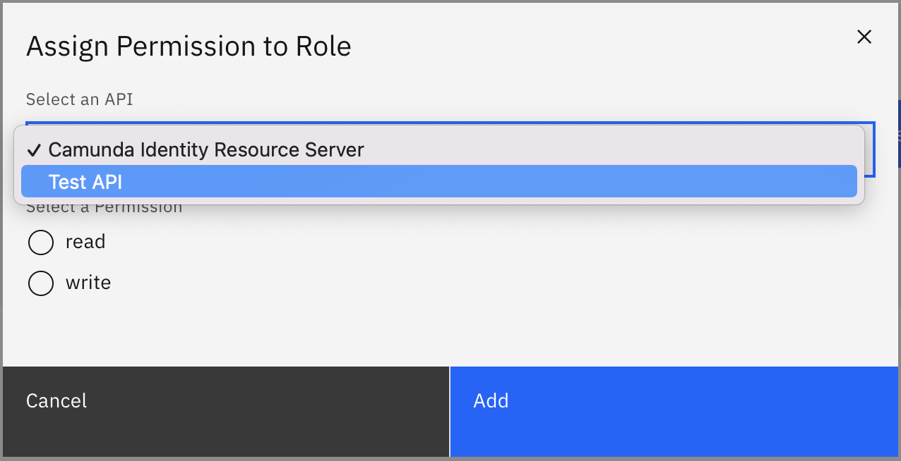

In this guide we will show you how to use Identity to assign a permission to a role.

:::caution Write access needed
To assign a permission to a role, you need to have write access to Identity.
Read our [guide on managing user access](managing-user-access.md) to learn more.
:::

To assign a permission to a role using Identity, take the following steps:

1. Log in to the Identity UI and navigate to the **Roles** tab, select **Permissions**, and click on **Assign Permission**:

2. Select the API which contains the permission you want to assign:

3. Select the permission you would like to assign and click **Add**

On confirmation, the modal will close, the table will update, and your assigned permission will be shown:

