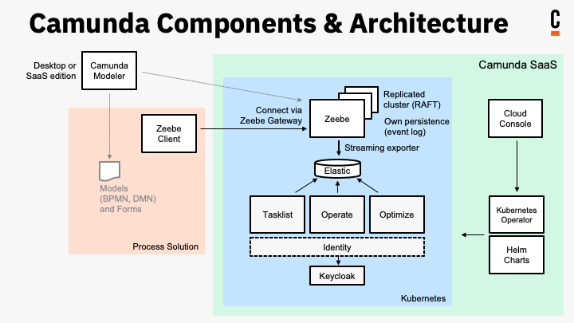

import DocCardList from '@theme/DocCardList';

This section steps through two concepts for integration:

- **Control your Camunda 8 process automation** by [deploying processes](/components/modeler/web-modeler/run-or-publish-your-process.md#deploy-a-process), [starting process instances](/components/modeler/web-modeler/run-or-publish-your-process.md), [activating jobs](/components/concepts/job-workers.md), and more using supplemental and community-maintained **Zeebe client libraries**.
- **Interact with the Camunda 8 ecosystem** by learning about [Camunda Components](/components/components-overview.md) and their APIs to communicate with your cluster, search, get and change data, create Cloud API clients, and more.

:::note
You're permitted to use these web apps and APIs for free with the Free Edition in non-production environments. To use the software in production, [purchase the Camunda Enterprise Edition](https://camunda.com/products/cloud/camunda-cloud-enterprise-contact/). Read more in our [licensing](../reference/licenses.md) documentation.
:::

## Deploy processes, start process instances, and more using Zeebe client libraries

Clients allow applications to do the following:

- Deploy processes.
- Start and cancel process instances.
- Activate jobs, work on those jobs, and subsequently complete or fail jobs.
- Publish messages.
- Update process instance variables and resolve incidents.

The official clients mentioned below interact with [Zeebe](/components/zeebe/zeebe-overview.md), the workflow engine integrated into Camunda 8. All clients require [setting up client credentials](/guides/setup-client-connection-credentials.md) to authenticate. Clients connect to Camunda 8 via [gRPC](https://grpc.io), a high-performance, open source, and universal RPC protocol.

Camunda 8 provides several official clients based on this API. Official clients have been developed and tested by Camunda. They also add convenience functions (for example, thread handling for job workers) on top of the core API.

### Official Zeebe clients

Official clients have been developed and tested by Camunda. They also add convenience functions (e.g. thread handling for job workers) on top of the core API.

<DocCardList items={[{type:"link", href:"/docs/next/apis-tools/cli-client/", label: "CLI client", docId:"apis-tools/cli-client/index"},
{
type:"link", href:"/docs/next/apis-tools/go-client/go-get-started/", label: "Go client", docId:"apis-tools/go-client/index",
},
{
type:"link", href:"/docs/next/apis-tools/java-client/", label: "Java client", docId:"apis-tools/java-client/index"
}
]}/>

:::note
Other components in Camunda 8, such as [Tasklist API (GraphQL)](../apis-tools/tasklist-api/generated.md), provide language-agnostic APIs, but no clients to interact with them. GraphQL enables you to query, claim, and complete user tasks.
:::

### Community clients

Community clients supplement the official clients. These clients have not been tested by Camunda.

- [C#](../apis-tools/community-clients/c-sharp.md)
- [JavaScript/NodeJS](../apis-tools/community-clients/javascript.md)
- [Micronaut](../apis-tools/community-clients/micronaut.md)
- [Python](../apis-tools/community-clients/python.md)
- [Ruby](../apis-tools/community-clients/ruby.md)
- [Rust](../apis-tools/community-clients/rust.md)
- [Spring](../apis-tools/community-clients/spring.md)
- [Quarkus](../apis-tools/community-clients/quarkus.md)

It is also possible to [build your own client](../apis-tools/build-your-own-client.md) You can browse other community extensions and the most up-to-date list of community clients [here](https://github.com/orgs/camunda-community-hub/repositories).

## Learn about Camunda Components and their APIs

Camunda 8 components have APIs to enable polyglot developers to work with in their programming language of choice. Below are links to available component APIs.

### API Reference

<DocCardList items={[{type:"link", href:"/docs/next/apis-tools/console-api-reference/", label: "Console API (REST)", docId:"apis-tools/console-api-reference"},
{
type:"link", href:"/docs/next/apis-tools/operate-api/overview/", label: "Operate API (REST)", docId:"apis-tools/operate-api/operate-api-overview"
},
{
type:"link", href:"/optimize/apis-tools/optimize-api/optimize-api-authorization/", label: "Optimize API (REST)"
},
{
type:"link", href:"/docs/next/apis-tools/tasklist-api/tasklist-api-overview/", label: "Tasklist API (GraphQL)", docId:"apis-tools/tasklist-api/tasklist-api-overview"
},
{
type:"link", href:"/docs/next/apis-tools/tasklist-api-rest/tasklist-api-rest-overview/", label: "Tasklist API (REST)", docId:"apis-tools/tasklist-api-rest/tasklist-api-rest-overview"
},
{
type:"link", href:"/docs/next/apis-tools/web-modeler-api/", label: "Web Modeler API (Beta, REST)", docId:"apis-tools/web-modeler-api/index"
},
{
type:"link", href:"/docs/next/apis-tools/grpc/", label: "Zeebe API (gRPC)", docId:"apis-tools/grpc"
}
]}/>

:::note
Additionally, visit our documentation on [Operate](../self-managed/operate-deployment/usage-metrics.md) and [Tasklist](../self-managed/tasklist-deployment/usage-metrics.md) usage metric APIs.
:::
