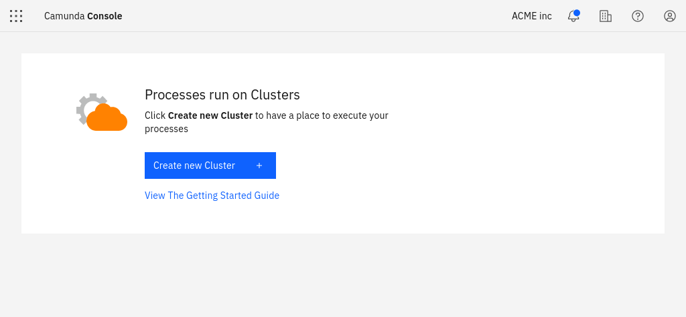
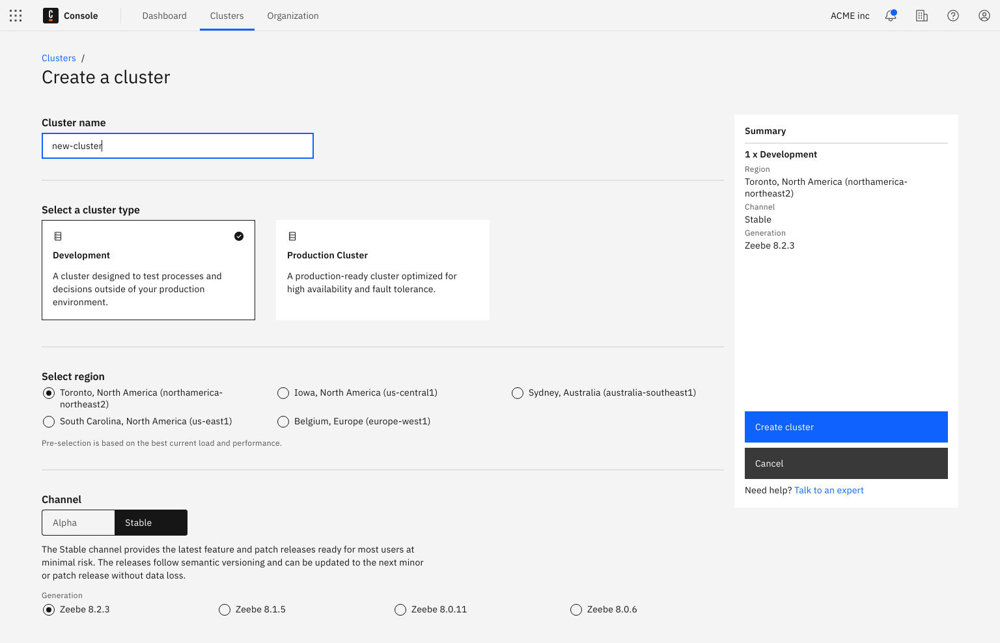
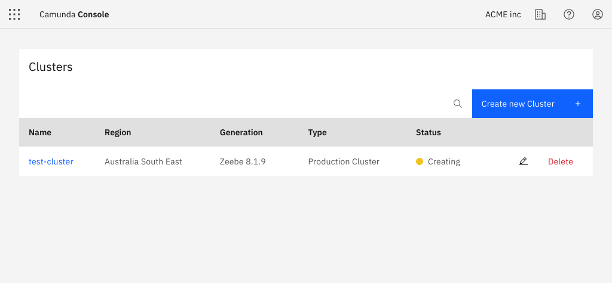
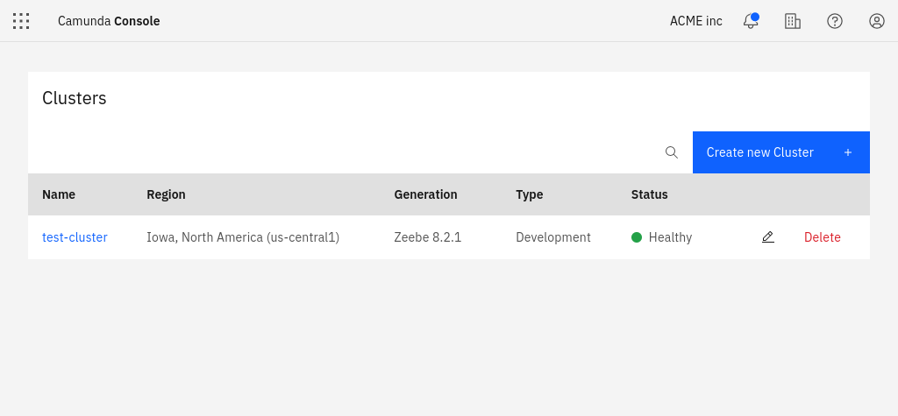

---
---

Let's take a closer look at creating clusters and viewing their details.

To create a cluster, follow the steps below:

1. Click **Create New Cluster** in the top right corner of the screen.

2. Set a name and choose the channel. Currently, there are two channels available:

- **Stable**: Provides the latest feature and patch releases ready for most users at a minimal risk. The releases follow semantic versioning and can be updated to the next minor or patch release without data loss.
- **Alpha**: Provides preview releases in preparation for the next stable release. They provide a short-term stability point to test new features and give feedback before they are released to the stable channel. Try these to ensure the upcoming release works with your infrastructure. These releases cannot be updated to a newer release, and therefore are not meant to be used in production.

Here, you can also decide if you want to have automated updates to new versions of Camunda Platform 8 activated. You can also toggle this feature anytime later in the **Settings** tab of your cluster.

3. After you've made your selection and created the cluster, view the new entry in the **Clusters** tab:

4. The cluster is now being set up. During this phase, its state is **Creating**. After one or two minutes, the cluster is ready for use and changes its state to **Healthy**:

5. After the cluster is created, click on the cluster name to visit the cluster detail page.
