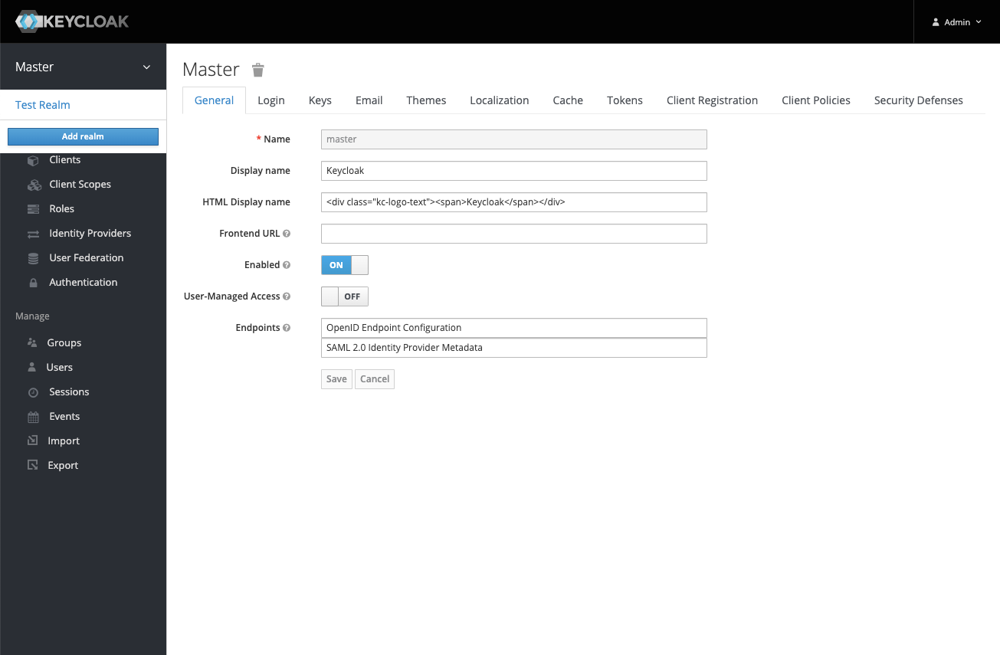
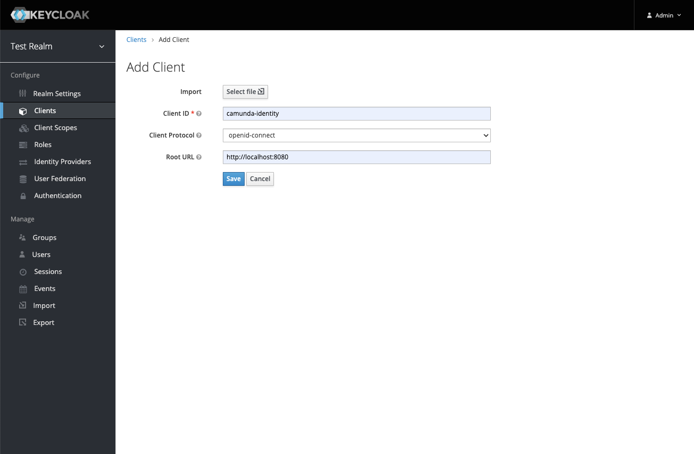
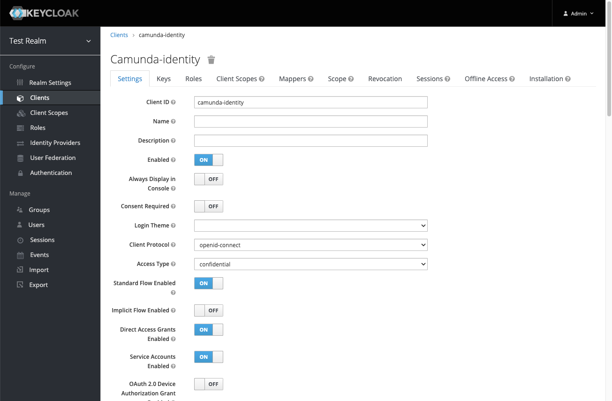

In this guide, we'll demonstrate how to connect Identity to your existing Keycloak instance.

### Prerequisites

- Access to your [Keycloak Admin Console](https://www.keycloak.org/docs/19.0.3/server_admin/#using-the-admin-console)
- A basic understanding of [administering realms and clients](https://www.keycloak.org/docs/19.0.3/server_admin/#assembly-managing-clients_server_administration_guide) in Keycloak.

### Steps

To connect Identity to an existing Keycloak instance, take the following steps:

1. Log in to your Keycloak Admin Console.
2. Select the realm you would like to connect Identity to. In our example, this is **Test Realm**.
   
3. Select **Clients** in the navigation menu, and click the **Create** button to create a new client.
4. Enter the client ID and the URL of where your Identity instance will be hosted and click **Save**.
   :::note What client ID should I use?
   By default, Identity uses the Client ID `camunda-identity`, so we recommend using this too. If you choose a different client ID, this will need to be set in the Identity application [environment variables](/docs/self-managed/identity/deployment/configuration-variables.md).
   :::
   
5. On the page for the created client, set the **Access Type** to `confidential`, **Service Accounts Enabled** to `ON`, and save your changes by clicking the **Save** button.
   
6. Navigate to the **Service Account Roles** tab in the top navigation.
   
7. Select the `realm-management` client from the **Client Roles** dropdown.
8. Assign the `manage-clients`, `manage-realm`, and `manage-users` role from the **Available Roles** list.
   
   :::note Why does Identity need these roles?
   Identity is designed to allow users to manage the various entities related to the Camunda Platform. To achieve this, it requires specific access to the realm.
   :::
9. Navigate to the **Credentials** tab and copy the client secret.
10. Set the `IDENTITY_CLIENT_SECRET` [environment variable](/docs/self-managed/identity/deployment/configuration-variables.md) with the value from **Step 9**.
11. Set the `KEYCLOAK_REALM` [environment variable](/docs/self-managed/identity/deployment/configuration-variables.md) to the realm you selected in **Step 2**.
    :::tip
    If you are using a specific realm, you need to set additional variables to use the intended realm.
    See the [environment variables](/docs/self-managed/identity/deployment/configuration-variables.md) page for details of Keycloak-specific variables to consider.
    :::
12. Start Identity.

:::note What does Identity create when starting?
Identity creates a base set of configurations required to function successfully. To understand more about what is created and why, see [the starting configuration](/docs/self-managed/identity/deployment/starting-configuration.md).
:::

### Considerations

When connecting Identity to a shared realm, accurately determining what clients should and should not be displayed in the Identity UI is not possible. Therefore, the clients in the realm you connect Identity to will be shown in the Identity UI and can
have their secrets viewed and updated. Users with access to Identity should be considered as having administrator-level access to the system.
