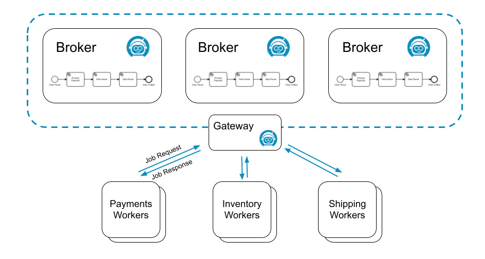

A **job worker** is a service capable of performing a particular task in a process. Each time such a task needs to be performed, this is represented by a **job**.

A job has the following properties:

- **Type**: Describes the work item and is defined in each task in the process. The type is referenced by workers to request the jobs they are able to perform.
- **Custom headers**: Additional static metadata that is defined in the process. Custom headers are used to configure reusable job workers (e.g. a `notify Slack` worker might read out the Slack channel from its header.)
- **Key**: Unique key to identify a job. The key is used to hand in the results of a job execution, or to report failures during job execution.
- **Variables**: The contextual/business data of the process instance required by the worker to do its work.

## Requesting jobs

Job workers request jobs of a certain type on a regular interval (i.e. polling). This interval and the number of jobs requested are configurable in the [Zeebe client](/apis-tools/working-with-apis-tools.md).

If one or more jobs of the requested type are available, [Zeebe](/components/zeebe/zeebe-overview.md) (the workflow engine inside Camunda 8) streams activated jobs to the worker. Upon receiving jobs, a worker performs them and sends back a `complete` or `fail` command for each job, depending on if the job could be completed successfully.

For example, the following process might generate three different types of jobs: `process-payment`, `fetch-items`, and `ship-parcel`:

Three different job workers, one for each job type, could request jobs from Zeebe:

Many workers can request the same job type to scale up processing. In this scenario, Zeebe ensures each job is sent to only one of the workers.

Such a job is considered activated until the job is completed, failed, or the job activation times out.

On requesting jobs, the following properties can be set:

- **Worker**: The identifier of the worker used for auditing purposes.
- **Timeout**: The time a job is assigned to the worker. If a job is not completed within this time, it can be reassigned by Zeebe to another worker.
- **MaxJobsToActivate**: The maximum number of jobs which should be activated by this request.
- **FetchVariables**: A list of required variable names. If the list is empty, all variables of the process instance are requested.

### Long polling

Ordinarily, a request for jobs can be completed immediately when no jobs are available.

To find a job to work on, the worker must poll again for available jobs. This leads to workers repeatedly sending requests until a job is available.

This is expensive in terms of resource usage, because both the worker and the server are performing a lot of unproductive work. Zeebe supports **long polling** for available jobs to better utilize resources.

With **long polling**, a request is kept open while no jobs are available. The request is completed when at least one job becomes available.

**Long polling** is set during [job activation with the parameter `request-timeout`](../../apis-tools/grpc.md#activatejobs-rpc).

### Job queuing

Zeebe decouples creation of jobs from performing the work on them. It is always possible to create jobs at the highest possible rate, regardless if there is a job worker available to work on them. This is possible because Zeebe queues jobs until workers request them.

This increases the resilience of the overall system. Camunda 8 is highly available so job workers don't have to be highly available. Zeebe queues all jobs during any job worker outages, and progress resumes as soon as workers come back online.

This also insulates job workers against sudden bursts in traffic. Because workers request jobs, they have full control over the rate at which they take on new jobs.

## Completing or failing jobs

After working on an activated job, a job worker informs Camunda 8 that the job has either `completed` or `failed`.

- When the job worker completes its work, it sends a `complete job` command along with any variables, which in turn is merged into the process instance. This is how the job worker exposes the results of its work.
- If the job worker can not successfully complete its work, it sends a `fail job` command. Fail job commands include the number of remaining retries, which is set by the job worker.
  - If `remaining retries` is greater than zero, the job is retried and reassigned.
  - If `remaining retries` is zero or negative, an incident is raised and the job is not retried until the incident is resolved.

When failing a job it is possible to specify a `retry back off`. This back off allows waiting for a specified amount of time before retrying the job.
This could be useful when a job worker communicates with an external system. If the external system is down, immediately retrying the job will not work.
This will result in an incident when the retries run out. Using the `retry back off` delays the retry. This allows the external system some time to recover.
If no `retry back off` the job is immediately retried.

When completing or failing jobs with [variables](components/concepts/variables.md), the variables are merged into the process at the job's associated task:

- When `Completing a job` the variables are propagated from the scope of the task to its higher scopes.
- When `Failing a job` the variables are only created in the local scope of the task.

:::tip Failing a job with variables

There are several advantages when failing a job with variables. Consider the following use cases:

- You can fail a job and raise an incident by setting the job `retries` to zero. In this case, it would be useful to provide some additional details through a variable when the incident is analyzed.
- If your job worker can split the job into smaller pieces and finish some but not all of these, it can fail the job with variables indicating which parts of the job were successfully finished which weren't. Such a job should be failed with a positive number of retries so another job worker can pick it up again and continue where the other job worker left off. The job can be completed when all parts are finished by a job worker successfully.

:::

## Timeouts

If the job is not completed or failed within the configured job activation timeout, Zeebe reassigns the job to another job worker. This does not affect the number of `remaining retries`.

A timeout may lead to two different workers working on the same job, possibly at the same time. If this occurs, only one worker successfully completes the job. The other `complete job` command is rejected with a `NOT FOUND` error.

The fact that jobs may be worked on more than once means that Zeebe is an "at least once" system with respect to job delivery and that worker code must be idempotent. In other words, workers **must** deal with jobs in a way that allows the code to be executed more than once for the same job, all while preserving the expected application state.

## Job streaming

:::danger
Job streaming is an experimental feature which is still under development. It is an opt-in feature which is disabled by default. [See the job worker documentation for details on usage](/apis-tools/java-client/job-worker.md).
:::

It's also possible to use job workers in a streaming fashion, such that jobs are automatically activated and pushed downstream to workers without requiring an extra round of polling, which greatly cuts down on overall latency.

### How it works

Job streaming works by having the worker open a long living gRPC unidirectional stream from the client to the gateway. The gateway then aggregates logically equivalent streams and registers each of these aggregated streams to every broker.

:::note
Two streams are considered logically equivalent if they would both activate the same job in the exact same way. More concretely, this means if they:

- Target the same job type
- Have the same worker name
- Have the same job activation timeout
- Have the same fetch variables
  :::

On the broker side, whenever a job is made activate-able (e.g. a service task is activated, a job times out, a job failed and is retried, etc.), if there is one or more streams for this job type, a random one is picked, the job is activated and pushed to it. As the job makes it way back to the gateway which owns this stream, a random client associated with it is picked, and the job is forwarded to it.

:::note
The RNG used to randomly pick streams and clients provides a good uniform distribution for the same underlying set, which is a cheap way of evenly distributing the load _as long as the stream set remains stable_.
:::

To help visualize the process in general, here is a sequence diagram which shows a single worker opening a job stream for jobs of type "foo" against a cluster consisting of a single gateway and a single broker. It receives some jobs, and when it closes, one job that was pushed asynchronously is returned to the broker:

### Troubleshooting

Since this feature requires a good amount of coordination between various components over the network, we've built in some tools to help monitor the health of the job streams.

#### Metrics

We expose several metrics which help check whether the feature is working.

- `zeebe_broker_jobs_pushed_count_total`: Allows you to derive the rate at which a broker is pushing jobs out to all streams. This can help you figure out if the broker is the bottleneck when it comes to throughput.
- `zeebe_gateway_job_stream_push_total`: Allows you to derive the rate at which a gateway is pushing jobs out to clients. If this is much less than the broker's pushed count, this could indicate an issue between the broker and the gateway: jobs are getting lost, the gateway is overloaded, etc.
- `zeebe_gateway_job_stream_clients`: The number of open job stream client calls on the gateway. This can help you figure out if your workers are well load balanced across your gateways.
- `zeebe_gateway_job_stream_streams`: The number of aggregated streams per gateway.
- `zeebe_broker_open_job_stream_count`: The count of job streams registered on the broker. This should be the sum of all gateway aggregated streams.
- `zeebe_gateway_job_stream_servers`: The amount of known brokers (or stream servers) per gateway. This should always be the number of brokers in your cluster. If this is less, this could indicate a clustering issue between your gateways and brokers (e.g. temporary network partition).

#### Actuator endpoint

Each broker and gateway exposes a new actuator endpoint - `/actuator/jobstreams` - accessible via the monitoring port. For example, if you run Zeebe locally with the default monitoring port, it would be accessible under `localhost:9600/actuator/jobstreams`.

This returns the current view of the registered job streams, where `client` refers to client streams opened on the gateway, and `remote` refers to the aggregated gateway streams as opened on each broker.

For example, if jobs of a given type are not activated, but a worker is opened for this type, you can verify first if it exists in one of the gateways as a client stream. Once you've found it, grab its ID, and verify that you can find it as a consumer of a remote stream on each broker.

If it's not present in the gateway as a client stream, restart your worker. If it's not present as a consumer in one of the brokers, this indicates a bug. As a workaround, restart your gateway, which will cause some interruption in your service, but will force all streams for this gateway to be recreated properly.
