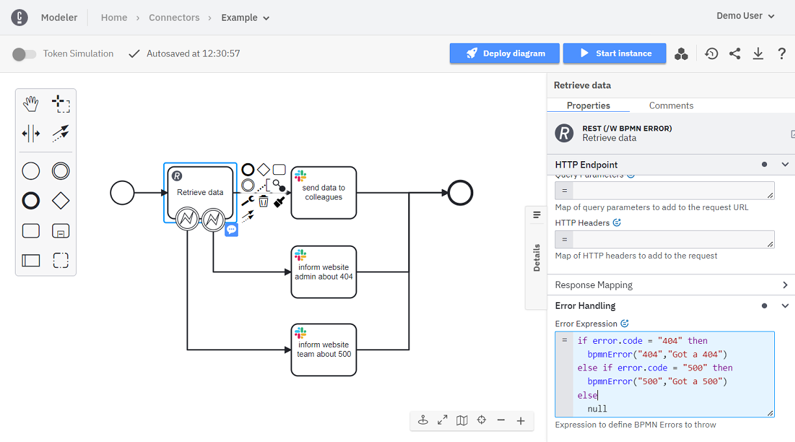

Any task can be transformed into a Connector task. This guide details the basic functionality all Connectors share.

Find the available Connectors in Camunda 8 SaaS and how to use them in detail in the [out-of-the-box Connectors](/components/connectors/out-of-the-box-connectors/available-connectors-overview.md) documentation. Additionally, learn how you can visit the [Camunda Marketplace](/docs/components/modeler/web-modeler/camunda-marketplace.md) from your BPMN diagram.

:::note
New to modeling with Camunda? The steps below assume some experience with Camunda modeling tools. [Model your first diagram](/components/modeler/web-modeler/model-your-first-diagram.md) to learn how to work with Web Modeler.
:::

## Using secrets

:::danger
`secrets.*` is a deprecated syntax. Instead, use `{{secrets.*}}`
:::

You can use sensitive information in your Connectors without exposing it in your BPMN processes by referencing secrets.
Use the Console component to [create and manage secrets](/components/console/manage-clusters/manage-secrets.md).

You can reference a secret like `MY_API_KEY` with `{{secrets.MY_API_KEY}}` in any Connector field in the properties panel that supports this.
Each of the [out-of-the-box Connectors](/components/connectors/out-of-the-box-connectors/available-connectors-overview.md) details which fields support secrets.

Secrets are **not variables** and must be wrapped in double quotes as follows when used in a FEEL expression:

```
= { myHeader: "{{secrets.MY_API_KEY}}"}
```

Using the secrets placeholder syntax, you can use secrets in any part of a text, like in the following FEEL expression:

```
= "https://" + baseUrl + "/{{secrets.TENANT_ID}}/accounting"
```

This example assumes there is a process variable `baseUrl` and a configured secret `TENANT_ID`.

The engine will resolve the `baseUrl` variable and pass on the secrets placeholder to the Connector. Assuming the `baseUrl` variable resolves to `my.company.domain`,
the Connector receives the input `"https://my.company.domain/{{secrets.TENANT_ID}}/accounting"`. The Connector then replaces the secrets placeholder upon execution.

For further details on how secrets are implemented in Connectors, consult our [Connector SDK documentation](/components/connectors/custom-built-connectors/connector-sdk.md#secrets).

:::note Warning
`secrets.*` is a reserved syntax. Don't use this for other purposes than referencing your secrets in Connector fields.
Using this in other areas can lead to unexpected results and incidents.
:::

## Variable/response mapping

When a **Connector** is expected to return a result, **Connectors** feature a dedicated section known as `Response Mapping`,
comprising two essential fields: `Result Variable` and `Result Expression`.
These fields export responses from external **Connector** calls into process variables.

### Result variable

This field declares a singular process variable designated for the export of responses from a **Connector** call.
The resulting process variable can be subsequently utilized within the ongoing process.

### Result expression

This field facilitates the mapping of a **Connector** response into multiple process variables,
providing further flexibility of the variable utilization within the ongoing process.
Additionally, the extracted values can be transformed with [FEEL expressions](/components/concepts/expressions.md).

To ensure process isolation, note that Connectors do not have access to process instance variables.

:::note
While using this field, a process variable with the name `response` is reserved.
:::

## Activation

The `Activation` section pertains specifically to [inbound](/components/connectors/connector-types.md) **Connectors**.

### Correlation key (process)

This field is instrumental in specifying which variable within a **Connector** should function as the process correlation key.
Learn more about [message correlation](components/concepts/messages.md#message-correlation-overview).

### Correlation key (payload)

This field guides the **Connector** on how to extract a correlation value from the incoming message payload.

### Message ID expression

This field extracts a unique message identifier from the incoming message payload. Messages sharing the same identifier
within a defined TTL (Time To Live) will be correlated at most once.
Leaving this field empty may result in identical messages being submitted and processed multiple times.

### Condition

Utilized for validating conditions against the incoming message payload, this field enables the filtering
of payloads that can initiate a process. Leaving this field empty results in all incoming messages triggering a new process,
except those failing pre-validation checks, such as HMAC signature verification for specific Connectors.

### Example

Imagine your Connector makes an external call to an arbitrary weather service. The weather service returns the following response:

```json
{
  "status": 200,
  "headers": {
    "date": "Thu, 19 Jan 2023 14:02:29 GMT",
    "transfer-encoding": "chunked",
    "content-type": "application/json; charset=utf-8",
    "connection": "keep-alive"
  },
  "body": {
    "latitude": 52.52,
    "longitude": 13.4,
    "generationtime_ms": 0.22804737091064453,
    "utc_offset_seconds": 0,
    "timezone": "GMT",
    "timezone_abbreviation": "GMT",
    "elevation": 45.0,
    "current_weather": {
      "temperature": 1.0,
      "windspeed": 10.1,
      "winddirection": 186.0,
      "weathercode": 2,
      "time": "2023-01-19T14:00"
    }
  }
}
```

If you declare a variable `myWeatherResponse` in the `Result Variable` field, the entire response is mapped to the declared variable.

Now, let's imagine that you wish to extract only temperature into a process variable `berlinWeather` and wind speed into `berlinWindSpeed`. Let's also imagine you need weather in Fahrenheit declared in `berlinWeatherInFahrenheit`.

In that case, you could declare `Result Expression` as follows:

```
= {
  berlinWeather: response.body.current_weather.temperature,
  berlinWindSpeed: response.body.current_weather.windspeed,
  berlinWeatherInFahrenheit: response.body.current_weather.temperature * 1.8 + 32
}
```

## BPMN errors

Being able to deal with exceptional cases is a common requirement for business process models. Read more about our general best practices around this topic in [dealing with exceptions](/components/best-practices/development/dealing-with-problems-and-exceptions.md).

Connectors share this requirement for exception handling like any other task in a model. However, Connectors define reusable runtime behavior that is not aware of your specific business use case. Thus, they can not determine if an exceptional case is a technical or business error.
Therefore, a Connector's runtime behavior cannot throw BPMN errors, but only technical errors. However, those technical errors can optionally contain an error code as structured data that can be reused when configuring a Connector task.

### Error expression

To support flexible exception handling, the [out-of-the-box Connectors](/components/connectors/out-of-the-box-connectors/available-connectors-overview.md) allow users to define an **Error Expression** in the **Error Handling** section at the bottom of the properties panel.

The example below uses this property to automatically inform the right group of people depending on the result of an HTTP request against an internal website. If the website returns a valid result, this data is passed on to the regular team.
In case of a [404](https://developer.mozilla.org/en-US/docs/Web/HTTP/Status/404) website response, the administrator is informed, so they can check why the website cannot be reached. HTTP responses with status [500](https://developer.mozilla.org/en-US/docs/Web/HTTP/Status/500)
indicate internal website errors, which is why the website team is informed.



The **Error Expression** property requires a [FEEL](/components/modeler/feel/what-is-feel.md) expression that yields a BPMN error object in the end. The BPMN error object can be an empty [context](/components/modeler/feel/language-guide/feel-data-types.md#context),
[null](/components/modeler/feel/language-guide/feel-data-types.md#null), or a context containing at least a non-empty `code`. You can use all available functionality provided by FEEL to produce this result.
Use the provided FEEL function [`bpmnError`](#function-bpmnerror) to conveniently create a BPMN error object. This triggers a [ThrowError call](/components/best-practices/development/dealing-with-problems-and-exceptions.md) to the workflow engine.

Within the FEEL expression, you access the following temporary variables:

- The result of the Connector in `response`.
- Any result variables created by the **Result Variable** and **Result Expression** properties (see the [REST Connector](/components/connectors/protocol/rest.md#response), for example).
- The technical exception that potentially occurred in `error`, containing a `message` and optionally a `code`. The code is only available if the Connector's runtime behavior provided a code in the exception it threw.

Building on that, you can cover those use cases with BPMN errors that you consider as exceptional. This can build on technical exceptions thrown by a Connector as well as regular results returned by the external system you integrated.
The [example expressions](#bpmn-error-examples) below can serve as templates for such scenarios.

### Function bpmnError()

Returns a context entry with a `code` and `message`.

- parameters:
  - `code`: string
  - `message`: string
- result: context

```feel
bpmnError("123", "error received")
// { code: "123", message: "error received" }
```

### BPMN error examples

#### HTTP errors to BPMN errors

Using the [REST Connector](/components/connectors/protocol/rest.md), you can handle HTTP errors directly in your business process model by setting a Header named `errorExpression` with the following value:

```feel
if error.code = "404" then
  bpmnError("404", "Got a 404")
else if error.code = "500" then
  bpmnError("500", "Got a 500")
else
  null
```

This will create BPMN errors for HTTP requests that return with a status [404](https://developer.mozilla.org/en-US/docs/Web/HTTP/Status/404) or [500](https://developer.mozilla.org/en-US/docs/Web/HTTP/Status/500).
You can extend that list to all HTTP errors you can handle as business use cases, e.g. by informing a website administrator directly via Slack using the [Slack Connector](/components/connectors/out-of-the-box-connectors/slack.md).

#### Response value to BPMN error

Using the [REST Connector](/components/connectors/protocol/rest.md) or any other Connector that returns a result, you can handle a response as BPMN error based on its value, by setting a Header named `errorExpression` with the following value:

```feel
if response.body.main.humidity < 0 then
  bpmnError("HUMIDITY-FAIL", "Received invalid humidity")
else null
```

This is assuming you requested data from a local weather station and received a value that is technically valid for the REST Connector.
However, you could define that for your business case a humidity value below `0` must be an error that should be checked manually.
You could automatically send a message to a technician to check the weather station.

#### Generic Header to transform a ConnectorException to a BPMN Error

If the Connector throws a `ConnectorException` like:

```java
  throw new ConnectorException("HUMIDITY-FAIL", "Received invalid humidity");
```

Then you can transform this exception to a BPMN error with this expression in a Header item named `errorExpression`:

```feel
if is defined(error) then bpmnError(error.code, error.message) else null
```
