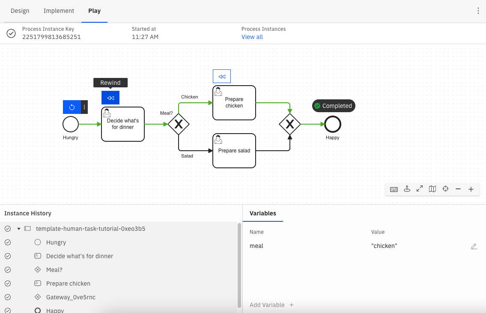

Camunda 8 only

Play is a Zeebe-powered playground environment within Web Modeler for validating a process at any stage of development. Developers can debug their process logic, testers can manually test the process, and process owners can demo to stakeholders - all within Play.

## Opening Play

To use Play, open a BPMN diagram and click the **Play** mode. Read the [limitations and availability section](#limitations-and-availability) if you don't see it.

You get a private Play environment that takes about 30 seconds to prepare and is automatically deleted after 20 minutes of inactivity. Even when the environment is deleted, your secrets persist in the browser's local storage.

The current version of the active process and all its dependencies, like called processes or DMN files, are automatically deployed to the Play environment. An error or warning is raised if a file fails to deploy, is missing, or a Connector secret isn’t filled out.

## Getting started with Play

The first view in Play is the process definition view. It shows deployment problems, active process instances, and start events.

Click a **start event's** play button to begin your process. Open the button's menu to start a process with variables. These variables can also be prefilled from the example data defined for the start event in the **Implement** mode. Play presents this example data in a readable JSON format, as illustrated below. See [data handling](/components/modeler/data-handling.md) for additional details.

## Play a process

Click the action icons next to a task or event to play the process.

The **Instance History** panel tracks the path taken throughout the diagram.

The **Variables** panel tracks the data collected. Global variables are shown by default. To view local variables, select the corresponding task or event. Variables can be edited or added here, and Play supports JSON format to represent complex data.

Play executes all logic of the process and its linked files, such as FEEL, forms, DMN tables, and outbound Connectors.

However, actions in Play cannot be triggered by any external system, such as external user interfaces, job workers, message systems, or inbound Connectors.

You have a few options to mock an external system:

- In **Implement** mode, hard-code an example payload in the task or event **Output** section.
- When completing a task or event, use the secondary action to complete it with variables.

Incidents are raised in Play just like in Operate. Use the variables and incident messages to debug the process instance.

## Replay a process

To replay a process, rewind to an earlier element by clicking on the **Rewind** button on a previously completed element.

:::note
You can also return to the definition view by clicking **View all** on the top banner, or start a new process instance by clicking on the **Restart process** button on the start event.
:::

### Rewind a process

After completing part of your process, you can **rewind** to a previous element to test a different scenario. Play will start a new instance and replay your actions up to, but not including, the selected previous task.

Play's rewind operation currently does not support the following elements:

- Call activities
- Timer events that complete without being skipped

If you completed an unsupported element before rewinding, you will rewind farther than expected.

In addition, Play rewinds to an element, not to an element instance. For example, if you wanted to rewind your process to a sequential multi-instance service task which ran five times, it will rewind your process to the first instance of that service task.

## Rapid iteration

To make changes, switch back to **Implement** mode. When returning to Play, your process is redeployed. Play only shows process instances from the process’s most recent version, so you may not see your previous instances.

Play saves your inputs when completing user task forms. It auto-fills your last response if you open the same form later in the session. You can click **Reset** to reset the form to its defaults.

## Details

Depending on the BPMN element, there may be a different action:

- **User tasks** with an embedded form are displayed on click. However, you cannot track assignment logic.
- **Outbound Connectors** are executed as defined on click.
- **Call activities** can be navigated into and performed.
- **Timer events** are executed as defined, with the option to skip the wait.
- **Manual tasks**, **undefined tasks**, **script tasks**, **business rule tasks**, **gateways**, and other BPMN elements that control the process’s path are automatically completed based on their configuration.
- **Service tasks**, **inbound Connectors**, message-related tasks or events, and **timer catch events** are simulated on click.
- Many action icons have secondary actions. For example, **user tasks** can be completed with variables rather than a form, and **service tasks** can trigger an error event.

## Operate vs. Play

[Operate](/components/operate/operate-introduction.md) is designed to monitor many production process instances and intervene only as necessary, while Play is designed to drive a single process instance through the process and mock external systems.

Both offer monitoring of a single process instance, its variables and path, incidents, and actions to modify or repair a process instance. Operate offers bulk actions and guardrails against breaking production processes, while Play offers a streamlined UX to run through scenarios quickly.

## Limitations and availability

:::note
Play is being rebuilt and progressively rolled out to more users. This section explains why you might not see the **Play** tab.
:::

For Camunda 8 SaaS, Play is available to all Web Modeler users with editor or admin permissions within a project.
Enterprise users need an admin to enable Play by opting in to [alpha features](/components/console/manage-organization/enable-alpha-features.md).

For Self-Managed, Play is controlled by the **PLAY_ENABLED** flag. It is `true` by default for the Docker distribution for development and `false` by default on the Kubernetes distribution for production use.

Play uses Zeebe 8.2. Any BPMN elements unavailable in Zeebe 8.2, such as signal events, will not be available in Play.

:::note
[Inbound Connectors](/components/connectors/connector-types.md#inbound-connectors) and [Connectors in hybrid mode](/guides/use-connectors-in-hybrid-mode.md) do not connect to external systems and must be completed manually.
[Start events with forms](/components/modeler/web-modeler/advanced-modeling/publish-public-processes.md#embed-form-in-start-event) will be completed without the form being shown.
[Decision table rule](/components/modeler/dmn/decision-table-rule.md) evaluations are not viewable. However, they can be inferred from the output variable.
:::

There are some bugs related to Play’s architecture. These will be resolved when Play is integrated with Camunda development clusters.

- **Timer events** sometimes fail silently. Try refreshing the page.
- Deployment sometimes fails with a network error in the **Output** panel of the **Implement** mode. If these errors repeat, let your Play cluster expire and try again.

## Alpha feature

Play is an alpha feature for a few reasons:

- Play runs on community-built projects, as described in the [Zeebe-Play repository](https://github.com/camunda-community-hub/zeebe-play).

- Play is run on completely isolated Camunda-hosted infrastructure from the core SaaS or Self-Managed Camunda deployment. It can only receive information from Web Modeler and can only communicate externally using Connectors and the user-defined secrets in the secret store or BPMN diagram.

  :::note
  Play is not authenticated, so anyone with the URL can access it. You should not submit personal or confidential information to Play.
  :::

- To mitigate this risk, a 34-character randomly generated UUID is in the URL. Each session lasts approximately 20 minutes, and the Play environment and its data are automatically deleted at the end of each session. You can reset the session timer by re-opening Play.

For more information about terms, refer to our [licensing and terms page](https://legal.camunda.com/licensing-and-other-legal-terms#c8-saas-trial-edition-and-free-tier-edition-terms).
