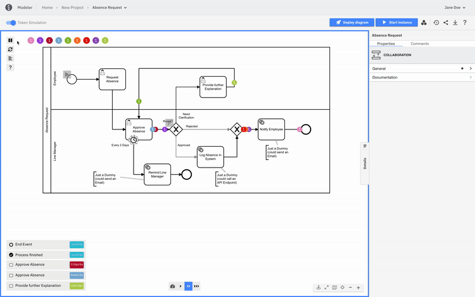

Use token simulation to get a deeper understanding of the BPMN execution semantics by playing, pausing, and resetting your simulation.

### Turn on/off

First, open your BPMN diagram in Modeler.

To turn the feature on/off, use the **Token Simulation** toggle (or the keyboard shortcut `T` inside the canvas). The modeling features will not work while you are in token simulation mode.

### Start simulation

The simulation can be started by triggering an event using the corresponding button:

### Token simulation palette

The palette on the left side provides the following controls:

- Play/pause simulation
- Reset simulation
- Show simulation log

### Animation speed palette

The speed of the simulation can be changed using the controls in the bottom palette:

