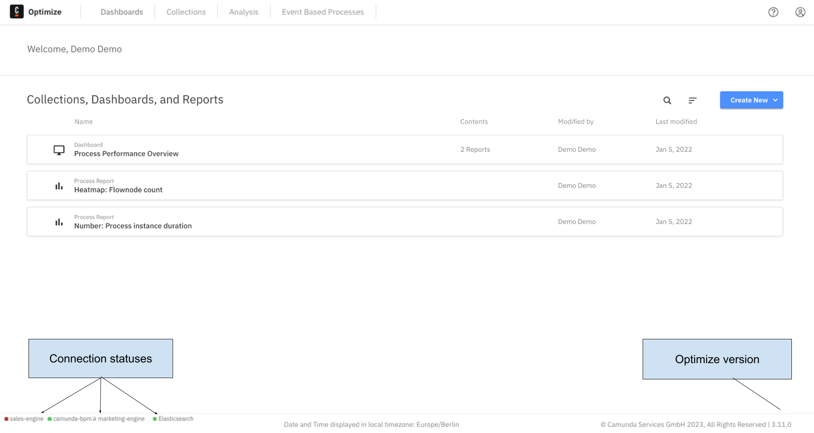
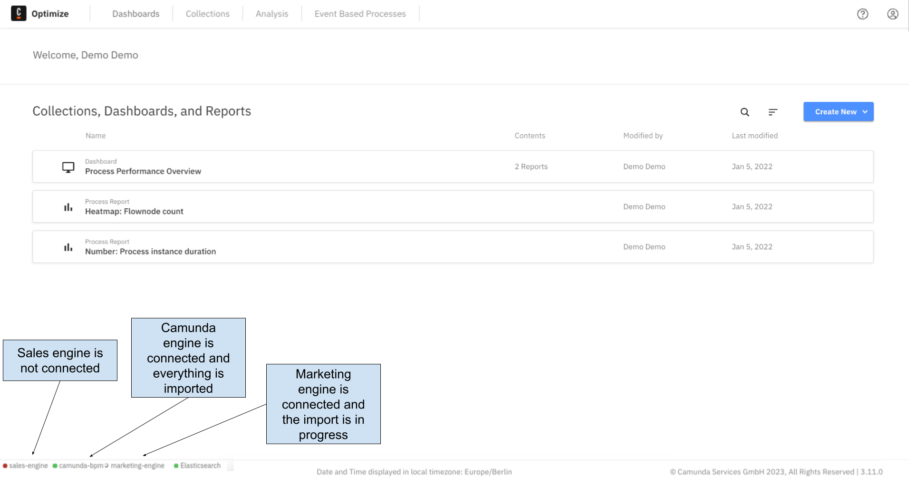

## Footer

In the **Footer** section of Optimize, you can see some important information, such as:

- Engine connections status: For each engine that is connected to Optimize, the connection status is shown. This enables you to be aware of any engine connection problems Optimize may be experiencing.
- Status of the connection to Elasticsearch
- Import progress: Indicates if Optimize is currently importing data from the engine. Analysis can only be performed in Optimize on data that has already been imported.
- Timezone: The timezone used to display all date and time information
- Optimize version

There are three possible states of engine connection:

- Connected and import finished (green circle)
- Connected and import is not completed (spinner)
- Not connected (red circle)

Elasticsearch can be either connected or not (green and red circles respectively).

