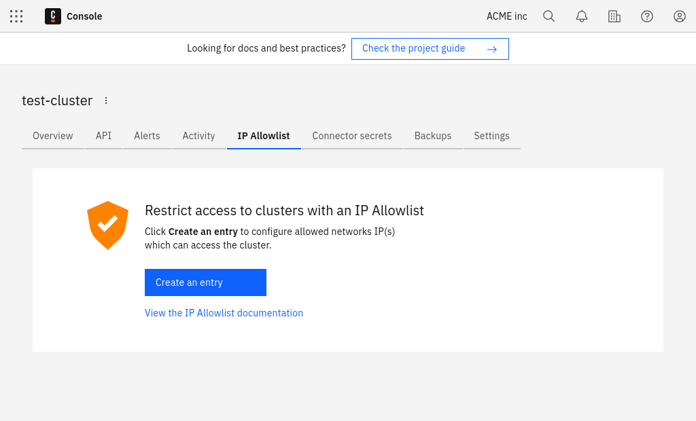

If your organization works within Camunda's [Enterprise](https://camunda.com/enterprise/) plan, you can restrict access to clusters with an IP allowlist.

## Create an IP allowlist

To create an IP allowlist, take the following steps:

1. Select the **IP Allowlist** tab.

2. Click **Create an entry** to create an IP Allowlist.

3. Enter a list of IPs or CIDR blocks separated by commas.

4. Enter an optional description for the Allowlist.
