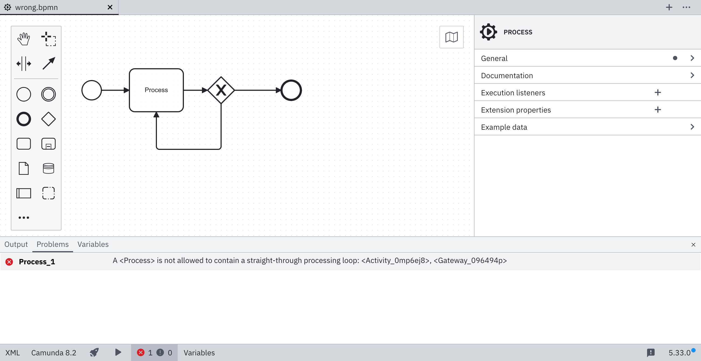
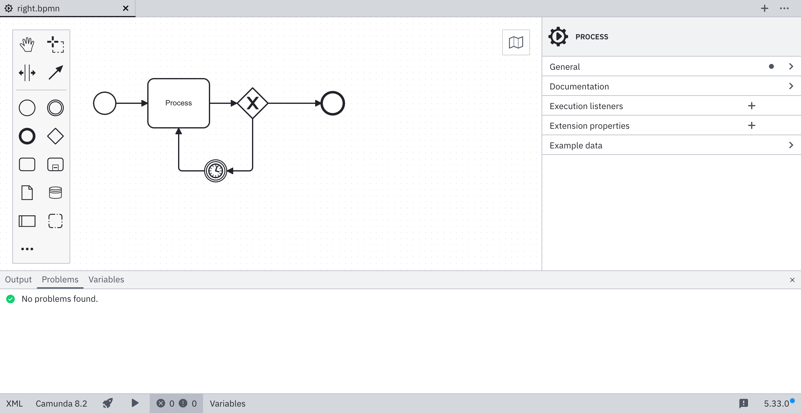

import MarkerGuideline from "@site/src/mdx/MarkerGuideline";

This error occurs when a BPMN model contains an automated loop (without human interaction or external event triggers). It may cause an endless recursion.

This may result in:

- Endless execution
- Excessive resource usage

To fix this problem, add a timer, user task, or external event (e.g., message catch) to break the straight-through loop and ensure controlled execution.

## <MarkerGuideline.Invalid /> Straight-through processing loop

## <MarkerGuideline.Valid /> Controlled Loop

## References

- [Rule source](https://github.com/camunda/bpmnlint-plugin-camunda-compat/blob/main/rules/camunda-cloud/no-loop.js)
