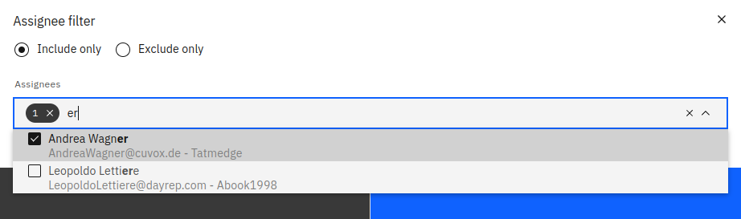
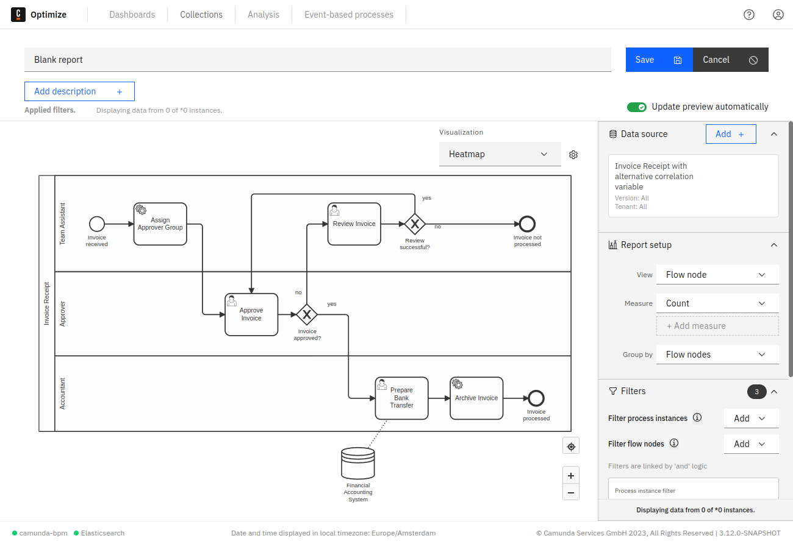

## Date filters

In Optimize, there are two kinds of date filters: the start and the end date filter. Each of these filters can be applied on [process instance](./process-instance-filters.md#process-instance-date-filter) and on [flow node](./flow-node-filters.md#flow-node-date-filter) dates.

There are multiple ways in which you can define your date filters:

- Set the filter to a current amount of time. For example, today, this week, this month, etc. In such cases, the filter does not remain static, but moves with time to deliver a subset of the data according to the selected time interval.

:::note
Within date filters, weeks begin on Monday, not Sunday. This is not configurable in Optimize.
:::

- Set it to a previous amount of time. For example, yesterday, last week, last month, etc. This filter also moves with time and is automatically adjusted to cover completed periods of time.

Take the following example: Today is Wednesday, March 11. If you set a process instance start date filter to `Last... + week`, you get all process instances that were started from Monday, March 2 to Sunday, March 8. A week passes, and we now have Wednesday, March 18. Applying the same filter now filters the process instances which were started from Monday, March 9 to Sunday, March 15.

- To cover previous time periods up the current moment of time, you can use the 'Rolling' option.

Take the following example: today is March 28. If you set a process instance start date filter to the last three days, you get all process instances that were started from March 26 to March 28. A day passes, and we now have March 29. Applying the same filter now filters the process instances which were started from March 27 to March 29.

- If you do not want the filter to be completely dynamic, you can also select `Between`, `Before`, or `After`.
- The `Between` option only considers process instances started or ended within a fixed date range (e.g. filter all process instances between 2018-01-01 and 2018-01-26). This range is fixed and does not change.
- In the same way, you can select `After` or `Before` options to only consider process instances that started or ended after/before a fixed date.

The start and the end date filters are independent and can be applied to a report simultaneously. However, be aware that each of these filters can only exist once. If, for example, you define a new start date filter when another one already exists, the second one will replace the first one.

## Assignee and candidate group filters

These filters allow you to include or exclude instances based on the assignee or the candidate group of at least one user task of a particular process instance.

As shown in the example, it is possible to select one or more assignees or even filter for unassigned instances.

This filter has different behavior depending on where it was [defined](./filters.md#filter-behavior):

- As a `Flow Node data filter` applied on a user task report: This filter only includes user task instances that satisfy _all_ assignee/candidateGroup filters defined in the report at once. Mutually exclusive filters like having both an inclusive and an exclusive filter on the same assignee do not yield any results in user task reports.

- As an `instance filter`: This filter includes all process instances where _at least one_ user task satisfies one particular assignee/candidateGroup criterion. This means multiple mutually exclusive assignee/candidateGroup filter entries might still yield results for these reports (e.g. if the process definition contains multiple user tasks).

## Incident filter

This filter has a different behavior depending on where it was [defined](./filters.md#filter-behavior):

- As an `instance filter`: This filter will retrieve only those process instances that contain open, resolved, or no incidents (depending on your selection). Here are some examples where this filter can be useful:

  - Creating reports that contain no incidents since the instances that have incidents have very long durations and are influencing your data.

  - To monitor all the instances from multiple engines that have open incidents.

  On the other hand, this filter is not useful for counting the number of incidents because instances with an open or resolved instance filter might still contain instances from the other type.

- As a `Flow Node data filter`: This filter will additionally filter the instance incident states to only include incidents of the same type (open or resolved). As an example, This filter can be used to count the number of open or resolved incidents since it considers the incidents of that type exclusively. This filter is currently only useful if you are in an incident view report.

:::note
The incident filter does not currently filter flow nodes regardless of where it was defined.
:::

## Combined filters

All the previously mentioned filters can be combined. Only those process instances which match all the configured filters
are considered in the report or analysis. The [duration filter](./process-instance-filters.md#process-instance-duration-filter), [flow node filter](./flow-node-filters.md), and [variable filter](./variable-filters.md) can be defined several times. See the following screenshot for a possible combination of filters:

Everyone who has access to the report can add their own filters. For example, by creating a dashboard that contains that report and using dashboard filters. Note that filters can apply to all processes or a subset of processes.

Filters added in such a way are always combined with the filters set in the report edit mode. That way, users can reduce the set of process instances that are considered when evaluating the report, but not increase the number of instances evaluated above the set the report author specified.

In essence, if two copies of the same process are present, Optimize combines them with OR logic, and their filters or variables can be combined with the same logic. Therefore, it's possible to compare two differently filtered slices of the same process on the same report (with the group by process feature) or combine them (without group by process).

Users can get access to a report via the sharing functionality or if the report is in a shared collection.
