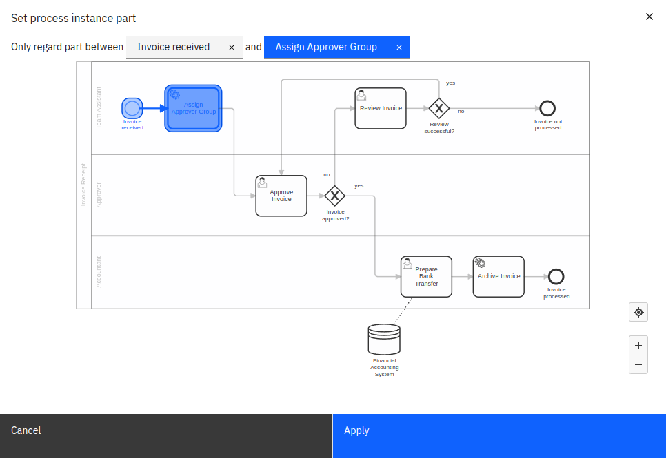

In some cases, you may not be interested in the duration of the whole process instance, but only a certain part of it. For that scenario, there is an additional button called **Process Instance Part** available for every process instance duration view that only shows data for a single process definition.

Clicking this button opens an overlay letting you select the start and end of the part of the process instance you are interested in. After confirming the selection, the displayed duration refers to the selected part only instead of the whole instance.

In some cases it can happen that the same task is executed multiple times in the same process instance, e.g. if the process contains loops or parallel gateways. In such cases, Optimize considers only the part between the start date of the first instance of the start node and the end date of the first instance of the end node.

