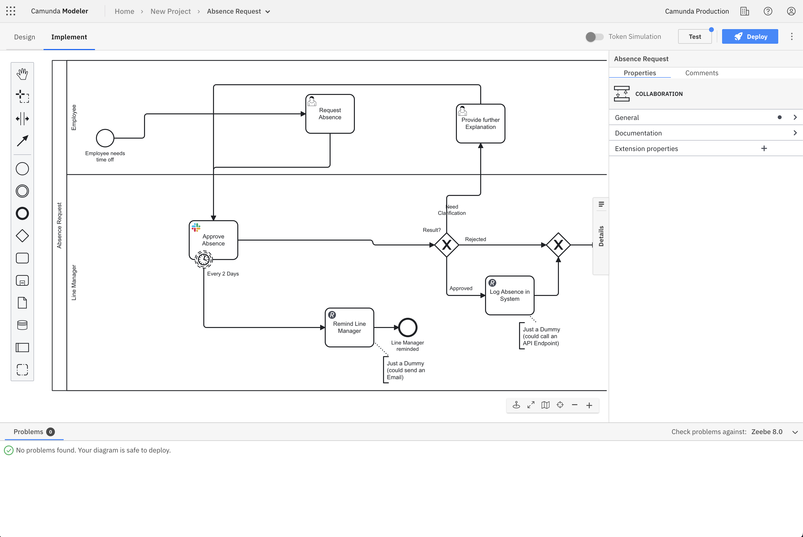

Camunda 8 only

In the **Implement** mode view, developers have access to a full, implementation-focused workspace of Web Modeler.

The view offers all possible implementation details, and the problems panel (accessed by clicking **Problems** in the bottom left corner) shows all implementation problems that need fixing before deployment.

The properties panel automatically opens when switching to the **Implement** mode, and if collapsed, it stays collapsed as long as you navigate between diagrams.

Developers can switch between the modes as they like, and when they open a process template, it opens in **Implement**.

