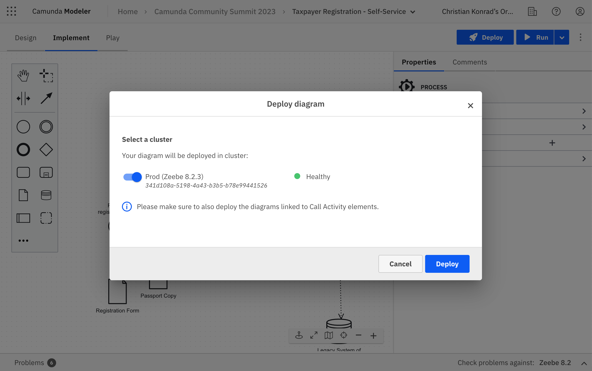

import Tabs from "@theme/Tabs";
import TabItem from "@theme/TabItem";

import PublicationSectionImg from './img/publication-section.png';
import LinkStartFormImg from './img/link-start-form.png';
import ImplementModeImg from './img/implement-mode-active.png';
import PublicLinkImg from './img/public-link.png';
import PublicFormImg from './img/public-form.png';

import ConvertToTimerImg from './img/web-modeler-convert-to-timer.png';
import WebhookPanelImg from './img/web-modeler-webhook-panel.png';
import ConvertToWebhookImg from './img/web-modeler-convert-to-webhook.png';
import TasklistProcessesImg from './img/tasklist-processes.png';

<span class="badge badge--cloud">Camunda 8 only</span>

When you design a process in Camunda Modeler, you have multiple flexible options to either run or publish it on Camunda 8. This page explains the differences between running and publishing a process, and outlines the various options to publish a process into any environment, and to any audience.

## Deploy a process

Web Modeler autosaves all your changes on a diagram. If you change a diagram and it is autosaved, this has no effect on deployed or running processes your cluster(s).

To make any change live in your cluster(s), you need to deploy it. If you deploy a process, it becomes available on the selected cluster and you can run or publish it.

:::info
Only organization owners or users with the **Admin** role in Console can deploy from Web Modeler to `prod` clusters.
Users without **Admin** roles can deploy only on `dev`, `test`, or `stage` clusters.
:::

To deploy, click **Deploy** in the upper right corner of the modeling screen:



### Before deploying a process

- Make sure your process is free of errors, otherwise it can't be deployed. Use the [problems panel to detect and fix errors](./fix-problems-in-your-diagram.md).
- Make sure all dependent files are deployed first, such as DMN diagrams, forms, or called processes. You can use the [link tool](./advanced-modeling/call-activity-linking.md) to drill-down into linked resources and deploy them.
- Implement and run your [job workers](../../concepts/job-workers.md) if you use tasks such as service or send tasks.

:::note
To perform any of these actions, make sure to be in **Implement** mode.

:::

## Run a process

Running a process means that you execute the process as a process instance on Camunda 8. It allows you to test and debug your process and observe how it performs in a live environment.

- [Test run using Play mode](#test-run-using-play-mode)
- [Run programmatically](#deploy-to-run-programmatically)
- [Run manually from Modeler](#run-manually-from-modeler)
- [Schedule via timer](#schedule-via-timer)

### Test run using Play mode

Before you publish or run a process, you can test it manually using the Play mode. With the Play mode, you can build and test your process iteratively in small steps. To enter the Play mode, click the Play tab in the top left corner of the modeling screen. Refer to the [Play mode documentation](./play-your-process.md) for details of how the Play environment works.

### Run manually from Modeler

You can also test your process thoroughly on a development cluster to observe how it behaves in Operate and Tasklist, in order to run your job workers, and to access your running process instances [programmatically](#deploy-to-run-programmatically). To start a process instance manually, take the following steps:

1. Click **Run** in the top right corner of the modeling screen.


2. Select the target cluster.

3. To test your process with data, you can also specify variables written to the process context at startup. The variables must be formatted in valid JSON. As an example, you can use the following JSON:

```json
{
  "hello": "world"
}
```

4. Click on **Run** to confirm. This will start a process instance on the selected cluster. If required, it (re-)deploys the process beforehand on the cluster.

After the process instance has been started, you will receive a notification with a link to the process instance view in [Operate](../../operate/operate-introduction.md). Follow this link to observe the progress of the process instance and interact with it if required.

:::info
Starting an instance from Web Modeler [deploys](#deploy-a-process) recent changes to the target cluster, which changes future runs of this process definition in case it has already been deployed and used. Existing process instances are not affected.
:::

:::tip
By [linking a Camunda Form to a start event](/components/modeler/web-modeler/advanced-modeling/form-linking.md), process instances can be started with the form's input [via a public form](#publish-via-a-public-form) (SaaS only) or directly [in Tasklist](#publish-to-tasklist).
:::

### Schedule via timer

You can also schedule a process to run at a specific time or interval using timers. Timers can be added to one or multiple start events of your process.

To schedule a process using a timer, follow these steps:

1. Select the start event.
2. Change the start event type to a timer event using the **wrench tool**.


3. [Configure the timer start event](../bpmn/timer-events/timer-events.md#timer-start-events) using the **properties panel** to define when the process should be executed. You can set the timer to trigger at a specific date and time or to repeat at a certain interval.

4. Click on **Deploy** to [deploy](#deploy-a-process) the process.

Once the process is deployed, the timer will be activated and the process will be executed at the scheduled time or interval.

Read more in the [timers documentation](../bpmn/timer-events/timer-events.md).

### Best practices for running a process

- Use the [Play mode](#test-run-using-play-mode) to run a process instance with test data before running it with live data.
- Verify that the process is running as expected on a development cluster before running it with live data in your production environment.
- Use [Operate](../../operate/operate-introduction.md) to help you diagnose any problems with the process.

:::tip
You can also define the success of your processes by setting key performance indicators (KPIs) for your process using [Optimize]($optimize$/components/what-is-optimize).
:::

## Publishing a process

Publishing a process means that you make it available to other users inside and outside of Camunda 8. Once published, other users can access and start instances of the process.

You have the following options to publish a process:

- [Deploy to run programmatically](#deploy-to-run-programmatically)
- [Publish via webhook](#publish-via-webhook)
- [Publish to Tasklist](#publish-to-tasklist)
- [Publish via a public form](#publish-via-a-public-form)
  - [Deploy process to the public](#deploy-process-to-the-public)
  - [Get the public link and share it](#get-the-public-link-and-share-it)
- [Listen to message or signal events](#listen-to-message-or-signal-events)
- [Best practices for publishing a process](#best-practices-for-publishing-a-process)

### Deploy to run programmatically

In order to be able to call a process programmatically from or inside another application or service, you simply have to [deploy](#deploy-a-process) it. Once deployed, you can run a process via our APIs, using an API client, or via one the various community SDKs. Read the [documentation on APIs & clients](../../../apis-tools/working-with-apis-tools.md) to learn more.

### Publish via webhook

You can publish a process via webhook, which allows you to integrate it easily with any system or service that can make an HTTP request. When a webhook is triggered in another system, it sends a HTTP request to a specified URL, which starts a process instance with the payload of the request.

Follow these steps to publish a process via a webhook:

1. Select the start event.
2. Switch your start event to a [HTTP webhook connector](/components/connectors/protocol/http-webhook.md) using the **wrench tool**.
   

3. Define the webhook configuration in the properties panel of the start event.
4. Finally, [deploy the process](#deploy-a-process) to activate the webhook connector.

When the process is deployed, the webhook URL can be found in the **Webhook** tab of the **properties panel**, and called from any outside system.


You have multiple options to ensure that the webhook connection is safe for use by your target audience only. Please refer to the [full documentation](/components/connectors/protocol/http-webhook.md) for configuration details.

### Publish to Tasklist

Publishing a process to Tasklist makes it available to users through the web-based [Tasklist application](../../tasklist/introduction-to-tasklist.md).

<Tabs groupId="tasklistPublishing" defaultValue="saas" values={[{label: 'SaaS', value: 'saas', }, {label: 'Self-Managed', value: 'sm', },]} >
<TabItem value="saas">

To publish a process to Tasklist, you first need to [deploy](#deploy-a-process) it. Once the process is deployed, it will automatically appear in the Tasklist application, where users can start new instances of the process.

</TabItem>
<TabItem value="sm">

To publish a process to Tasklist, you first need to [deploy](#deploy-a-process) it. Once the process is deployed, you need to [set permissions in Identity](../../../self-managed/tasklist-deployment/tasklist-authentication.md#resource-based-permissions) in order to make it accessible in the Tasklist application.

</TabItem>
</Tabs>


To learn more about publishing processes to Tasklist, refer to our [documentation on Tasklist](../../tasklist/userguide/using-tasklist.md#processes).

### Publish via a public form

<span class="badge badge--cloud">Camunda 8 SaaS only</span>

Publishing a process via a public form allows you to share your process with external users who can start instances of the process without requiring access to Camunda 8. This feature is particularly useful when you want to gather data or initiate a process from users who are not part of your organization or do not have direct access to Camunda. It also allows you to rapidly test a process with your peers in a development environment.


To publish a process via a public form, you first need to [link a Camunda Form](/components/modeler/web-modeler/advanced-modeling/form-linking.md#using-the-link-button) to the process' start event, then you can follow these steps:

#### Deploy process to the public

1. Open the **Publication** section in the **properties panel** (not the tab of the same name) and activate the toggle.


2. Click **Deploy** to [deploy](#deploy-a-process) the process and to activate the public form.

Once the process is deployed, a public URL for the form is generated on the target cluster.

#### Get the public link and share it

You can access the URL in the **Publication** tab of the **properties panel**, and share it with any user via email, social media, or any other communication channel.


When an external user accesses the public form URL, they can fill in the form fields and submit the data. Upon submission, a new process instance is automatically started in Camunda 8, using the submitted data as input.

For further configuration and how to unpublish a process again, refer to the [full documentation](./advanced-modeling/publish-public-processes.md).

### Listen to message or signal events

Camunda 8 supports message and signal events, which can be used to trigger a process instance when a specific event occurs. Everyone on the platform that knows the message or signal correlation keys can call such a process. To listen to a message or signal event, you need to define a [message](../bpmn/message-events/message-events.md#message-start-events) or [signal start event](../bpmn/signal-events/signal-events.md#signal-start-events) in your process model and configure it to listen for the desired event. Follow these steps to configure a message or signal start event:

1. Select the start event.
2. Change the start event type to a message or signal start event using the **wrench tool**.
3. Configure the message or signal start event using the **properties panel** to define the message or signal to listen to. Using messages, you can create a 1:1 relationship between calling processes. With signals, you can create broadcast-like message distributions.
4. Click on **Deploy** to [deploy](#deploy-a-process) the process.

As soon as a matching event is received, a process instance will be started. To learn more about message and signal events, refer to our [documentation on events](../bpmn/events.md).

### Best practices for publishing a process

- Use the [problems panel](./fix-problems-in-your-diagram.md) to make sure that the process free of errors before publishing it.
- Ensure the process works by testing it interactively using the [Play mode](./play-your-process.md).
- Use meaningful names and descriptions for the process and its elements.
- Document the process with clear instructions and details on how it should be used.
- Make sure that the process is accessible to the appropriate users only.

:::note
When working on Camunda 8 Self-Managed, you can define access permissions on a per-process level using [Identity Resource Authorizations](../../../self-managed/identity/user-guide/authorizations/managing-resource-authorizations.md).
:::
