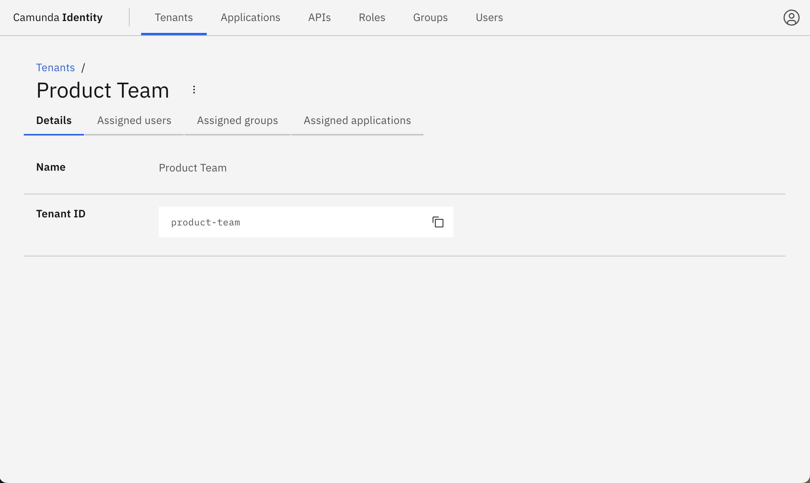
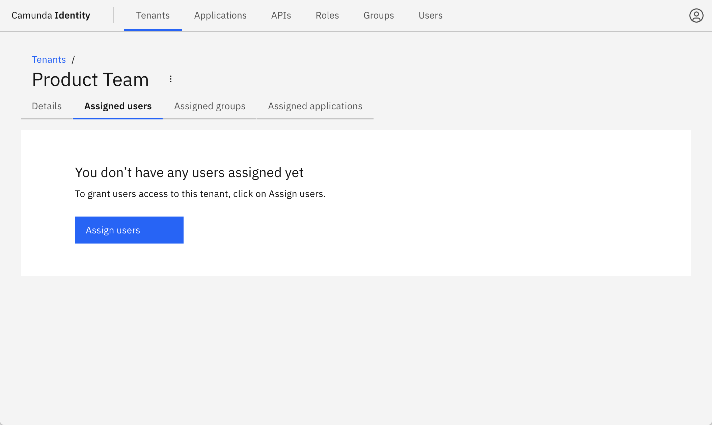
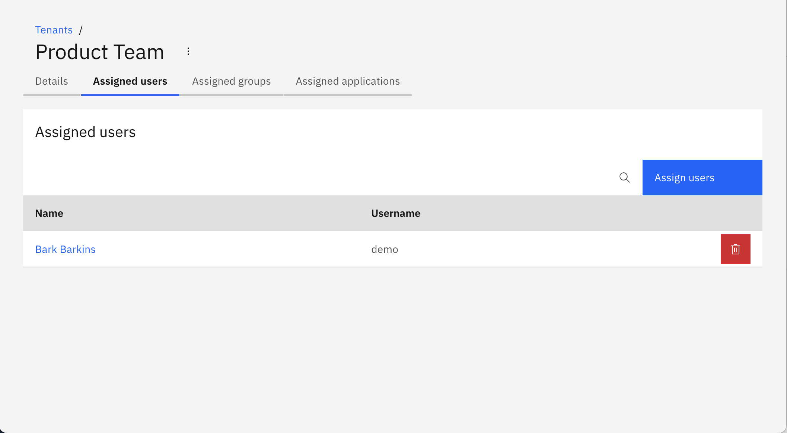
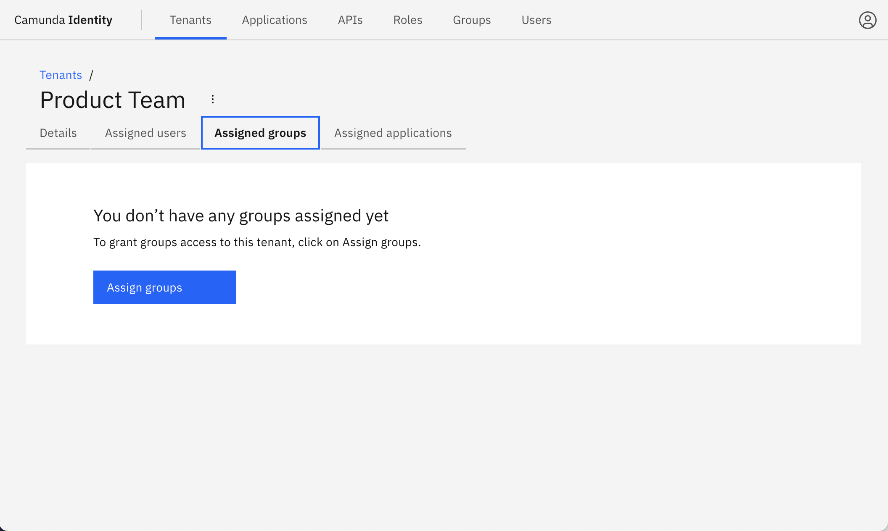
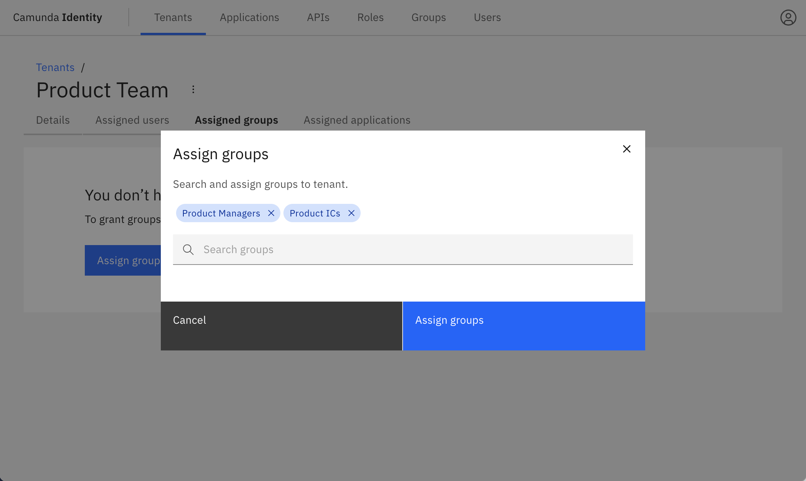
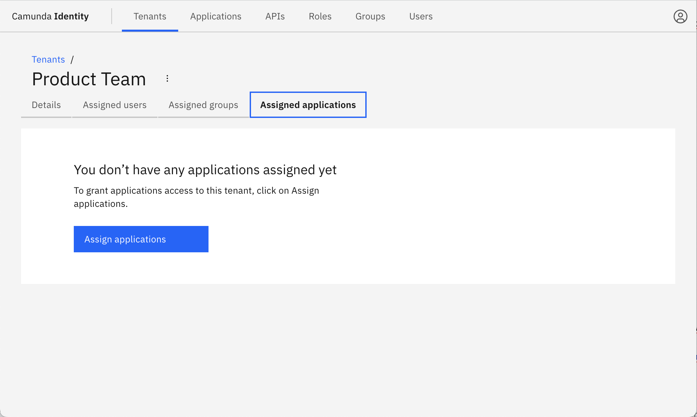
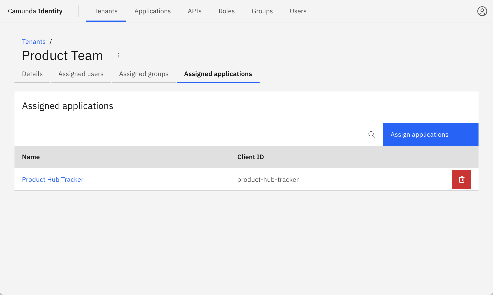

Manage and use tenants to isolate data access for your custom applications and users.

## About using multi-tenancy with Identity

Camunda 8 multi-tenancy refers to the ability to serve multiple distinct tenants or clients within a single installation.

**Precondition**: Multi-tenancy is disabled by default. To enable multi-tenancy, you must:

1. Enable [`MULTITENANCY_ENABLED` feature flag](/self-managed/identity/miscellaneous/configuration-variables.md#feature-flags).
2. [Configure a database](/self-managed/identity/miscellaneous/configuration-variables.md#database-configuration).

:::info
To learn more about using multi-tenancy in Camunda 8, see [multi-tenancy](/self-managed/concepts/multi-tenancy.md).
:::

## Create a tenant

:::note
A `<default>` tenant is automatically created during Identity startup.
:::

1. Log in to the Identity interface and navigate to the **Tenants** tab.

   

2. Click **Create Tenant** and a modal will open.

3. Enter a name and ID for the tenant, and click **Create tenant**:

   

   On creation, the modal closes and the table updates with your new tenant.

4. Click on your new tenant to view the details:

   

## Assign applications, groups, and users to a tenant

You can assign applications, groups, and individual users to a tenant as follows:

### Assign applications to a tenant

1. Click **Assigned users** to view the users assigned to the tenant, and click **Assign users**:

   

1. Search and select the users to assign to the tenant. After selecting the users, click **Assign users**:

   

   On confirmation, the modal closes, the table updates, and the assigned users are shown:

   

### Assign groups to a tenant

1. Click **Assigned groups** to view the groups assigned to the tenant, and click **Assign groups**:

   

1. Search and select the groups to assign to the tenant. After selecting the groups, click **Assign groups**:

   

   On confirmation, the modal closes, the table updates, and the assigned groups are shown:

   

### Assign applications to a tenant

1. Click **Assigned applications** to view the applications assigned to the tenant, and click **Assign applications**:

   

1. Search and select the applications to assign to the tenant. After selecting the applications, click **Assign applications**:

   

   On confirmation, the modal closes, the table updates, and the assigned applications are shown:

   
