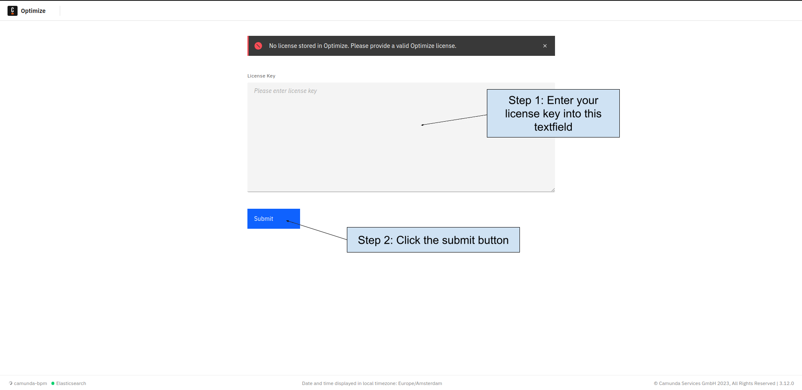

Camunda 7 only

When you log in to Optimize for the first time, you are redirected to the license page. Here, enter your license key to be able to use Camunda Optimize.

Alternatively, you can add a file with the license key to the path `${optimize-root-folder}/config/OptimizeLicense.txt`; it will be automatically loaded to the database unless it already contains a license key.

If you are using the Optimize Docker images and want Optimize to automatically recognize your license key, refer to the [installation guide](../../install-and-start#license-key-file) on how to achieve this.
