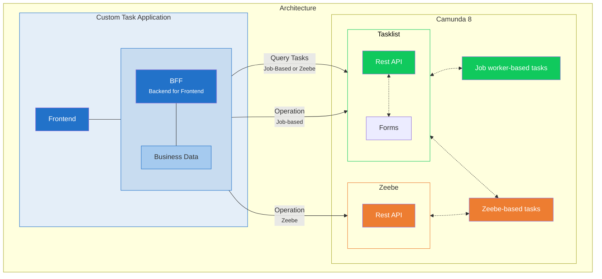

A typical task application architecture consists of a task application frontend, a backend-for-frontend, and one or more data sources or services that contain business data relevant for the application users to perform their work. The backend implements Camunda Zeebe and Tasklist clients to retrieve and interact with tasks via Camunda APIs. For historical process instance data, Operate is also required.

Depending on the user task implementation type (job-based vs Zeebe user task) you use in your processes, you need to run either the Tasklist or Zeebe client to run operations on task. Task, form, and variable retrieval happens via the Tasklist API. Learn more about the differences of the task implementation types in the [migration guide for Zeebe user tasks](/apis-tools/tasklist-api-rest/migrate-to-zeebe-user-tasks.md).

:::tip
Starting a completely new project? Use only Zeebe user tasks to simplify your implementation.
:::

Click on any element of this diagram to jump to the documentation page for the respective component:

Follow these resources to learn more about the individual components:

- Familiarize yourself with the [Tasklist API](/apis-tools/tasklist-api-rest/tasklist-api-rest-overview.md) for task, variable, and form retrieval, and to run operations on job-based user tasks.
- Learn how to use the [Zeebe API](/apis-tools/zeebe-api-rest/zeebe-api-rest-overview.md) to run operations on Zeebe-based user tasks.
- Understand how to design, embed, and customize [forms](/apis-tools/frontend-development/03-forms/01-introduction-to-forms.md).
- Understand how this architecture fits into the overall Camunda architecture with the [Java greenfield stack](/components/best-practices/architecture/deciding-about-your-stack.md).
