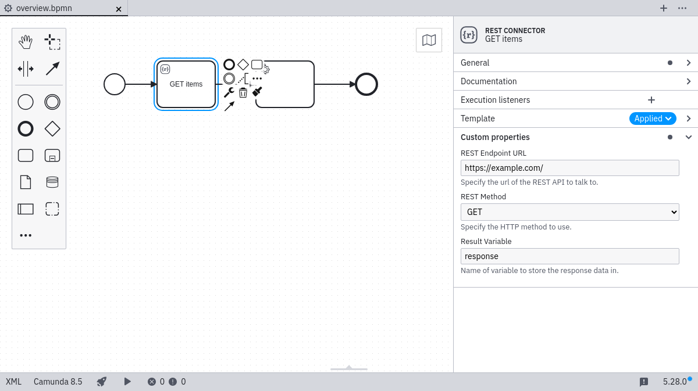
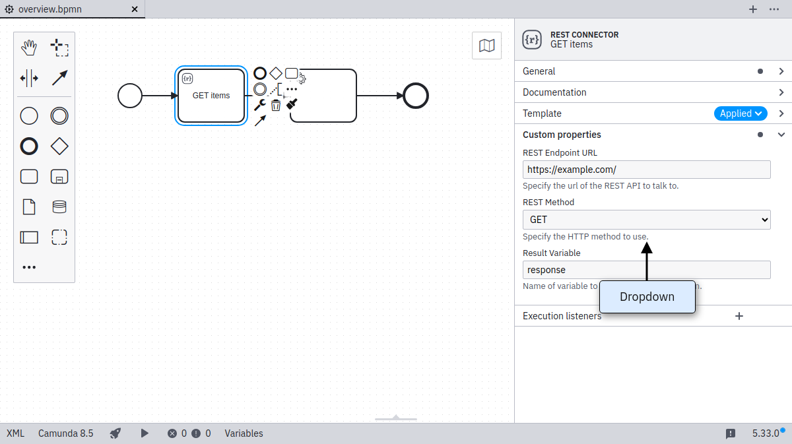
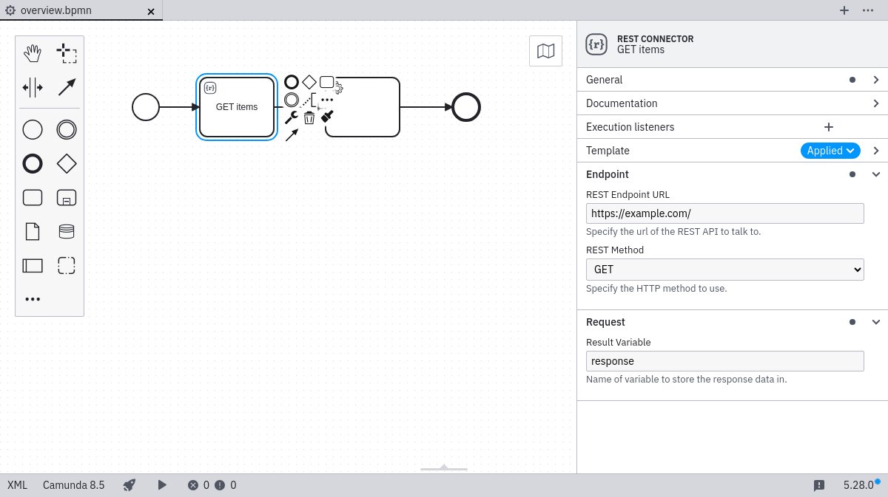
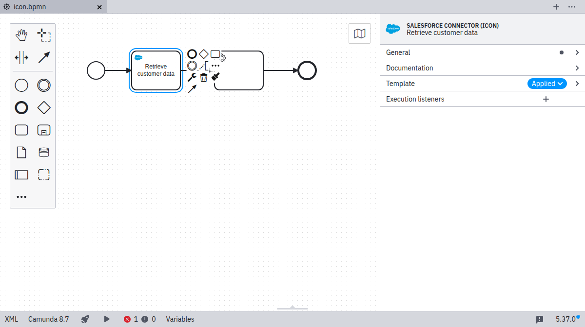
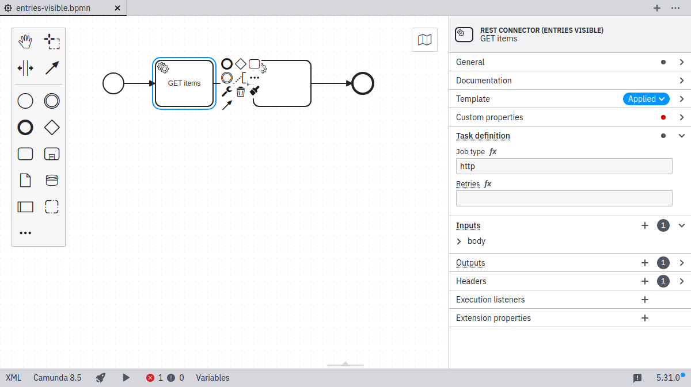

Templates are defined in template descriptor files as a JSON array:

```json
[
  {
    "$schema": "https://unpkg.com/@camunda/zeebe-element-templates-json-schema/resources/schema.json",
    "name": "Template 1",
    "id": "sometemplate",
    "description": "some description",
    "version": 1,
    "engines": {
      "camunda": "^8.6"
    },
    "appliesTo": [
      "bpmn:Task"
    ],
    "elementType": {
      "value": "bpmn:ServiceTask",
    },
    "properties": [
      ...
    ]
  },
  {
    "name": "Template 2",
    ...
  }
]
```

As seen in the code snippet, a template consists of a number of important components:

- `$schema : String`: URI pointing towards the [JSON schema](https://json-schema.org/) which defines the structure of the element template `.json` file. Element template schemas are maintained in the [element templates JSON schema](https://github.com/camunda/element-templates-json-schema) repository. Following the [JSON schema](https://json-schema.org/) standard, you may use them for validation or to get assistance (e.g., auto-completion) when working with them in your favorite IDE.

:::note

The `$schema` attribute is **required** for Camunda 8 element templates.
:::

Example:

```json
"$schema": "https://unpkg.com/@camunda/zeebe-element-templates-json-schema/resources/schema.json"
```

- `name : String`: Name of the template. Shown in the element template selection modal and in the properties panel on the right side of the screen (after applying an element template).
- `id : String`: ID of the template.
- `description : String`: Optional description of the template. Shown in the element template selection modal and in the properties panel (after applying an element template).
- `documentationRef : String`: Optional URL pointing to a template documentation. Shown in the properties panel (after applying an element template).
- `version : Integer`: Optional version of the template. If you add a version to a template, it is considered unique based on its ID and version. Two templates can have the same ID if their version is different.
- `engines : Object`: Optional dictionary of environments compatible with the template. Environment version is specified with semantic versions range.
- `appliesTo : Array<String>`: List of BPMN types the template can be applied to.
- `elementType : Object`: Optional type of the element. If you configure `elementType` on a template, the element is replaced with the specified type when a user applies the template.
- `properties : Array<Object>`: List of properties of the template.

## Creating and editing Connector templates

Connector templates are a specific kind of element template. You can edit them with visual preview and edit support like formatting, code completion, and error highlighting in [Web Modeler](/components/connectors/manage-connector-templates.md).

## JSON schema compatibility

The application uses the `$schema` property to ensure compatibility for a given element template. You find [the latest supported versions here](https://www.npmjs.com/package/@camunda/zeebe-element-templates-json-schema).

The tooling ignores element templates defining a higher `$schema` version and logs a warning message.

For example, given the following `$schema` definition, the application takes `0.9.1` as the JSON schema version of the element template:

```json
"$schema": "https://unpkg.com/@camunda/zeebe-element-templates-json-schema@0.9.1/resources/schema.json"
```

The JSON schema versioning is backward-compatible, meaning that all versions including or below the current one are supported.

## Template compatibility

You can define template compatibility with execution platforms and applications using the `engines` property.

This property is a dictionary object, where the execution platform names are the keys, and the [semantic version](https://semver.org/) ranges are the values.

For example, the following `engines` definition specifies that the template is compatible with Camunda 8.6 or higher.

```json
"engines": {
  "camunda": ">8.5"
}
```

Compatibility is only validated if the platform version is provided by both the template and the modeler. In the example below, the template is compatible with specified versions of both Desktop and Web Modeler, but it requires Camunda version 8.6 or higher for both:

```json
"engines": {
  "camunda": ">8.5",
  "camundaDesktopModeler": ">=5.30",
  "camundaWebModeler": "^8.5.5"
}
```

You can also use this feature to explicitly specify a template’s incompatibility with a platform. For instance, the following template is incompatible with all versions of Web Modeler:

```json
"engines": {
  "camundaWebModeler": "0"
}
```

If no engines are specified, the template is considered compatible with any execution platform version.

## Supported BPMN types

Currently, element templates may be used on the following BPMN elements:

- `bpmn:Activity` (including tasks, service tasks, and others)
- `bpmn:SequenceFlow` (for maintaining `condition`)
- `bpmn:Process`
- `bpmn:Event`

## Defining template properties

With each template, you define some user-editable fields as well as their mapping to BPMN 2.0 XML, and Camunda extension elements.

Let us consider the following example that defines a template for a mail sending task:

```json
{
  "$schema": "https://unpkg.com/@camunda/zeebe-element-templates-json-schema/resources/schema.json",
  "name": "REST Connector",
  "id": "io.camunda.examples.RestConnector",
  "description": "A REST API invocation task.",
  "appliesTo": ["bpmn:ServiceTask"],
  "properties": [
    {
      "type": "Hidden",
      "value": "http",
      "binding": {
        "type": "zeebe:taskDefinition",
        "property": "type"
      }
    },
    {
      "label": "REST Endpoint URL",
      "description": "Specify the url of the REST API to talk to.",
      "type": "String",
      "binding": {
        "type": "zeebe:taskHeader",
        "key": "url"
      },
      "constraints": {
        "notEmpty": true,
        "pattern": {
          "value": "^https?://.*",
          "message": "Must be http(s) URL."
        }
      }
    },
    {
      "label": "REST Method",
      "description": "Specify the HTTP method to use.",
      "type": "Dropdown",
      "value": "get",
      "choices": [
        { "name": "GET", "value": "get" },
        { "name": "POST", "value": "post" },
        { "name": "PATCH", "value": "patch" },
        { "name": "DELETE", "value": "delete" }
      ],
      "binding": {
        "type": "zeebe:taskHeader",
        "key": "method"
      }
    },
    {
      "label": "Request Body",
      "description": "Data to send to the endpoint.",
      "value": "",
      "type": "String",
      "optional": true,
      "binding": {
        "type": "zeebe:input",
        "name": "body"
      }
    },
    {
      "label": "Result Variable",
      "description": "Name of variable to store the response data in.",
      "value": "response",
      "type": "String",
      "optional": true,
      "binding": {
        "type": "zeebe:output",
        "source": "= body"
      }
    }
  ]
}
```

The example defines five custom fields, each mapped to different technical properties:

- The task type `http` is mapped to the `type` property of a `zeebe:taskDefinition` element in BPMN 2.0 XML.
- The `REST Endpoint URL` and `REST Method` are mapped to `task headers`.
- The `Request Body` is mapped to a local variable via an `input parameter`.
- The `Result Variable` is mapped into a process variable via an `output parameter`.

The task type is hidden to the user. Properties specified in the template can be edited through the properties panel as shown in the following screenshot:



As seen in the example, the important attributes in a property definition are:

- `label`: A descriptive text shown with the property.
- `type`: Defining the visual appearance in the properties panel (may be any of `String`, `Text`, `Boolean`, `Dropdown` or `Hidden`).
- `value`: An optional default value to be used if the property to be bound is not yet set.
- `binding`: Specifying how the property is mapped to BPMN or Camunda extensions (cf. [bindings](#bindings)).
- `constraints`: A list of editing constraints to apply to the template.

In addition, fields can be activated conditionally via these properties:

- `id`: An identifier that can be used to reference the property in conditional properties
- `condition`: A condition that determines when [the property is active](#defining-conditional-properties)

### Generated value

As an alternative to static `value`, you can use a generated value. The value is generated when a property is applied to an element. Currently, the generated value can be a UUID:

```json
{
  "type": "Hidden",
  "generatedValue": {
    "type": "uuid"
  },
  "binding": {
    "type": "zeebe:property",
    "name": "id"
  }
}
```

### Types

The input types `String`, `Text`, `Number`, `Boolean`, `Dropdown`, and `Hidden` are available. As seen above, `String` maps to a single-line input, while `Text` maps to a multi-line input.

#### Number type

The `Number` type maps to a number input field. By default, this will be persisted as a string in the BPMN. Refer to the [FEEL](#feel) section to use `Numbers` as expressions.

#### Boolean / checkbox type

The `Boolean` type maps to a checkbox that can be toggled by the user.

When checked, it maps to `true` in the respective field (refer to [bindings](#bindings)). Additionally, refer to the [FEEL](#feel) section to use `Booleans` as expressions.

#### Dropdown type

The `Dropdown` type allows users to select from a number of pre-defined options that are stored in a custom properties `choices` attribute as `{ name, value }` pairs:

```json
...
  "properties": [
    ...
    {
      "label": "REST Method",
      "description": "Specify the HTTP method to use.",
      "type": "Dropdown",
      "value": "get",
      "choices": [
        { "name": "GET", "value": "get" },
        { "name": "POST", "value": "post" },
        { "name": "PATCH", "value": "patch" },
        { "name": "DELETE", "value": "delete" }
      ],
      "binding": {
        "type": "zeebe:taskHeader",
        "key": "method"
      }
    }
  ]
...
```

The resulting properties panel control looks like this:



#### FEEL

The following input types support the `feel` property:

- `String`
- `Text`
- `Number`
- `Boolean`

##### FEEL required

The field will be displayed as a FEEL editor and a visual indication that a FEEL expression is required will be shown:

```json
  "properties": [
    {
      "label": "Required FEEL Expression",
      "type": "String",
      "feel": "required"
    }
  ]
```

##### FEEL optional

An indicator to switch to a FEEL expression is shown. When activated, the field will be displayed as a FEEL editor:

```json
  "properties": [
    {
      "label": "Optional FEEL Expression",
      "type": "String",
      "feel": "optional"
    }
  ]
```

For `Boolean` and `Number` fields, the value will always be persisted as a FEEL expression. This ensures that the value will not be interpreted as a string when evaluated in the engine.

##### FEEL static

The value of `feel: static` is only valid for `Boolean` and `Number` fields. Similar to [FEEL optional](#feel-optional), the value of the field will be persisted as a FEEL expression. However, there is no toggle to switch to a FEEL editor and ensures only a static value can be entered:

```json
  "properties": [
    {
      "label": "Static FEEL value",
      "type": "Number",
      "feel": "static"
    }
  ]
```

For binding types `zeebe:input` and `zeebe:output`, `feel: static` is the value used in case of missing `feel` property.

### Bindings

The following ways exist to map a custom field to the underlying BPMN 2.0 XML. The **mapping result** in the following section uses `[userInput]` to indicate where the input provided by the user in the `Properties Panel` is set in the BPMN XML. As default or if no user input was given, the value specified in `value` is displayed and used for `[userInput]`. `[]` brackets are used to indicate where the parameters are mapped to in the XML.

Notice that adherence to the following configuration options is enforced by design. If not adhering, it logs a validation error and ignores the respective element template.

#### `property`

| **Binding `type`**          | `property`                       |
| --------------------------- | -------------------------------- |
| **Valid property `type`'s** | All property types are supported |
| **Binding parameters**      | `name`: The name of the property |
| **Mapping result**          | `<... [name]=[userInput] ... />` |

Configures a generic BPMN element property.

#### `zeebe:input`

| **Binding `type`**          | `zeebe:input`                                                                    |
| --------------------------- | -------------------------------------------------------------------------------- |
| **Valid property `type`'s** | `String`<br /> `Text`<br />`Hidden`<br />`Dropdown`<br />`Boolean`<br />`Number` |
| **Binding parameters**      | `name`: The name of the input parameter                                          |
| **Mapping result**          | `<zeebe:input target="[name]" source="[userInput] />`                            |

Configures an [input mapping](../../../../concepts/variables/#input-mappings).

#### `zeebe:output`

| **Binding `type`**          | `zeebe:output`                                                                   |
| --------------------------- | -------------------------------------------------------------------------------- |
| **Valid property `type`'s** | `String`<br /> `Text`<br />`Hidden`<br />`Dropdown`<br />`Boolean`<br />`Number` |
| **Binding parameters**      | `source`: The source of the output parameter                                     |
| **Mapping result**          | `<zeebe:output target="[userInput]" source="[source] />`                         |

Configures an [output mapping](../../../../concepts/variables/#output-mappings).

#### `zeebe:taskHeader`

| **Binding `type`**          | `zeebe:taskHeader`                                  |
| --------------------------- | --------------------------------------------------- |
| **Valid property `type`'s** | `String`<br /> `Text`<br />`Hidden`<br />`Dropdown` |
| **Binding parameters**      | `key`: The key of the task header                   |
| **Mapping result**          | `<zeebe:header key="[key]" value="[userInput] />`   |

Configures a [task header](../../../bpmn/service-tasks/#task-headers).

#### `zeebe:taskDefinition`

| **Binding `type`**          | `zeebe:taskDefinition`                                                            |
| --------------------------- | --------------------------------------------------------------------------------- |
| **Valid property `type`'s** | `String`<br /> `Text`<br />`Hidden`<br />`Dropdown`                               |
| **Binding parameters**      | `property`: The name of the task definition property. Can be `type` or `retries`. |
| **Mapping result**          | `<zeebe:taskDefinition [property]="[userInput]" />`                               |

Configures the [task](../../../bpmn/service-tasks/#task-definition) for a service or user task.

#### `zeebe:taskDefinition:type`

:::danger
`zeebe:taskDefinition:type` is a deprecated binding. Instead, use `zeebe:taskDefinition` with `property=type`.
:::

| **Binding `type`**          | `zeebe:taskDefinition:type`                         |
| --------------------------- | --------------------------------------------------- |
| **Valid property `type`'s** | `String`<br /> `Text`<br />`Hidden`<br />`Dropdown` |
| **Binding parameters**      |                                                     |
| **Mapping result**          | `<zeebe:taskDefinition type="[userInput]" />`       |

Configures the [task type](../../../bpmn/service-tasks/#task-definition) for a service or user task.

#### `zeebe:property`

| **Binding `type`**          | `zeebe:property`                                      |
| --------------------------- | ----------------------------------------------------- |
| **Valid property `type`'s** | `String`<br />`Text`<br />`Hidden`<br />`Dropdown`    |
| **Binding parameters**      | `name`: The name of the property                      |
| **Mapping result**          | `<zeebe:property name="[name]" value="[userInput] />` |

The `zeebe:property` binding allows you to set any arbitrary property for an outside system. It does not impact execution of the Zeebe engine.

#### `bpmn:Message#property`

| **Binding `type`**          | `bpmn:Message#property`                            |
| --------------------------- | -------------------------------------------------- |
| **Valid property `type`'s** | `String`<br />`Text`<br />`Hidden`<br />`Dropdown` |
| **Binding parameters**      | `name`: The name of the property                   |
| **Mapping result**          | `<bpmn:message [name]="[userInput]" />`            |

The `bpmn:Message#property` binding allows you to set properties of a `bpmn:Message` referred to by the templated element. This binding is only valid for templates of events with `bpmn:MessageEventDefinition`, receive tasks, and send tasks.

#### `bpmn:Message#zeebe:subscription#property`

| **Binding `type`**          | `bpmn:Message#property`                            |
| --------------------------- | -------------------------------------------------- |
| **Valid property `type`'s** | `String`<br />`Text`<br />`Hidden`<br />`Dropdown` |
| **Binding parameters**      | `name`: The name of the property                   |
| **Mapping result**          | `<zeebe:subscription [name]="[userInput]" />`      |

The `bpmn:Message#zeebe:subscription#property` binding allows you to set properties of a `zeebe:subscription` set within `bpmn:Message` referred to by the templated element. This binding is only valid for templates of events with `bpmn:MessageEventDefinition`, and receive tasks.

:::note

The binding name of `correlationKey` is not applicable to message start events on a process. In such cases, the property is automatically hidden.

:::

#### `zeebe:calledElement`

| **Binding `type`**          | `zeebe:calledElement`                                                |
| --------------------------- | -------------------------------------------------------------------- |
| **Valid property `type`'s** | `String`<br />`Text`<br />`Hidden`<br />`Dropdown`                   |
| **Binding parameters**      | `property`: The name of the property (only `processId` is supported) |
| **Mapping result**          | `<zeebe:calledElement [property]="[userInput]" />`                   |

The `zeebe:calledElement` binding allows you to configure process called by a call activity.

:::note

For `zeebe:calledElement` bindings, variable propagation is not supported. To provide or retrieve variables, use `zeebe:input` and `zeebe:output` bindings.

:::

### Optional bindings

We support optional bindings that do not persist empty values in the underlying BPMN 2.0 XML.

If a user removes the value in the configured control, it will also remove the mapped element.

```json
[
  {
    "$schema": "https://unpkg.com/@camunda/zeebe-element-templates-json-schema/resources/schema.json",
    "name": "Task example",
    "id": "some-template",
    "appliesTo": ["bpmn:ServiceTask"],
    "properties": [
      {
        "label": "Request",
        "type": "String",
        "optional": true,
        "binding": {
          "type": "zeebe:input",
          "name": "request"
        }
      },
      {
        "label": "Response",
        "type": "Text",
        "optional": true,
        "binding": {
          "type": "zeebe:output",
          "source": "response"
        }
      }
    ]
  }
]
```

#### Supported Bindings

The following binding types can be `optional`:

- `zeebe:input`
- `zeebe:output`
- `zeebe:taskHeader`
- `zeebe:property`

### Groups

You can define `groups` to organize custom fields into:

```json
{
  "$schema": "https://unpkg.com/@camunda/zeebe-element-templates-json-schema/resources/schema.json",
  "name": "Groups",
  "id": "group-example",
  "appliesTo": [
    "bpmn:ServiceTask"
  ],
  "groups": [
    {
      "id": "definition",
      "label": "Task definition"
    },
    {
      "id": "request",
      "label": "Request payload"
    },
    {
      "id": "result",
      "label": "Result mapping"
    },
    {
      "id": "authentication",
      "label": "Authentication",
      "tooltip": "Optional authentication settings",
      "openByDefault": false
    }
  ],
  "properties": [
    ...
  ]
}
```

Groups can have the following attributes:

- `id`: Unique identifier of the group
- `label`: Label of the group
- `tooltip`: Tooltip for the group (optional)
- `openByDefault`: Whether the group will be expanded in the properties panel (optional, default: `true`)

Associate a field with a group (ID) via the fields `group` key:

```json
{
  ...
  "properties": [
    {
      "group": "definition",
      "label": "Task type",
      "type": "String",
      "value": "http",
      "binding": {
        "type": "zeebe:taskDefinition:type"
      }
    },
    ...
  ],
  ...
}
```



### Constraints

Custom fields may have a number of constraints associated with them:

- `notEmpty`: Input must be non-empty
- `minLength`: Minimal length for the input
- `maxLength`: Maximal length for the input
- `pattern`: Regular expression to match the input against

#### Regular expression

Together with the `pattern` constraint, you can define your custom error messages:

```json
...
  "properties": [
    {
      "label": "Web service URL",
      "type": "String",
      "binding": { ... },
      "constraints": {
        "notEmpty": true,
        "pattern": {
          "value": "https://.*",
          "message": "Must be https URL"
        }
      }
    }
  ]
```

### Placeholder

The following property types support the `placeholder` attribute:

- `String`
- `Text`

The placeholder is displayed when a field is empty:

```json
...
  "properties": [
    {
      "label": "Web service URL",
      "type": "String",
      "binding": { ... },
      "placeholder": "https://example.com"
    }
  ]
```

### Icons

It is possible to define custom icons to update the visual appearance of elements after applying an element template.

```json
[
  {
    "name": "Template 1",
    "id": "sometemplate",
    "appliesTo": [
      "bpmn:ServiceTask"
    ],
    "icon": {
      "contents": "data:image/svg+xml,%3Csvg xmlns='http://www.w3.org/2000/svg' width='22' height='22' viewBox='0 0 22 22' fill='none'%3E%3Ccircle cx='11' cy='11' r='9' fill='black'/%3E%3Ctext x='6.9' y='14.9' fill='white' style='font-family: Arial; font-size: 10px;'%3EM%3C/text%3E%3C/svg%3E"
    },
    "properties": [
      ...
    ]
  }
]
```



The icon contents must be a valid [data](https://developer.mozilla.org/en-US/docs/Web/HTTP/Basics_of_HTTP/Data_URIs) or HTTP(s) URL. We recommend using square icons as they get rendered 18x18 pixels on the canvas and 32x32 pixels in the properties panel.

### Display all entries

Per default, the element template defines the visible entries of the properties panel. All other property controls are hidden. If you want to bring all the default entries back, it is possible to use the `entriesVisible` property.

```json
[
  {
    "name": "Template 1",
    "id": "sometemplate",
    "entriesVisible": true,
    "appliesTo": [
      "bpmn:ServiceTask"
    ],
    "properties": [
      ...
    ]
  }
]
```



## Defining conditional properties

Properties may have a condition which determines when they should be active, depending on the value of another property. When property is **active**, it is displayed in the properties panel, and its value is serialized in the XML. If a property is **not active**, it is not displayed, and its value is removed from the XML.

For a property value to be used in a condition, the property needs to have an `id` that can be referenced by the conditional property.

A property can depend on one or more conditions. If there are multiple conditions, they can be defined using `allMatch`. All of the conditions must be met for the property to be active.

There are three possible comparison operators:

- `equals`: Checks if the value is equal to the value defined in the condition.
- `oneOf`: Checks if the value is in the list of values defined in the condition.
- `isActive`: Checks if the referenced property is currently active and not hidden by other conditions.

```json
...
  "properties": [
    {
      "id": "httpMethod",
      "label": "HTTP Method",
      "type": "Dropdown",
      "choices": [
        { "name": "get", "value": "GET" },
        { "name": "patch", "value": "PATCH" },
        { "name": "post", "value": "POST" },
        { "name": "delete", "value": "DELETE" }
      ],
      "binding": { ... },
    },
    {
      "label": "Request Body",
      "type": "String",
      "binding": { ... },
      "condition": {
        "property": "httpMethod",
        "oneOf": ["patch", "post", "delete"]
      }
    },
    {
      "id": "authenticationType",
      "label": "Authentication Type",
      "type": "Dropdown",
      "choices": [
        {
          "name": "None",
          "value": ""
        },
        {
          "name": "Basic",
          "value": "basic"
        }
      ],
      "binding": { ... }
    },
    {
      "label": "Username",
      "type": "String",
      "binding": { ... },
      "condition": {
       "allMatch": [
          {
            "property": "httpMethod",
            "oneOf": ["patch", "post", "delete"]
          },
          {
            "property": "authenticationType",
            "equals": "basic"
          }
        ]
      }
    },
    {
      "label": "Password",
      "type": "String",
      "binding": { ... },
      "condition": {
        "allMatch": [
          {
            "property": "httpMethod",
            "oneOf": ["patch", "post", "delete"]
          },
          {
            "property": "authenticationType",
            "equals": "basic"
          }
        ]
      }
    },
  ]
```
