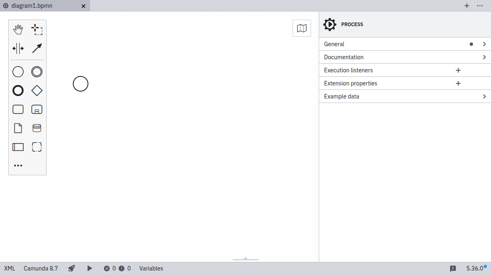

Camunda 7 and 8

Desktop Modeler is a desktop application for modeling BPMN, DMN, and Forms and supports you in building executable diagrams with Camunda.

## Features

- Design [BPMN](../bpmn/bpmn.md), [DMN](../dmn/dmn.md), and [Forms](../forms/camunda-forms-reference.md)
- Implement process applications for Camunda 7 and 8
- Deploy and run processes directly from the application
- Validate your diagrams using [configurable lint rules](https://github.com/camunda/camunda-modeler-custom-linter-rules-plugin)
- [Customize](./flags/flags.md) and [extend](./plugins/plugins.md) the application

## Download

Download the app for Windows, Linux, or macOS from the [Camunda downloads page](https://camunda.com/download/modeler/).

## Get started

Learn how to [develop your first process](./model-your-first-diagram.md) and [deploy it](./connect-to-camunda-8.md) to Camunda 8.

## Resources

- [Report an issue](https://github.com/camunda/camunda-modeler/issues)
- [Source code](https://github.com/camunda/camunda-modeler)
- [Troubleshooting](/self-managed/operational-guides/troubleshooting/troubleshooting.md)
