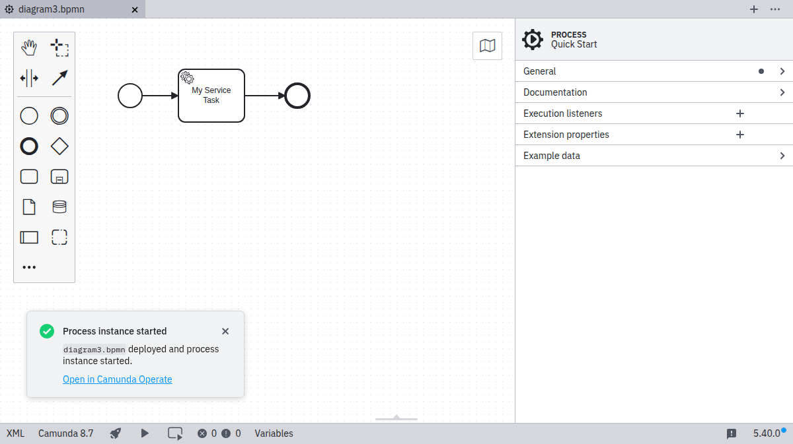

1. Ensure you have already set up and selected a connection by following the [Connect to Camunda 8](./connect-to-camunda-8.md) guide.

   

2. Click the play icon to start a new process instance.

   

3. Enter optional variables for starting the process instance. Click **Start BPMN process instance** to deploy and start the instance.

   

   A confirmation message confirms that the instance started successfully.

   
