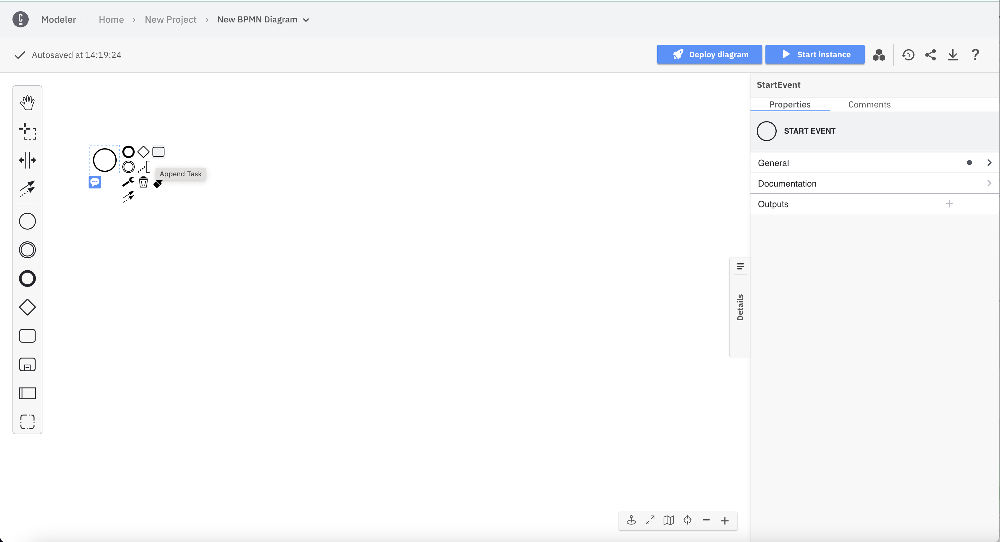
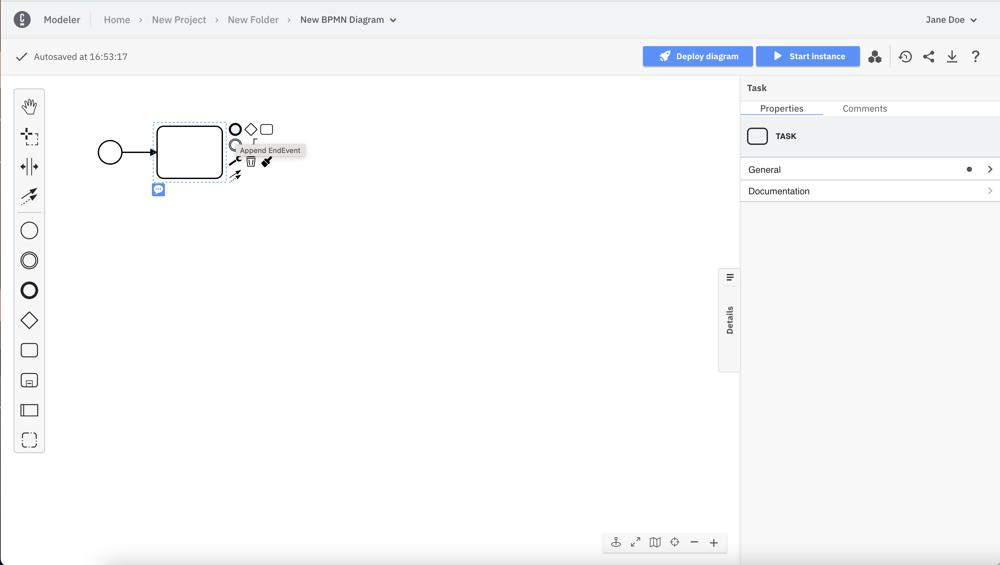
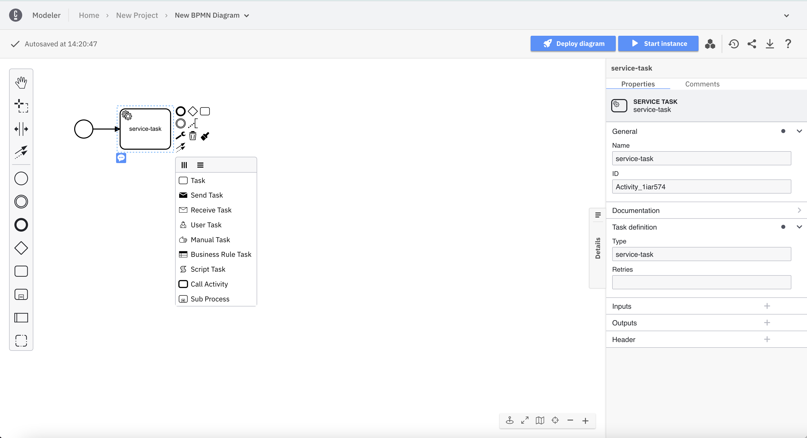

Camunda 8 only

After you've created a BPMN diagram, you can start modeling it.

We've preconfigured a diagram consisting of a start event. To convert it to something meaningful, append a **Task** to it, and afterwards append an **EndEvent**:

Each element has adjustable attributes. Use the properties panel on the right side of the page.

Elements supporting different types can be reconfigured by clicking on the corresponding icon. In the following screenshot, a task has been added to the diagram. It can be converted to a service task, for example.

To revert or reapply changes, you can use the **undo** and **redo** buttons located below the elements palette.

:::info
See undo/redo management limitations when [Collaborating](./collaboration.md#undoredo-management-limitations) and [Importing](./import-diagram.md#undoredo-management-limitations).
:::

Use the canvas tools in the bottom right corner to interact with your diagram.

1. Zoom in.
   

2. Zoom out.
   

3. Reset viewport if you get lost on the canvas.
   

4. Open the minimap to navigate complex diagrams.
   

5. Enter the fullscreen mode for distraction-free modeling.
   

6. Drop an attention point and use it as a laser pointer in your presentations.
   
