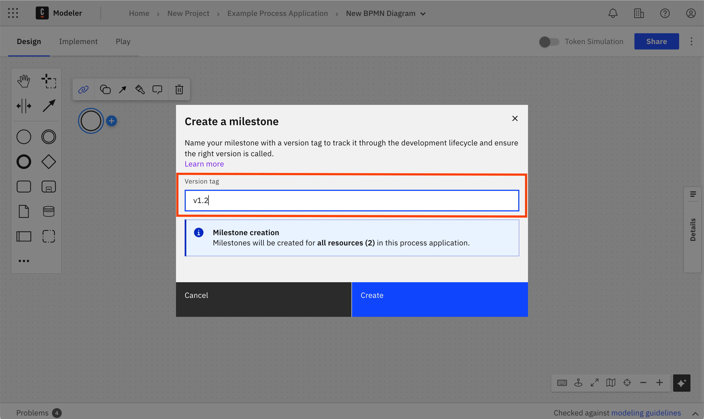
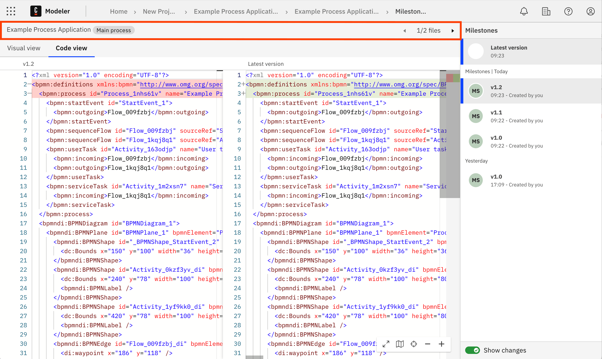

Although you cannot version a process application itself, you can use [bulk milestone creation](milestones.md#bulk-milestone-creation) and version tags to save a single 'versioned' snapshot of all the process application files in one action, instead of having to create separate milestones for every file.

- When you create a milestone in any process application file, a milestone is also created with the same name (version tag) for all files currently available in the process application.

- This allows you to track a process application through the development lifecycle and ensure the correct version is called.

## A worked example

In this example, you have a process application that contains multiple files as well as the main process.

- You create a new milestone for the main process and enter "1.2" as the version tag.
- When you create this new milestone, a milestone is also created for every other file and named with the same "1.2" version tag.
- All files in the process application now have a "version 1.2" milestone.

## Create a bulk milestone

To create a bulk milestone for a process application:

1. Open any file in a process application and [create a milestone](milestones.md#create-a-milestone).
1. Enter a **Version tag**.
1. Select **Create** to create the milestone and matching version milestones for every file in the process application.

Now when you open the milestone history for any file in the process application, you can use the file navigation header buttons to switch between files, and view their individual milestone history. See [compare milestones](/docs/components/modeler/web-modeler/milestones.md#compare-milestones).

:::note

When naming your milestone with a version tag, you cannot edit or delete the created versions.

:::
