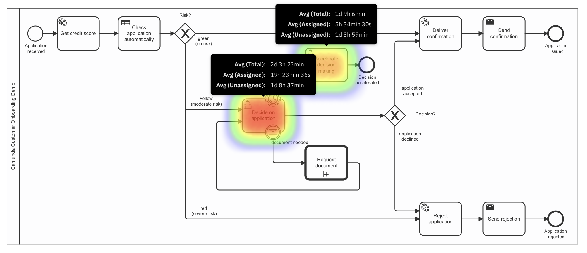
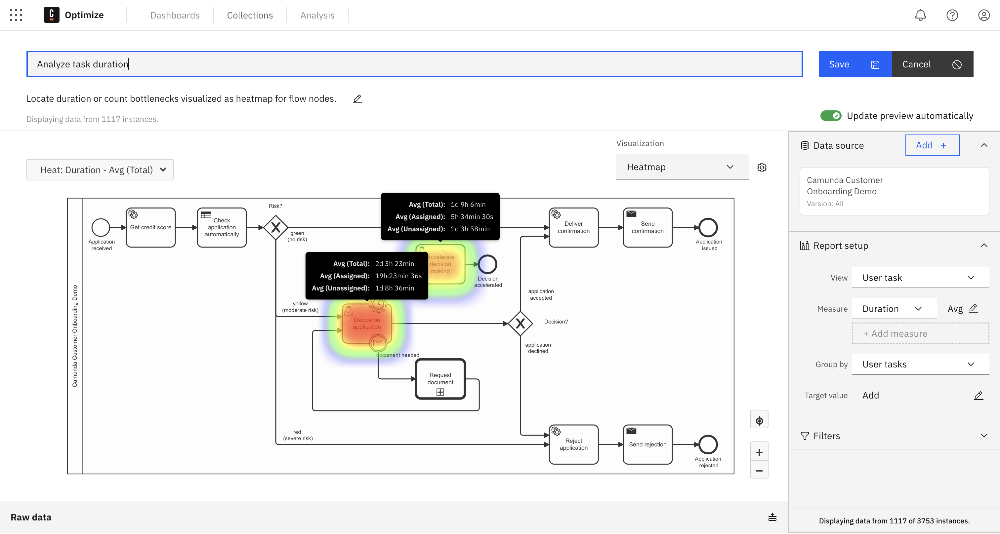
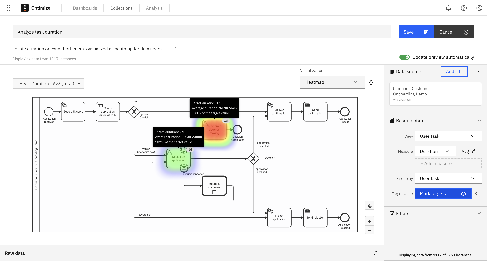
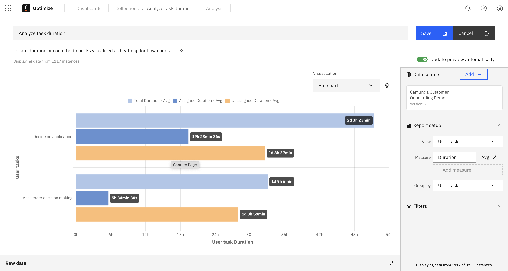
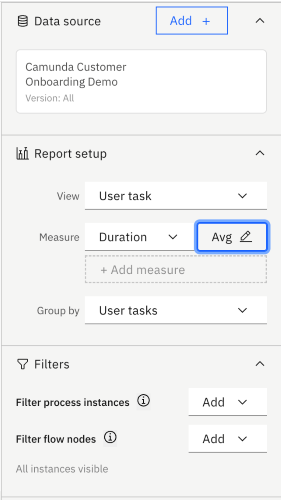
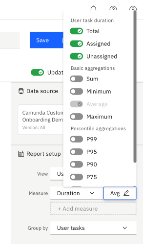

In the realm of automated processes, the efficiency and effectiveness of a system are largely determined by how well it supports the user in performing their tasks. Often, businesses find that, despite automation, there still exist significant bottlenecks affecting overall productivity. These bottlenecks are commonly rooted in user tasks.

- **User tasks generating the highest effort:** In an automated environment, certain tasks still demand significant human intervention. These tasks are often complex, error-prone, and time-consuming, leading to a disproportionate allocation of resources.
- **Optimizing user tasks as a driver for improvement projects:** As organizations continually seek to improve performance, the optimization of user tasks emerges as a primary driver for new improvement projects. Streamlining these tasks can lead to substantial gains in productivity and cost savings.
- **User tasks as a source of operational frictions:** User tasks are frequently the primary source of operational frictions. These frictions can manifest as delays, decreased throughput, and increased error rates, all of which negatively impact the business's bottom line.

Optimizing user tasks offers a comprehensive approach to mitigating the challenges associated with user tasks. By leveraging advanced analytical tools, businesses can gain insights into how time and resources are being spent on user tasks and identify opportunities for improvement. Optimize provides the following capabilities to do so:

- **Analyze time spent on user tasks for assignment:** By measuring and analyzing the time users spend on specific tasks, organizations can identify patterns and outliers. This analysis allows for a better understanding of task complexity and the allocation of resources.
- **Define targets for user tasks:** With concrete data on how long tasks should take, organizations can set realistic performance targets. These targets provide a benchmark for measuring improvements and can drive accountability and motivation among users.

## Use cases

### Analyze task duration on a heatmap

The user task heatmap is designed to offer stakeholders a panoramic view of all user tasks within a given process. This visual tool synthesizes complex data into an understandable graphical representation, highlighting areas of high activity and potential bottlenecks within the process flow. Optimize allows different aggregations based on the lifecycle of a task. With filters, it is possible to restrict evaluated process instances to analyze specific cases.

### Measure targets on a heatmap

To maintain adherence to Service Level Agreements (SLAs), it is essential to establish clear and measurable targets for each user task within a process. These targets serve as performance benchmarks, guiding users and helping maintain the quality and timeliness of task completion. Optimize allows users to define target values for user tasks on the heatmap.

### Evaluate task performance

For a thorough understanding of task execution within your processes, it is imperative to examine how tasks are performed both by the nature of the user task itself and by the assignee responsible for completing the task. This detailed analysis enables organizations to assess individual and collective task performance, providing insights into workflow efficiency and productivity.

Optimize allows breaking down user tasks by user task or assignee for the assigned and unassigned state of the task lifecycle. With filters, it is possible to evaluate only a subset of the process instances, for example, to evaluate the performance by country.

## Features

To evaluate user tasks, the following features are available in the report builder:

- **View user task** - The `View: User task` option limits the flow nodes evaluated to user tasks only.
- **Duration aggregations** - Durations can be aggregated by `Total`, `Assigned` and `Unassigned`.
- **Grouping** - Data can be grouped by `User tasks` or `Assignee`.
- **Filter** - Data can be filtered by `Assignee`.

## Good to know

:::danger Known limitations

- Currently, user task analytics can be used only with assigned or unassigned time. We are working on analyzing net-work time.
- This will only work with Tasklist and custom task applications implementing the complete [Camunda Tasklist Lifecycle]($docs$/apis-tools/frontend-development/task-applications/introduction-to-task-applications/).
- User task analytics only work correctly if all user tasks in a process are of type `Zeebe user task`. The `Job worker` user type does not contain task lifecycle information and is therefore not displayed in the view `User tasks` view.

:::

### How to evaluate task performance per assignee

Evaluating performance on assignee level is not allowed in all organizations. All features related to data evaluation on an assignee level can be deactivated via [configuration](../../../self-managed/optimize-deployment/configuration/system-configuration-platform-8.md#settings-related-to-camunda-8-zeebe-user-tasks).

Evaluation on assignee level is only possible in Camunda 7 and Camunda 8 Self-Managed.

### How the user task duration time is calculated

In user task duration reports, you have the opportunity to select which part of the user task's lifecycle you want to see in the report:

- **Unassigned:** View how long each user task was considered assigned (not claimed by an assignee/user) during its execution.
- **Assigned:** View how long each user task was considered to be assigned to assignees/users (claimed by an assignee/user) during its execution.
- **Total:** View how long each user task took to complete.

It is possible to display and compare multiple user task duration times in the same report. Reports with multiple user task duration times that have a [second "Group by"](./report-analysis/define-reports.md#reports-with-a-second-group-by-option) can only be visualized as table.

In certain circumstances, user tasks can be completed without being assigned to a user. These user tasks are evaluated as follows:

- If the user task was canceled without assignment (for example, by an Operator in Operate), the task duration is considered `Unassigned`.
- If the user tasks were completed without assignment (for example, via a custom UI), the time between start and end is considered `Assigned`.
- As these user tasks do not have an `assignee` set, they are displayed `Unassigned` in the reports.
