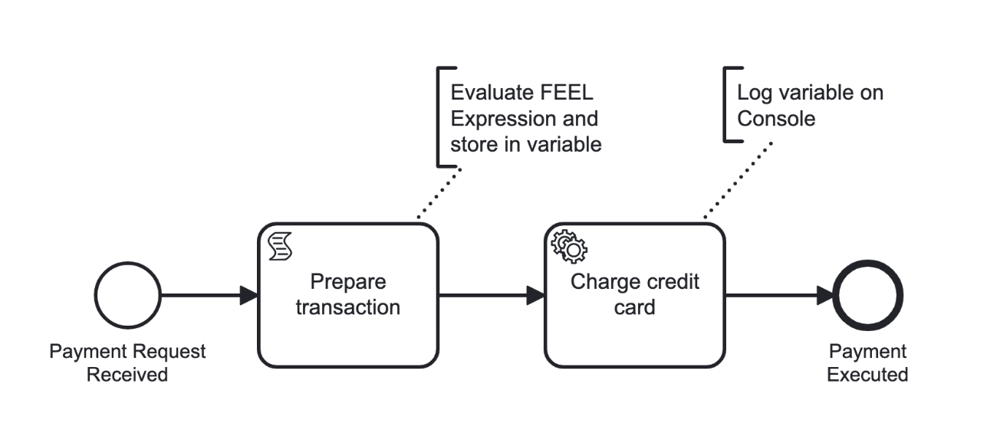

import Install from './react-components/\_install-c8run.md'

<span class="badge badge--beginner">Beginner</span>
<span class="badge badge--medium">1 hour</span>

In this guide, we'll step through using Spring Boot and the [Spring Zeebe SDK](/apis-tools/spring-zeebe-sdk/getting-started.md) with Desktop Modeler to interact with your local Self-Managed Camunda 8 installation. While this guide focuses on Self-Managed, you can do something similar with [SaaS](https://signup.camunda.com/accounts?utm_source=docs.camunda.io&utm_medium=referral).

:::note
This guide specifically uses Java and Spring because the two, in combination with Camunda 8, is our [default technology stack recommendation](/components/best-practices/architecture/deciding-about-your-stack.md#the-java-greenfield-stack).
:::

By the end of this tutorial, you'll be able to use Spring and Java code with Zeebe to:

- Deploy a process model.
- Initiate a process instance.
- Handle a service task.

For example, in this guide we will outline a BPMN model to receive a payment request, prepare a transaction, charge a credit card, and execute a payment:



:::note
While stepping through this guide, you can visit our [sample repository](https://github.com/camunda/camunda-8-get-started-spring/blob/main/src/main/java/io/camunda/demo/process_payments/ChargeCreditCardWorker.java) with the completed code to check your work.
:::

## Prerequisites

Before getting started, ensure you have the following in your local environment:

- Access to your preferred code editor or IDE
- [OpenJDK ≥ 17](https://openjdk.org/install/)
- [Camunda 8 Desktop Modeler](/components/modeler/desktop-modeler/index.md) and [Camunda 8 Run](/self-managed/setup/deploy/local/c8run.md)

:::note
After installing OpenJDK, ensure `JAVA_HOME` is set by running `java -version` in a **new** terminal.

If no version of Java is found, follow your chosen installation's instructions for setting `JAVA_HOME` before continuing.
:::

## Step 1: Create a new Spring Boot project

Next, create a new Spring Boot project:

1. Go to [https://start.spring.io/](https://start.spring.io/) to get started.
2. Under **Project**, select **Maven**. Under **Language**, select **Java**. Under **Spring Boot**, select `3.3.8`.
3. Under **Project Metadata**, configure the following or use the [pre-filled shortcut](https://start.spring.io/#!type=maven-project&language=java&packaging=jar&groupId=io.camunda.demo&artifactId=process_payments&name=Process%20payments&description=Process%20payments%20with%20Camunda&packageName=io.camunda.demo.process_payments):
   1. **Group**: `io.camunda.demo`
   2. **Artifact**: `process_payments`
   3. **Name**: `Process payments`
   4. **Description**: `Process payments with Camunda`
   5. **Package name**: `io.camunda.demo.process_payments`
   6. **Packaging**: `Jar`
   7. **Java**: Select the Java version you have installed.
   8. For this tutorial, we will not install any dependencies.
4. Click **Generate**.
5. Download the project, extract the `.zip` file, and add the contents to your desired location.
6. Open this project in your preferred code editor.
7. From within the extracted directory, run `mvn spring-boot:run` in your terminal to confirm your Spring project builds.
8. (Optional) Run `git init` if you'd like to commit milestones along the way, and add a `.gitignore` file containing `target/` to ignore build artifacts.

## Step 2: Create a new BPMN diagram

Next, we'll create a BPMN diagram to represent the transaction model shown at the beginning of this guide:

1. Open Desktop Modeler.
2. Click **Create a new diagram** in Camunda 8.
3. In the properties panel, under the **General** section:
   - Name your diagram `Process payments`
   - Set the ID to `process-payments`
4. Add a start event, and name it `Payment request received`.
5. Append a task named `Prepare transaction`.
6. Click the wrench-shaped change type context menu icon to change the type of task to a script task, and configure the following properties:
   1. **Implementation**: `FEEL expression` [What is FEEL?](/components/modeler/feel/what-is-feel.md)
   2. **Script/Result variable**: `totalWithTax`
   3. **Script/FEEL expression**: `total * 1.1` (this represents the tax applied to the transaction.)
7. Append a task named `Charge credit card`.
8. Click on the task and click the wrench-shaped icon to change the type of task to a service task. In the properties panel, change the **Task definition/Type** to `charge-credit-card`.
9. Append an end event named `Payment executed`.
10. Save this BPMN file to your Spring project in `src/main/resources`, and name it `process-payments.bpmn`.

## Step 3: Deploy your process

To deploy your process, take the following steps:

1. Open Desktop Modeler and click the rocket icon in the bottom left corner.
2. Change the **Deployment name** to `process-payments`, and ensure the **Target** is `Camunda 8 Self-Managed`.
3. Change the **Cluster endpoint** to `http://localhost:26500/`, with no authentication.
4. Click **Deploy**.

When you open Operate at http://localhost:8080/operate/, you should now note the process deployed to your local Self-Managed setup.

## Step 4: Run your process from Modeler

To run your process, take the following steps:

1. From Desktop Modeler, click the "play" icon (next to the rocket icon to deploy) in the bottom left corner.
2. In **Variables**, insert the JSON object `{"total": 100}`.
3. Click **Start**.

From Operate, you should now notice a process instance running. You'll notice the process instance is waiting at **Charge credit card**, because we'll need to configure a job worker.

## Step 5: Implement a service task

To implement a service task, take the following steps:

### Configure Spring Boot Starter

Add the following Maven dependency to your Spring Boot Starter project, replacing `x` with the latest patch level available:

```xml
<dependency>
    <groupId>io.camunda</groupId>
    <artifactId>spring-boot-starter-camunda-sdk</artifactId>
    <version>8.6.x</version>
</dependency>
```

### Configure the Zeebe client

Open your `src/main/resources/application.yaml` file, and paste the following snippet to connect to the Self-Managed Zeebe Broker:

```yaml
camunda:
  client:
    mode: self-managed
    zeebe:
      enabled: true
      grpc-address: http://127.0.0.1:26500
      rest-address: http://127.0.0.1:8080
```

### Create a worker

1. In `src/main/java/io/camunda/demo/process_payments/`, create a file called `ChargeCreditCardWorker.java`.
2. In the file created above, paste the following dependencies and package `package io.camunda.demo.process_payments`:

```java
package io.camunda.demo.process_payments;

import java.util.Map;

import org.slf4j.Logger;
import org.slf4j.LoggerFactory;
import org.springframework.stereotype.Component;

import io.camunda.zeebe.spring.client.annotation.JobWorker;
import io.camunda.zeebe.spring.client.annotation.Variable;
```

3. Next, we can add a `ChargeCreditCardWorker` class decorated with `@Component` and instantiate a logger. Additionally, we will add a `chargeCreditCard` method and decorate it with `@JobWorker`, specifying the type of service tasks it will handle. The method takes a `@Variable(name = "totalWithTax") Double totalWithTax` argument to indicate which variables it needs from the task. The implementation of the method will log the `totalWithTax`, and return a map, to indicate to Zeebe that the task has been handled:

```java
@Component
public class ChargeCreditCardWorker {
  private final static Logger LOG = LoggerFactory.getLogger(ChargeCreditCardWorker.class);
  @JobWorker(type = "charge-credit-card")
  public Map<String, Double> chargeCreditCard(@Variable(name = "totalWithTax") Double totalWithTax) {
    LOG.info("charging credit card: {}", totalWithTax);
    return Map.of("amountCharged", totalWithTax);
  }
}
```

:::note
To check your work, visit our [sample repository](https://github.com/camunda/camunda-8-get-started-spring/blob/main/src/main/java/io/camunda/demo/process_payments/ChargeCreditCardWorker.java) with the completed code.
:::

In your terminal, run `mvn spring-boot:run`, where you should see the `charging credit card` output. In Operate, refresh if needed, and note the payment has executed.

## Step 6: Start a process instance

To start a process instance programmatically, take the following steps:

1. In `ProcessPaymentsApplication.java`, add the following dependencies after the package definition:

```java
package io.camunda.demo.process_payments;

import java.util.Map;
import org.slf4j.Logger;
import org.slf4j.LoggerFactory;
import org.springframework.beans.factory.annotation.Autowired;
import org.springframework.boot.CommandLineRunner;
import org.springframework.boot.SpringApplication;
import org.springframework.boot.autoconfigure.SpringBootApplication;

import io.camunda.zeebe.client.ZeebeClient;
import io.camunda.zeebe.spring.client.annotation.Deployment;
```

2. Convert the application to a `CommandLineRunner`, by adding `implements CommandLineRunner` to the `ProcessPaymentsApplication` class declaration. Instantiate a static `Logger` variable, and an instance variable named `zeebeClient` with the `@Autowired` annotation.

```java
@SpringBootApplication
public class ProcessPaymentsApplication implements CommandLineRunner {

   private static final Logger LOG = LoggerFactory.getLogger(ProcessPaymentsApplication.class);

   @Autowired
   private ZeebeClient zeebeClient;

   public static void main(String[] args) {
      SpringApplication.run(ProcessPaymentsApplication.class, args);
   }
}
```

3. Implement an overriding `run` method in `ProcessPaymentsApplication`. When the application runs, it will create a new `process-payments` process instance, of the latest version, with specified variables, and send it to our local Self-Managed instance:

```java
   @Override
   public void run(final String... args) {
      var bpmnProcessId = "process-payments";
      var event = zeebeClient.newCreateInstanceCommand()
            .bpmnProcessId(bpmnProcessId)
            .latestVersion()
            .variables(Map.of("total", 100))
            .send()
            .join();
      LOG.info("started a process instance: {}", event.getProcessInstanceKey());
   }
```

:::note
To check your work, visit our [sample repository](https://github.com/camunda/camunda-8-get-started-spring/blob/main/src/main/java/io/camunda/demo/process_payments/ProcessPaymentsApplication.java) with the completed code.
:::

Re-run the application in your terminal with `mvn spring-boot:run` to see the process run, and note the instance history in Operate.

## Step 7: Deploy the process

To deploy your process, take the following steps:

1. Decorate the `ProcessPaymentsApplication` class with `@Deployment(resources = "classpath:process-payments.bpmn")` in `ProcessPaymentsApplication.java`:

```java
@SpringBootApplication
@Deployment(resources = "classpath:process-payments.bpmn")
```

2. In Desktop Modeler, change the tax amount calculated to `total * 1.2` under **FEEL expression** and save your changes.

Re-run the application in your terminal with `mvn spring-boot:run` to see the process run. In Operate, note the new version `2` when filtering process instances, and the tax amount has increased for the most recent process instance.
