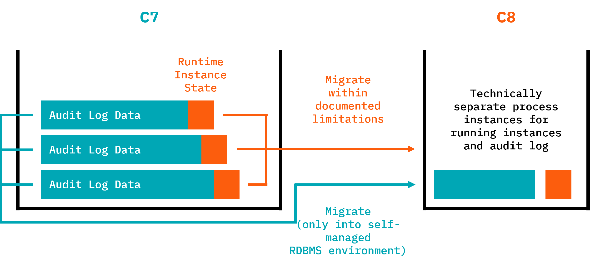

Camunda currently invests in tooling to help support and ease your migration from Camunda 7 to Camunda 8.

## Migration tools

Camunda provides the following migration tools:

| Migration tool                                                                       | Description                                                                                                                                                                  |
| :----------------------------------------------------------------------------------- | :--------------------------------------------------------------------------------------------------------------------------------------------------------------------------- |
| **[Migration Analyzer & Diagram Converter](#migration-analyzer--diagram-converter)** | Gain a first understanding of migration tasks. Available for local installation (Java or Docker) or [hosted as a free SaaS offering](https://diagram-converter.camunda.io/). |
| **[Data Migrator](#data-migrator)**                                                  | Copies active Camunda 7 runtime instances and existing audit trail data (history) to Camunda 8.                                                                              |
| **[Code Converter](./code-conversion.md)**                                           | Supported by a mixture of diagram conversion tools, code conversion patterns, and automatable refactoring recipes.                                                           |
| **[Camunda 7 Adapter](#camunda-7-adapter)**                                          | Run existing Camunda 7 delegation code directly in a Camunda 8 environment.                                                                                                  |

## Migration Analyzer & Diagram Converter

Camunda is developing the **Migration Analyzer & Diagram Converter**, a tool to gain a first understanding of migration tasks. This tool is based on the existing [diagram converter](https://github.com/camunda-community-hub/camunda-7-to-8-migration/tree/main/backend-diagram-converter), which can be used via CLI to produce a CSV file with tasks in your model. Our consultants then import this data into a [Google Spreadsheet template](https://docs.google.com/spreadsheets/d/1ZUxGhj1twgTnXadbopw1CvZg_ZvDnB2VXRQDSrKtmcM/edit?gid=6013418#gid=6013418) to analyze what tasks need to be done to migrate.

:::info
The [existing diagram converter](https://github.com/camunda-community-hub/camunda-7-to-8-migration/tree/main/backend-diagram-converter) can be used today. UI and reporting will be added and documentation will be extended. The initial release is **planned for 8.8**. Iterative improvements will follow.
:::

For example, the following image shows a sample report.

Performing this analysis will help you understand what needs to be done to migrate.

## Data Migrator

The data migrator can copy runtime and audit data from Camunda 7 to Camunda 8.

:::info
Camunda is developing the Data Migrator with a first release planned for **Camunda 8.8 (October 2025)**. Iterative improvements might follow.
:::

It provides two important modes that can be applied separately:

- Runtime instance migration mode
- History migration mode

### Runtime instance migration mode

Migrate currently running process instances. Running means that these process instances in Camunda 7 are not yet ended and currently wait in some [wait-state](https://docs.camunda.org/manual/latest/user-guide/process-engine/transactions-in-processes/#wait-states). This state is persisted in the database and a corresponding data entry needs to be created in Camunda 8, so that the process instance can continue from that state in the new solution.

**Requirements and limitations:**

- The Runtime Data Migrator needs to access the Camunda 7 database.
- The Runtime Data Migrator needs to access Camunda 8 APIs (which means you can also use this tool when you run on SaaS).
- Multiple Instance is not supported, so process instances that are currently waiting in a multiple instance task cannot be migrated and need to be moved out of that state in Camunda 7 beforehand.

If you need to adjust your process models before migration, you can use [process version migration](https://docs.camunda.org/manual/7.22/user-guide/process-engine/process-instance-migration/) in the Camunda 7 environment to migrate process instances to versions that are migratable to Camunda 8. An interesting strategy can be to define dedicated migration states you want your process instances to pile up in. Another common strategy is to use [process instance modification](https://docs.camunda.org/manual/7.22/user-guide/process-engine/process-instance-modification/) in the Camunda 7 environment to move out of states that are not migratable (for example, process instances within a multiple instance task).

### History migration mode (copying audit log data)

Process instances left traces, referred to as [History in Camunda 7](https://docs.camunda.org/manual/latest/user-guide/process-engine/history/). These are audit logs of when a process instance was started, what path it took, and so on.

It is important to note that audit data can exist for ended processes from the past, but is also available for currently still running process instances, as those process instances also left traces up to the current wait state.

The History Data Migrator can copy this audit data to Camunda 8.

Audit data migration might need to look at a huge amount of data, which can take time to migrate. In early measurements, migrating 10,000 process instances took around 10 minutes, but the number varies greatly based on the amount of data attached to a process instance (for example, user task instances, variable instances, and so on).

You can run audit data migration alongside normal operations (for example, after the successful big bang migration of runtime process instances) so that it doesn't require downtime and as such, the performance might not be as critical as for runtime instance migration.

**Requirements and limitations:**

- The History Data Migrator needs to access the Camunda 7 database.
- The History Data Migrator can only migrate to Camunda 8 **if a relational database (RDBMS) is used**, a feature planned for **Camunda 8.9**.
- The History Data Migrator needs to access the Camunda 8 database (which means you can only run this tool in a **self-managed environment**).
- If runtime and history data are migrated at the same time, you will end up with two instances in Camunda 8: a canceled historic process instance and an active new one in the runtime. They are linked by process variables.

### Typical choreography of runtime and history migration

As described in [the roll-out phase of the migration journey](./migration-journey.md#6roll-out), you will typically use the following sequence of tasks when applying both data migrations while keeping downtimes to a minimum:

1. Stop the Camunda 7 solution (normally shut down your application).
2. Start the Data Migrator in "running instance migration mode".
3. Wait until running instance migration is completed.
4. Start the new Camunda 8 solution immediately so migrated process instances can continue right away.
5. Start the Data Migrator in "history migration mode".
6. The migrator runs until all history data is migrated while Camunda 8 process execution continues in parallel.

With this approach, the duration of history migration doesn't block big bang migrations.

### Customization of Data Migrator

You might need to customize the data migration, especially if you used complex data formats in Camunda 7 (for example, Java objects) that need to be converted to something Camunda 8 can handle (for example, JSON). As part of this step, you might also need to extract big payloads and binaries (like documents) into an external data store and reference it from the process (using, for example, upcoming document handling possibilities).

## Code Converter

Code conversion is described in [Code Conversion](./code-conversion.md).

## Camunda 7 Adapter

The adapter and its documentation are available on GitHub: [Camunda 7 Adapter](https://github.com/camunda-community-hub/camunda-7-to-8-migration/tree/main/camunda-7-adapter).
