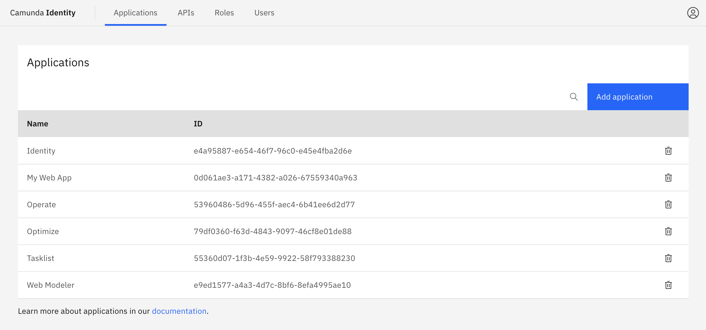
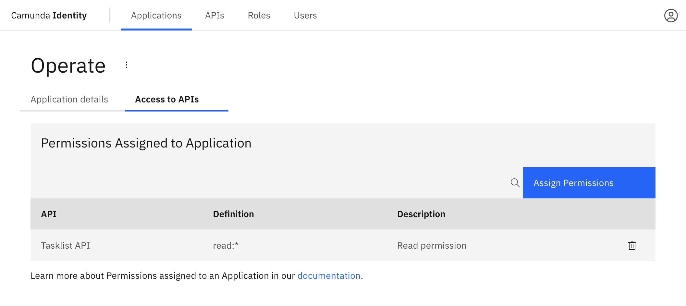

In this guide we will show you how to use Identity to create an application and assign a permission to an application.

:::tip Want to learn more about applications?
Head over to our documentation on [applications](/self-managed/concepts/access-control/applications.md) to find out more.
:::

:::caution Write access needed
To add an application and assign a permission to an application, you need to have write access to Identity.
Read our [guide on managing user access](/self-managed/identity/user-guide/authorizations/managing-user-access.md) to learn more.
:::

## Add an application

1. Log in to the Identity UI and navigate to the **Applications** tab:

2. Click the **Add application** button located on the top right of the table and a modal will open.

3. Fill in a name for your application. For this guide we will use a set of example values.
   Select the type of your application based on our [guide](/self-managed/concepts/access-control/applications.md#types-of-applications).
   Depending on the selected type, you might need to enter at least one redirect URI. When you have inserted the required
   details, click **Add**:

On confirmation, the modal will close, the list will update, and your new application will be shown. Click on your new application to view the details. This includes your generated client ID
and client secret depending on the selected [type](/self-managed/concepts/access-control/applications.md#types-of-applications).

## Assigning a permission an application

To assign a permission to an application using Identity, take the following steps:

1. Log in to the Identity UI and navigate to the **Applications** page and click on an application. Then, select the **Access to APIs** tab and click **Assign Permissions**:

2. Select the API which contains the permission you want to assign.

3. Select the permissions you would like to assign and click **Add**.

On confirmation, the modal will close, the table will update, and your assigned permissions will be shown:

