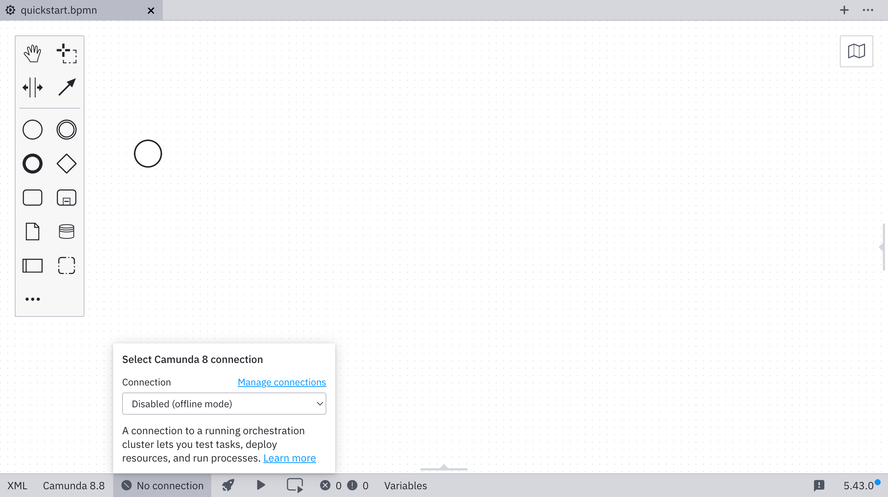

import Tabs from "@theme/Tabs";
import TabItem from "@theme/TabItem";

To deploy diagrams, start process instances, or test tasks, you must first connect Desktop Modeler to a Camunda 8 Orchestration Cluster. Follow the steps below to set up a connection.

1. Click the **Connection manager**. For new installations, this will show **No connection**. If you have previously selected a connection, it will show the name of that connection.

   

2. To add a new connection, open the settings. You can either open the connection manager and click **Manage connections** or open the settings directly (`Cmd/Ctrl + ,`).

   By default, a local c8run connection is already configured. If you have previously used Desktop Modeler to deploy a diagram, that connection will also be available as **Unnamed Connection**. You can rename this connection to something more descriptive in the connection manager settings.

   

3. Click **Add connection**.
   

4. Select **Camunda 8 Self-Managed** as the target.

   

5. Enter the cluster URL, and optionally the tenant ID and Operate URL.

   :::caution
   You can connect to Camunda 8 both securely and insecurely through the `https` and `http` protocols. Secured connections to a remote endpoint are established only if the remote server certificate is trusted by the app. Ensure that root and intermediate certificates you trust are [known to the app](/components/modeler/desktop-modeler/flags/flags.md#zeebe-ssl-certificate).

   Multi-tenancy is available only when authentication is enabled through [Identity](../../identity/managing-tenants.md).
   :::

   

6. Select your authentication method, and enter the required credentials.

   <Tabs groupId="auth" defaultValue="basic" queryString values={
   [
   {label: 'Basic', value: 'basic' },
   {label: 'OAuth', value: 'oauth' }
   ]}>

   <TabItem value='basic'>

   For **basic authentication**, enter your username and password.

   

   </TabItem>

   <TabItem value='oauth'>

   For **OAuth**, enter the credentials for your OAuth provider. These credentials are configured during the default [[Helm installation](../../setup/install.md). You can find them in [Orchestration Cluster Identity](../../identity/what-is-identity.md).

   

   | Name            | Description                             | Example value                                                                            |
   | --------------- | --------------------------------------- | ---------------------------------------------------------------------------------------- |
   | Client ID       | The name of your Zeebe client.          | `zeebe`                                                                                  |
   | Client secret   | The password of your Zeebe client.      | `zecret`                                                                                 |
   | OAuth token URL | The full path to the token endpoint.    | `https://<keycloak base url>/auth/realms/camunda-platform/protocol/openid-connect/token` |
   | OAuth audience  | The permission name for Zeebe.          | `zeebe.example.com`                                                                      |
   | OAuth scope     | The permissions available to the token. | `Zeebe,Tasklist,Operate`                                                                 |

   </TabItem>
   </Tabs>

   If the connection is established successfully, you can leave the settings and go back to the connection manager, where your new connection is now available.

7. Select the connection you just created to use it for [deployment](./deploy-to-self-managed.md):

   
   :::note
   As a next step, [deploy your diagram](./deploy-to-self-managed.md).
   :::
